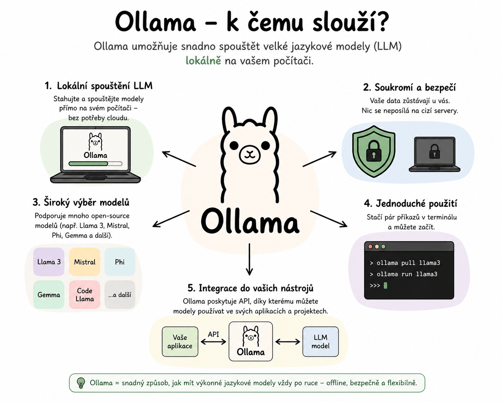

# Ollama - Lokální LLM (Large Language Model) pro Windows

> Průvodce nastavením, spuštěním a správou Ollama na Windows.

---

## Základní informace

- Ollama naslouchá na adrese: [http://127.0.0.1:11434/](http://127.0.0.1:11434/)
- Pro spuštění je nutné spustit soubor `ollama app.exe`.

---

## Příkazy pro správu modelů

| Příkaz | Popis |
|--------|-------|
| `ollama list` | Zobrazí nainstalované modely |
| `ollama run [model]` | Stáhne a spustí model |
| `ollama rm [model]` | Odstraní model |

---

## Změna naslouchací adresy

1. Otevřete **System variables** ve Windows.
2. Přidejte proměnnou prostředí `OLLAMA_HOST` s požadovanou adresou.
3. Restartujte aplikaci `ollama app.exe`.

> [!IMPORTANT]
> Změna se projeví až po restartu aplikace.

---

## Vypnutí automatického spuštění

1. Stiskněte `Windows` + `R`.
2. Zadejte `shell:startup` a potvrďte.
3. Odstraňte zástupce na Ollama ze složky.

> [!NOTE]
> Ollama se ve výchozím stavu spouští automaticky při startu počítače.
