# PostgreSQL – Průvodce a tipy

> Přehled základních pojmů, instalace, příkazů a doporučení pro práci s PostgreSQL.

---

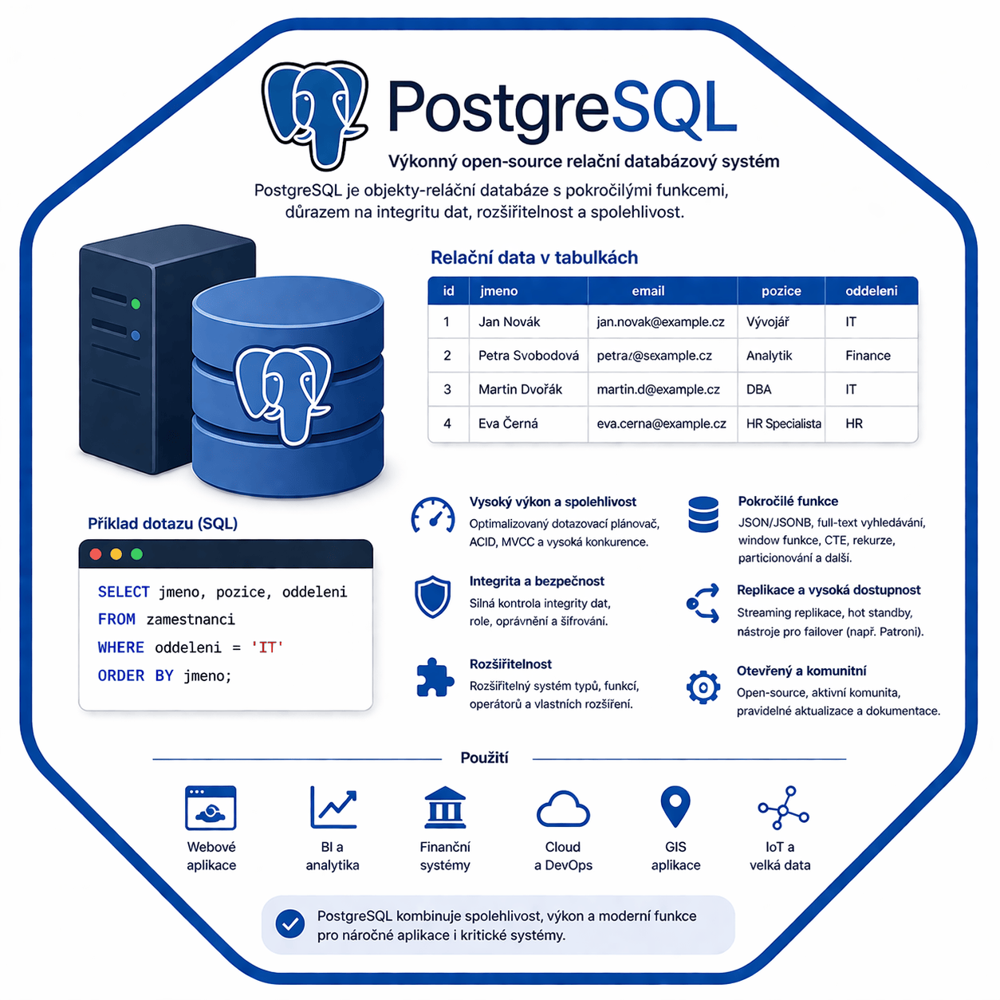

## Co je PostgreSQL?

- **Objektově-relační databázový systém** s otevřeným zdrojovým kódem.
- Jeden z nejrobustnějších SQL systémů dostupných zdarma.
- Podporuje procedurální jazyky: `PL/pgSQL`, `PL/Python`, `PL/Perl`, `PL/Java` a další.

> [!NOTE]
> `PL` znamená „Procedural Language" – umožňuje psaní funkcí a procedur přímo v databázi.

---

## Uživatelské rozhraní

Doporučený klient je **pgAdmin 4** – instaluje se jako součást PostgreSQL:

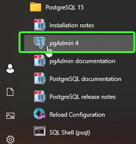

---

## Instalace PostgreSQL

<details>
<summary>Kompletní průvodce instalací krok za krokem</summary>

**1. Výběr verze a stažení**

Stáhni instalátor z [enterprisedb.com/downloads/postgres-postgresql-downloads](https://www.enterprisedb.com/downloads/postgres-postgresql-downloads):

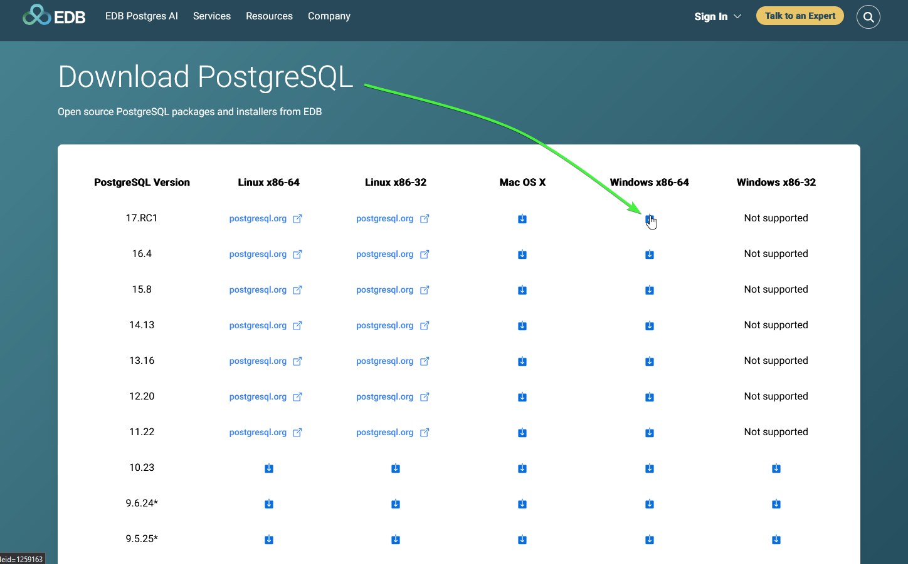

**2. Spuštění instalace**

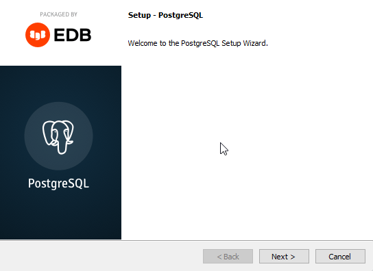

**3. Výběr složky instalace** (doporučeno ponechat výchozí):

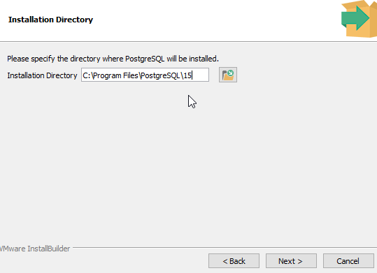

**4. Výběr komponent**

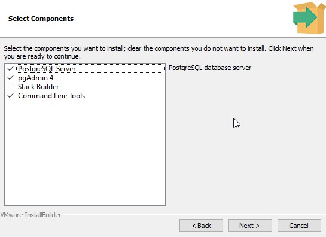

> [!NOTE]
> Doporučeno nainstalovat `pgAdmin 4` (grafické rozhraní) a `Command Line Tools`.

**5. Složka pro data** (doporučeno ponechat výchozí):

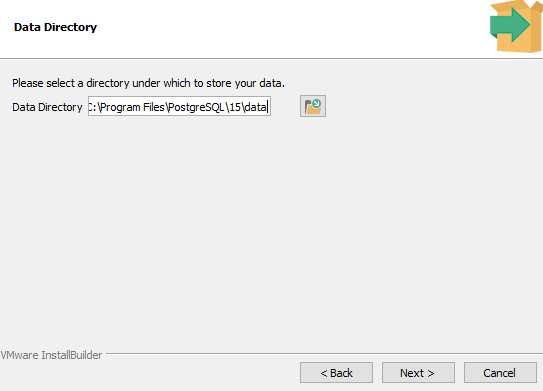

**6. Nastavení hesla:**

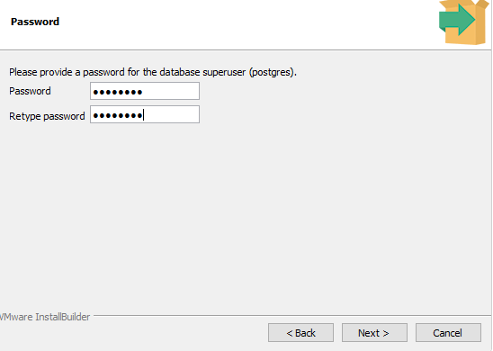

**7. Port serveru** (výchozí: `5432`):

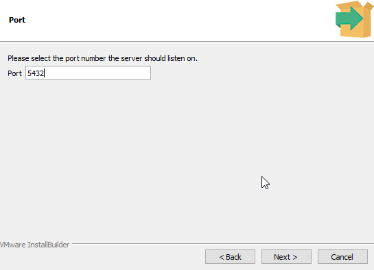

**8. Geografická lokace:**

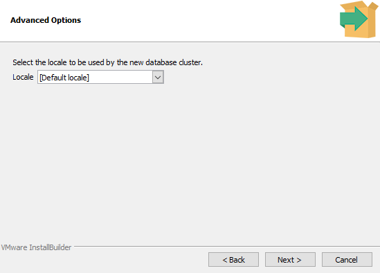

**9. Kontrola a dokončení:**

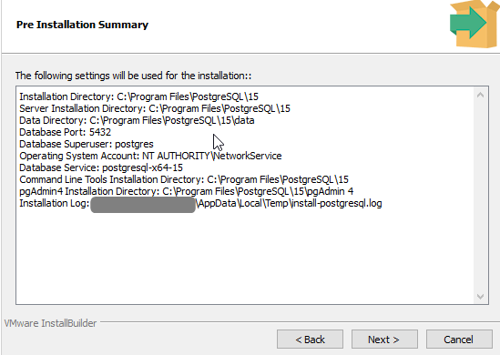

</details>

---

## Připojení z příkazového řádku

<details>
<summary>Test naslouchání a ověření připojení</summary>

Otevři konzoli PostgreSQL:

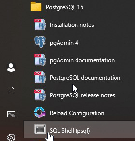

P�ipojení k serveru:

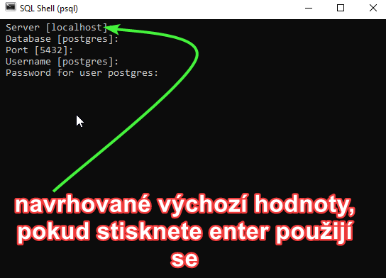

Výsledek:

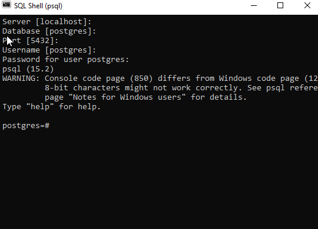

Ověření verze:

```sql
SELECT version();
```

> [!WARNING]
> Pokud konzole nezobrazuje anglický text, uprav:
> - `C:\Program Files\PostgreSQL\16\data\postgresql.conf`
>
>   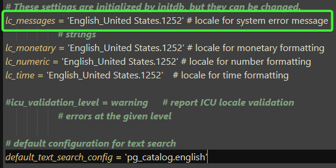
>
> - Systémové proměnné prostředí
>
>   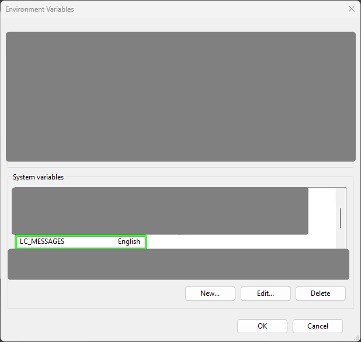
>
> Poté restartuj konzoli.

</details>
