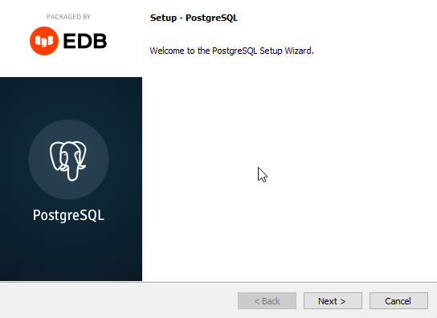
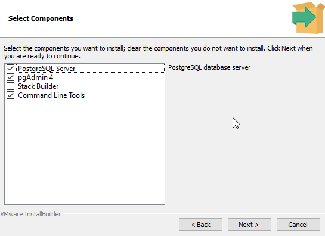
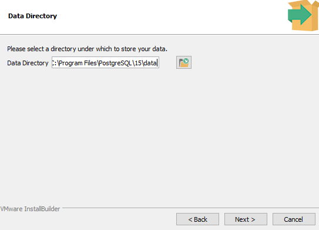
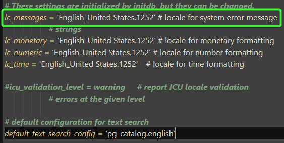

## PostgreSQL

- Podporuje programovací jazyky: `C`, `C++`, `Java`, `Perl`, `Python`, `Ruby`, `Tcl`, `Scheme`, `PHP`, `Swift`, `Go`, `JavaScript`, `TypeScript`, `R`, `Rust`, `Kotlin`, `Lua`, `Erlang`, `Elixir`, `Haskell`, `Scala`, `D`, `Julia`, `PL/pgSQL`, `SQL`, `PL/Python`, `PL/Perl`, `PL/Tcl`, `PL/Java`, `PL/R`, `PL/V8`

    > [!NOTE]
    > `PL` znamená "Procedural Language" (procedurální jazyk)
    >
    > Tyto jazyky se používají k psaní funkcí a spouštěcích procedur v rámci databáze PostgreSQL.
    >
    > Procedurální jazyky umožňují provádět složitější logiku a operace přímo v databázi.

- PostgreSQL podporuje v podstatě všechny funkce, které podporují jiné systémy pro správu databází.

<details>
<summary><span style="color:#1E90FF;"> Uživatelské rozhraní</span></summary>

Otevřete aplikaci:


</details>

### Instalace

<details>
<summary><span style="color:#1E90FF;">Výběr verze produktu</span></summary>

<a href="https://www.enterprisedb.com/downloads/postgres-postgresql-downloads"></a>

</details>

<details>
<summary><span style="color:#1E90FF;">Spustit instalaci</span></summary>

Po dokončení stahování dvakrát klikněte na stažený soubor a spusťte instalaci:



</details>

<details>
<summary><span style="color:#1E90FF;">Složka pro instalaci</span></summary>

Můžete zadat umístění PostgreSQL, vybereme prozatím výchozí volbu:


</details>

<details>
<summary><span style="color:#1E90FF;">Výběr komponent</span></summary>



> [!NOTE]
> Chcete-li používat PostgreSQL, budete muset nainstalovat PostgreSQL Server.
>
> Doporučuji `pgAdmin 4`, který poskytuje uživatelské rozhraní a `Comand Line Tools` pro příkazový řádek.

</details>

<details>
<summary><span style="color:#1E90FF;">Složka pro uložení dat databáze</span></summary>

Vyberte kam uložit data databáze, použijeme výchozí volbu:



</details>

<details>
<summary><span style="color:#1E90FF;">Nastavit heslo</span></summary>

Pro přístup do databáze budete muset zvolit heslo.


</details>

<details>
<summary><span style="color:#1E90FF;">Port k naslouchání</span></summary>

Můžete nastavit port, na kterém má server naslouchat, použijeme výchozí volbu:


</details>

<details>
<summary><span style="color:#1E90FF;">Geografické umístění serveru</span></summary>

Vyberte geografické umístění databázového serveru:


</details>

<details>
<summary><span style="color:#1E90FF;">Kontrola před provedením</span></summary>


Následně stačí dokončit instalaci

</details>

### Příkazový řádek

<details>
<summary><span style="color:#1E90FF;"> Otestovat zda PostgreSQL naslouchá</span></summary>

Otevřít:


Připojení:


Nyní byste měli dostat výsledek podobný níže:


> [!WARNING]
> **Pokud nevidíte konzoli v angličtině**, musíte udělat tyto změny:
>
> - Nastavit v `C:\Program Files\PostgreSQL\16\data\postgresql.conf`
    >
    >    
>
> - Nastavit v proměnném prostředí
    >
    >    
>
> Nyní stačí vypnout a zapnout konzoli a změny by se měli projevit


Pro odzkoušení zda jsme se správně připojili stačí zavolat kód níže:

```sql
SELECT version();
```

</details>