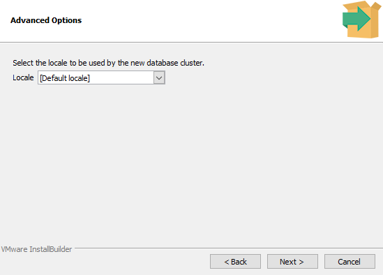
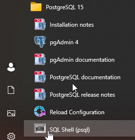
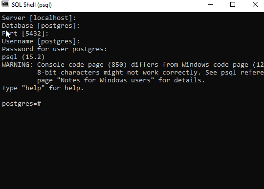

# 🗂️ PostgreSQL – Praktický průvodce & tipy

> 🚀 Moderní přehled základních pojmů, instalace, příkazů a doporučení pro práci s PostgreSQL.

---

## 📖 Co je PostgreSQL?

- **Objektově-relační databázový systém**
- Podporuje širokou škálu programovacích jazyků:  
  `C`, `C++`, `Java`, `Perl`, `Python`, `Ruby`, `Tcl`, `Scheme`, `PHP`, `Swift`, `Go`, `JavaScript`, `TypeScript`, `R`, `Rust`, `Kotlin`, `Lua`, `Erlang`, `Elixir`, `Haskell`, `Scala`, `D`, `Julia`, `PL/pgSQL`, `SQL`, `PL/Python`, `PL/Perl`, `PL/Tcl`, `PL/Java`, `PL/R`, `PL/V8`

> [!NOTE]  
> `PL` znamená "Procedural Language" – umožňuje psaní funkcí a procedur přímo v databázi.

---

## 🖥️ Uživatelské rozhraní

<details>
<summary><span style="color:#1E90FF;">🖥️ Otevření aplikace</span></summary>

</details>

---

## 🛠️ Instalace PostgreSQL

<details>
<summary><span style="color:#1E90FF;">🔢 Výběr verze produktu</span></summary>
<a href="https://www.enterprisedb.com/downloads/postgres-postgresql-downloads"></a>
</details>

<details>
<summary><span style="color:#1E90FF;">▶️ Spuštění instalace</span></summary>
Po stažení spusťte instalační soubor:

</details>

<details>
<summary><span style="color:#1E90FF;">📁 Složka pro instalaci</span></summary>
Zvolte umístění PostgreSQL (doporučeno ponechat výchozí):

</details>

<details>
<summary><span style="color:#1E90FF;">🧩 Výběr komponent</span></summary>

> [!NOTE]  
> Doporučuji nainstalovat `pgAdmin 4` (grafické rozhraní) a `Command Line Tools`.
</details>

<details>
<summary><span style="color:#1E90FF;">💾 Složka pro uložení dat</span></summary>
Vyberte umístění pro data databáze (doporučeno ponechat výchozí):

</details>

<details>
<summary><span style="color:#1E90FF;">🔑 Nastavení hesla</span></summary>
Zvolte heslo pro přístup do databáze:

</details>

<details>
<summary><span style="color:#1E90FF;">🔌 Port k naslouchání</span></summary>
Nastavte port serveru (doporučeno ponechat výchozí):

</details>

<details>
<summary><span style="color:#1E90FF;">🌍 Geografické umístění serveru</span></summary>
Vyberte lokaci serveru:

</details>

<details>
<summary><span style="color:#1E90FF;">✅ Kontrola před instalací</span></summary>

Po kontrole dokončete instalaci.
</details>

---

## 💻 Příkazový řádek

<details>
<summary><span style="color:#1E90FF;">🔎 Otestovat naslouchání PostgreSQL</span></summary>
Otevřete příkazovou konzoli:

Připojení k serveru:

Výsledek připojení:


> [!WARNING]  
> Pokud nevidíte konzoli v angličtině, upravte:
> - `C:\Program Files\PostgreSQL\16\data\postgresql.conf`
    >   
> - Proměnné prostředí
    >   
    > Poté restartujte konzoli.

Pro ověření připojení spusťte:
```sql
SELECT version();
```
</details>