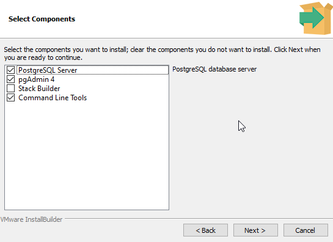

# PostgreSQL – instalace a připojení

PostgreSQL je relační databázový systém.

Pro práci lze použít konzoli psql nebo grafický klient pgAdmin.

## Instalace PostgreSQL ve Windows

1. Vyber podporovanou verzi a instalátor z [oficiálního rozcestníku](https://www.postgresql.org/download/windows/).
2. V instalátoru EDB zvol server a **Command Line Tools**, případně také **pgAdmin 4**.
3. Vyber datový adresář, nastav heslo databázového správce a poznamenej si port. Běžný výchozí port je `5432`.
4. Dokonči instalaci a ověř běh databázové služby.

pgAdmin je samostatný klient.

Jeho přítomnost závisí na distribuci a volbě komponent.

### Výběr komponent



[Zobrazit obrázek v původní velikosti](../images/wqiRRNNKOT.png)

## Připojení z příkazového řádku

Otevři **SQL Shell (psql)**, nebo v terminálu s dostupným `psql` spusť:

```text
psql -h localhost -p 5432 -U postgres -d postgres
```

Heslo zadej do výzvy, nikoli jako součást příkazu.

Po přihlášení ověř:

```sql
SELECT version();
SELECT current_database(), current_user;
```

V konzoli lze použít také:

| Syntaxe v konzoli psql | Význam |
|---|---|
| `\l` | Seznam databází |
| `\dt` | Tabulky v aktuálním vyhledávacím schématu |
| `\d <schéma>.<tabulka>` | Struktura vybrané tabulky. Doplň její schéma a název |
| `\q` | Ukončení konzole |

Například `\d public.notes` zobrazí strukturu existující tabulky `notes` ve schématu `public`.

Zadává se do konzole psql, nikoli přímo do PowerShellu.

[Reference psql](https://www.postgresql.org/docs/current/app-psql.html)

## Připojení v pgAdminu

Zaregistruj server a vyplň hostitele, port, databázi pro první připojení, uživatele a heslo odpovídající instalaci.

V **Query Tool** spusť stejný ověřovací dotaz jako v psql. [Dialog serveru](https://www.pgadmin.org/docs/pgadmin4/latest/server_dialog.html)

Pro aplikace vytvoř samostatný účet s potřebnými oprávněními.

Správce `postgres` v tomto návodu slouží k ověření nové lokální instalace.

## Když se připojení nedaří

| Chyba | Co ověřit |
|---|---|
| `psql` nenalezen | Instalaci Command Line Tools a cestu k adresáři `bin` |
| Connection refused | Běh serveru, hostitele a port |
| Password authentication failed | Jméno databázového uživatele a jeho heslo |
| No pg_hba.conf entry | Pravidla přístupu pro konkrétního klienta a databázi |

Jazyk konzole není důvod měnit konfiguraci serveru.

Řeš konkrétní chybu připojení. [Konfigurace přístupu](https://www.postgresql.org/docs/current/auth-pg-hba-conf.html)
