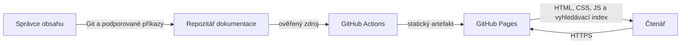
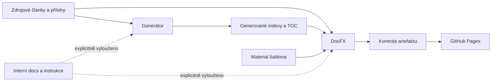

# Architektura systému

Tento dokument je jediným kanonickým popisem architektury projektu.

Funkční význam systému je definovaný v [`../product/requirements.md`](../product/requirements.md).

Důvody významných voleb jsou zaznamenané v [`decisions/`](decisions/README.md).

## Stav architektonických tvrzení

Tvrzení v tomto dokumentu používají kanonické stavy definované v části [`Stav tvrzení`](../governance/documentation.md#stav-tvrzení).

Pokud není uvedeno jinak, skutečnosti v tomto dokumentu byly ověřené proti repozitáři a lokálnímu běhu dne 2026-08-28.

Přechodové stavy jsou soustředěné v části [Známá rizika, dluh a přechodové stavy](#11-známá-rizika-dluh-a-přechodové-stavy).

## 1. Účel architektury a kvalitativní cíle

| Priorita | Kvalitativní cíl | Navázaný požadavek | Jak architektura podporuje ověření |
|---|---|---|---|
| 1 | Interní projektová metadata nikdy nevstoupí do veřejného artefaktu | `QLT-003` | Sdílená klasifikace cest, DocFX exclusions, testy a kontrola manifestu i výstupu |
| 2 | Stejný zdroj vytvoří lokálně i v CI stejný ověřitelný web | `QLT-001`, `QLT-002` | Generátor je deterministický a runtime i DocFX mají strojově připnuté verze |
| 3 | Veřejné cesty se chovají shodně na Windows a Linuxu | `QLT-004` | Registr používá přesný lowercase casing a test kontroluje skutečné názvy v souborovém systému |

## 2. Omezení

| Omezení | Původ | Dopad | Stav |
|---|---|---|---|
| Výstup je statický web bez backendu | `REQ-001`, `REQ-002` a současný DocFX projekt | Veškerý obsah, navigace a vyhledávací index musí vzniknout při buildu | Záměr |
| Veřejný obsah je primárně v češtině | Produktové omezení | Generátor, názvy workflow a uživatelský text používají češtinu | Záměr |
| Hosting a VCS jsou GitHub a GitHub Pages | Git remote a workflow | CI používá GitHub Actions a deployment do větve `gh-pages` | Skutečnost |
| Projekt nemá serverovou databázi ani runtime tajemství | Inventura repozitáře a běhového výstupu | Obnova vychází z Git zdrojů a opakovatelného buildu | Skutečnost |
| Historické veřejné URL mohou obsahovat mixed-case názvy | Lokální snapshot `origin/gh-pages` | Lowercase sjednocení může přerušit přímé historické odkazy | Skutečnost a přechod `ARCH-RISK-001` |

## 3. Kontext a hranice systému

Systém vlastní veřejné články, generování navigace, DocFX build kontrakt, vzhled výsledného webu a projektové ověřovací příkazy.

GitHub vlastní vzdálený Git, běh Actions a Pages infrastrukturu, zatímco čtenářův prohlížeč vlastní pouze lokální preferenci tématu.

Diagram ukazuje autorství, sestavení a veřejné čtení bez serverové aplikační vrstvy.

| Aktér nebo systém | Směr komunikace | Účel | Rozhraní | Vlastník | Selhání a náhrada |
|---|---|---|---|---|---|
| Správce obsahu | Do systému | Udržuje zdrojové články, registr navigace a projektovou konfiguraci | Git, Markdown a lokální CLI | Vlastník repozitáře | Neúspěšná kontrola změnu zastaví a uvede konkrétní důkaz |
| GitHub | Obousměrně | Uchovává vzdálený Git a spouští workflow | Git přes SSH, GitHub Actions | GitHub a vlastník repozitáře | Lokální práce pokračuje; publikování čeká na obnovení platformy |
| GitHub Pages | Ze systému k čtenáři | Hostuje odvozený statický web | HTTPS a větev `gh-pages` | GitHub a vlastník repozitáře | Poslední úspěšný deployment zůstává dostupný, pokud platforma zachová službu |
| Prohlížeč čtenáře | Obousměrně se statickým webem | Zobrazuje stránky, vyhledává a ukládá neškodnou volbu tématu | HTTPS, HTML, CSS, JavaScript, `localStorage` | Čtenář | Nedostupné úložiště tématu se bezpečně nahradí režimem `auto` |

## 4. Strategie řešení

- Veřejný obsah je explicitní allowlist tematických oblastí a zdrojových příloh, nikoli každý Markdown nalezený v repozitáři.
- [`ADR-0002`](decisions/ADR-0002-verejny-docfx-build.md) sjednocuje veřejnou hranici, připnutý toolchain a kontrolu sestaveného artefaktu do jednoho build kontraktu.
- [`scripts/generate-docs.js`](../../scripts/generate-docs.js) vlastní názvy, pořadí a cesty veřejné navigace; generované indexy a TOC nejsou ručně upravované zdroje pravdy.
- `package.json` poskytuje stejné lidské vstupní příkazy lokálnímu vývoji i GitHub Actions.
- Interní kanonické dokumenty řídí projekt, ale nemají běhovou závislost na veřejném webu a DocFX je nesmí zpracovat.

## 5. Stavební bloky a pravidla závislostí

| Blok | Odpovědnost | Veřejná hranice | Povolené závislosti | Vlastník dat |
|---|---|---|---|---|
| Zdrojový veřejný obsah | Tematické Markdown stránky a přílohy v `images/` a `pdf/` | Relativní veřejné cesty uvedené v registru navigace | Jiné veřejné stránky a přílohy | Správce obsahu |
| Generátor navigace | Normalizuje veřejný Markdown, migruje legacy cesty, generuje přehledy a ověřuje navigaci i lokální odkazy | npm profily `docs:generate` a `docs:check` | Node.js standardní knihovna a zdrojový veřejný obsah | Engineering |
| Kanonická projektová dokumentace | Definuje záměr, architekturu, workflow a dlouhé úkoly | Interní odkazy z `AGENTS.md` a `docs/index.md` | Strojové konfigurace jako důkaz, nikoli veřejný obsah | Maintainers |
| DocFX build | Převádí povolené zdroje a aktivní šablonu na statický web | npm profil `docs:build` a adresář `_site/` | Generovaný i zdrojový veřejný obsah, resources a `templates/material` | Engineering |
| Kontrola artefaktu | Ověřuje manifest, povinné veřejné stránky a nepřítomnost interních cest | npm profil `docs:artifact-check` | Čistý DocFX výstup | Quality |
| GitHub workflow | Obnovuje připnuté nástroje, volá `npm run verify` a publikuje výstup | Workflow pro `develop`, pull request a `main` | GitHub Actions, build kontrakt a `GITHUB_TOKEN` pouze při publikování | Delivery |

Povolené závislosti směřují od zdrojů přes generování a build k neměnnému artefaktu.

Interní dokumentace je pouze řídicí kontext a obě zpracovatelské hranice ji aktivně odmítají.

## 6. Klíčové běhové scénáře

| Scénář | Navázaný požadavek | Konzistenční hranice | Selhání a zotavení |
|---|---|---|---|
| Aktualizace navigace | `REQ-003`, `REQ-E001` | Jedno spuštění nejdříve migruje cesty a normalizuje zdroje, poté generuje všechny přehledy a až nakonec validuje úplnost | Chyba skončí nenulovým kódem; správce opraví uvedený zdroj a spustí kontrolu znovu |
| Ověřené lokální sestavení | `REQ-E002`, `REQ-E003`, `QLT-002`, `QLT-003` | `docs:build` odstraní pouze `_site`, provede strict DocFX build a ověří celý nový artefakt | Warning, chybějící veřejná stránka nebo interní cesta zastaví profil bez publikování |
| Publikování `main` | `REQ-004` | Jediný job sestaví ověřený commit a až po úspěchu předá `_site` publikační akci | Selhání zachová předchozí `gh-pages`; oprava se provede ve zdroji a workflow se zopakuje |

## 7. Data a jejich životní cyklus

| Datová oblast | Autoritativní zdroj | Vlastník | Konzistence | Retence a mazání | Migrace |
|---|---|---|---|---|---|
| Zdrojové články a veřejné přílohy | Git soubory mimo generované indexy a interní exclusions | Správce obsahu | Git historie a lokální link/navigation check | Podle historie repozitáře; odstranění je běžná verzovaná změna | Přejmenování řídí `legacyRenames` a kontrola přesného casingu |
| Registr navigace | `sectionInfo`, `sectionOrder`, `navigation` a `rootPages` v generátoru | Engineering | Generované výstupy musí po `docs:generate` projít `docs:check` | Historii drží Git; překonaný přechod se odstraní po migraci | Generátor převádí známé legacy cesty před vytvořením výstupů |
| Generované indexy a TOC | Výstup generátoru se zdrojovým markerem | Engineering | Nesmějí se ručně upravovat; drift je chyba | Přepisují se atomicky při generování a zůstávají verzované | Vždy se znovu odvozují z registru |
| Statický web | Čistý build `_site/` a publikovaná větev `gh-pages` | Delivery | Artefakt check porovnává manifest a výstup s veřejnou hranicí | Lokální `_site/` je odstranitelný; `gh-pages` uchovává pouze poslední kořenový deployment commit | Neobsahuje datové migrace a lze jej znovu sestavit ze zdroje |
| Volba tématu | `localStorage` klíč `theme` v prohlížeči | Čtenář | Hodnota se omezuje na `light`, `dark` nebo `auto` | Odstranění dat prohlížeče vrátí `auto` | Není potřeba serverová migrace |

## 8. Nasazení a provozní topologie

| Prostředí | Běhové jednotky | Stav | Síťová hranice | Škálování | Pozorovatelnost |
|---|---|---|---|---|---|
| Lokální vývoj | Node generátor, test runner, lokální DocFX tool a volitelný statický server | Git checkout a odvozený `_site/` | Síť je nutná pouze pro první restore a případné otevření externích odkazů | Není relevantní | Návratové kódy a konzolový výstup |
| GitHub Actions quality | Jeden read-only job na Ubuntu | Dočasný checkout a artefakt bez publikování | GitHub runner, NuGet a action distribution | Jeden běh na událost | GitHub Actions log |
| GitHub Actions publish | Jeden job na Ubuntu s `contents: write` | Dočasný checkout, `_site/` a jediný kořenový deployment commit | GitHub runner, NuGet a GitHub API | Concurrency skupina nepovolí souběžné publikování | GitHub Actions log a commit `gh-pages` |
| GitHub Pages | Statické soubory z `gh-pages` | Pouze publikovaný artefakt | Veřejné HTTPS | Řídí GitHub | HTTP dostupnost a uživatelský smoke scénář |

## 9. Průřezové koncepty

| Koncept | Kanonický princip | Vynucení | Výjimky |
|---|---|---|---|
| Veřejná hranice | Publikuje se pouze explicitně povolený obsah | Sdílená klasifikace cest, DocFX exclusions, testy a artifact check | Žádné; změna vyžaduje aktualizaci `ADR-0002` nebo jeho nahrazení |
| Cesty a casing | Registr i fyzický soubor používají shodný lowercase název, pokud je tak cesta kanonizovaná | Generátor a filesystem test | Historické URL jsou přechod `ARCH-RISK-001` |
| Generovaný obsah | Upravuje se zdrojový registr nebo článek, nikdy odvozený markerový soubor | `docs:check` a Git review | Žádné |
| Chyby | Kontrola selže nahlas s konkrétní cestou a nenulovým kódem | Node CLI, testy a DocFX `--warningsAsErrors` | Žádné tiché retry |
| Konfigurace nástrojů | Přesná verze má jednu strojovou autoritu | `package.json`, `global.json`, `.config/dotnet-tools.json` | Lokální novější instalace není autoritou |
| Tajemství | Build je bez tajemství; publikační token se předává pouze deploy akci | Workflow permissions a explicitní `github_token` | Přechodně má celý publish job `contents: write`, viz `ARCH-RISK-002` |

## 10. Bezpečnost a ochrana dat

| Aktivum nebo hranice | Hrozba | Opatření | Zbytkové riziko | Ověření |
|---|---|---|---|---|
| Interní dokumentace a pracovní záznamy | Nechtěné zveřejnění širokým globem DocFX | Explicitní exclusions, stejná klasifikace v generátoru a kontrola manifestu i výstupu | Nový typ interní cesty musí být přidaný do klasifikace | Negativní testy a `docs:artifact-check` |
| `GITHUB_TOKEN` s právem zápisu | Zneužití kompromitovanou akcí nebo build krokem | Full SHA všech actions, žádné uchované checkout credentials a žádné předání tokenu build příkazům | Celý publish job má kvůli branch deploymentu právo zápisu | Review workflow a `ARCH-RISK-002` |
| Veřejný HTML obsah | Vložení škodlivého aktivního obsahu důvěryhodným commitem | Git review, DocFX zpracování a publikování pouze z `main` po kontrolách | Projekt nemá samostatný content security scanner | Review změn Markdownu a šablony |
| Lokální preference tématu | Uložení citlivých údajů v prohlížeči | Ukládá se pouze jedna z neškodných hodnot tématu a chyba storage se ignoruje | Žádné významné citlivé aktivum | Zdrojová inspekce a vizuální smoke |

## 11. Známá rizika, dluh a přechodové stavy

| ID | Skutečnost nebo přechod | Dopad | Cílový záměr | Vlastník | Podmínka uzavření |
|---|---|---|---|---|---|
| `ARCH-RISK-001` | Přechod: pět historických mixed-case URL bylo sjednoceno na lowercase bez redirectů | Přímý odkaz na starou cestu může na case-sensitive hostingu vrátit 404 | Jediná stabilní lowercase cesta nebo explicitně přijaté redirecty | Product a Delivery | Ověřený inventář živých URL a rozhodnutí, zda jsou redirecty potřebné |
| `ARCH-RISK-002` | Přechod: publish používá third-party branch-push akci a celý job má `contents: write` | Kompromitovaná build závislost má širší oprávnění než read-only quality | Oddělený build artefakt a privilegovaný deploy job po potvrzení nastavení GitHub Pages | Delivery | Vlastník ověří Pages source a přijme bezpečnější deployment model |
| `ARCH-RISK-003` | Skutečnost: kontrolují se lokální odkazy, ale ne dostupnost externích URL ani odborná aktuálnost článků | Starší návod nebo externí odkaz může zůstat nefunkční | Rizikově řízená periodická revize obsahu | Správce obsahu | Zavedený review interval nebo samostatný ověřovací mechanismus s přijatelným šumem |
| `ARCH-RISK-004` | Skutečnost: živá branch protection a Pages settings se mohou změnit mimo Git strom | Lokální dokumentace nemusí zachytit ruční změnu platformy | Po každé změně workflow ověřit první vzdálený quality i publish běh, jedno-commitovou `gh-pages` a veřejný web | Delivery | Důkaz z GitHubu po publikování každé změny delivery toku |

## 12. Architektonický slovník

| Termín | Kanonický technický význam |
|---|---|
| Zdrojový veřejný obsah | Ručně udržované články a přílohy, které jsou uvedené v registru nebo explicitní resource konfiguraci |
| Veřejná hranice | Pravidlo určující, které zdroje a výstupní cesty smějí být součástí publikovaného webu |
| Kanonická projektová dokumentace | Interní systém v `docs/`, který vlastní záměr a pravidla projektu, nikoli obsah webu |
| Build artefakt | Čistý, ověřený a znovu sestavitelný adresář `_site/` určený k publikování |
| Case-only migrace | Přejmenování, při kterém se mění pouze velikost písmen, ale na case-sensitive hostingu vzniká jiná URL |

## Pravidlo aktualizace

Tento dokument se aktualizuje ve stejné změně jako zásah do hranic modulů, toku dat, běhových scénářů, nasazení, bezpečnosti, veřejného rozhraní nebo významného kvalitativního opatření.

Rozsáhlý dokument se smí rozdělit pouze podle nepřekrývajících se oblastí vlastnictví a po aktualizaci [`../index.md`](../index.md).
