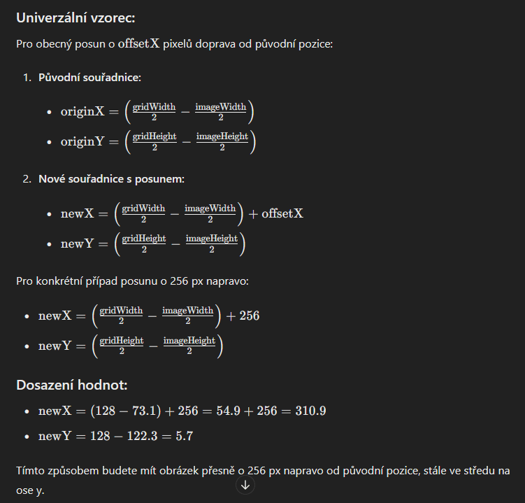
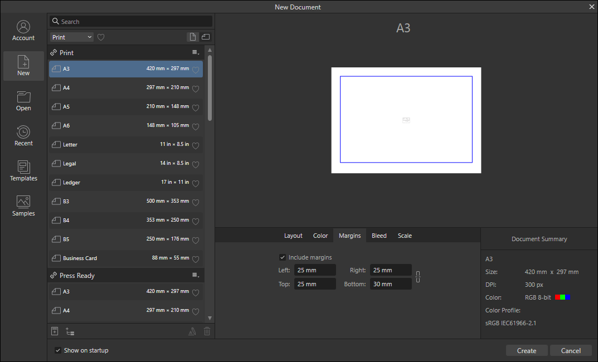
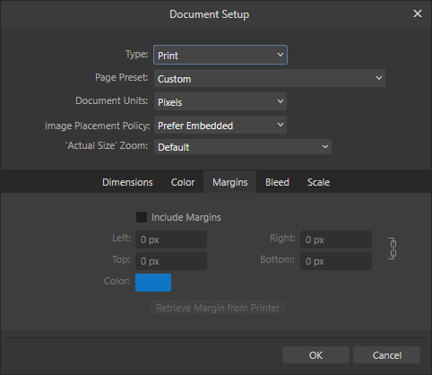

# 🗂️ Affinity – Praktický průvodce mřížkou & tipy

> 🚀 Moderní přehled použití mřížky, výpočtů zarovnání a řešení častých problémů v Affinity.

---

## 📖 Použití mřížky (Grid)

🔹 Zobrazení a nastavení mřížky

<ol>
  <li><strong>View → Show Grid</strong> – zobrazí mřížku</li>
  <li><strong>View → Grid and Axis...</strong> – nastavení parametrů mřížky</li>
</ol>

---

## 🧮 Výpočet zarovnání obrázku na střed

📐 Výpočet pro střed gridu

> [!NOTE]  
> Ukázka níže používá tyto hodnoty:
> - `gridWidth = 256 px`
> - `gridHeight = 256 px`
> - `offsetX = 256 px` (posun doprava od původního)

---

## ❓ FAQ

🔵 Modrý čtverec uvnitř stránky

Je způsoben odsazením (Include margins).

---

### 📝 Řešení

Při vytváření nového dokumentu

Pro otevřený dokument

