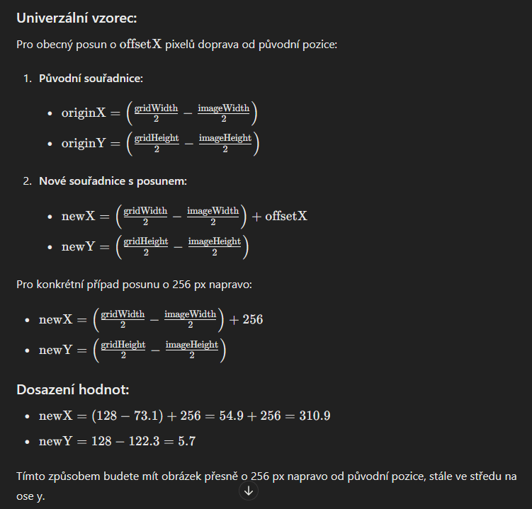
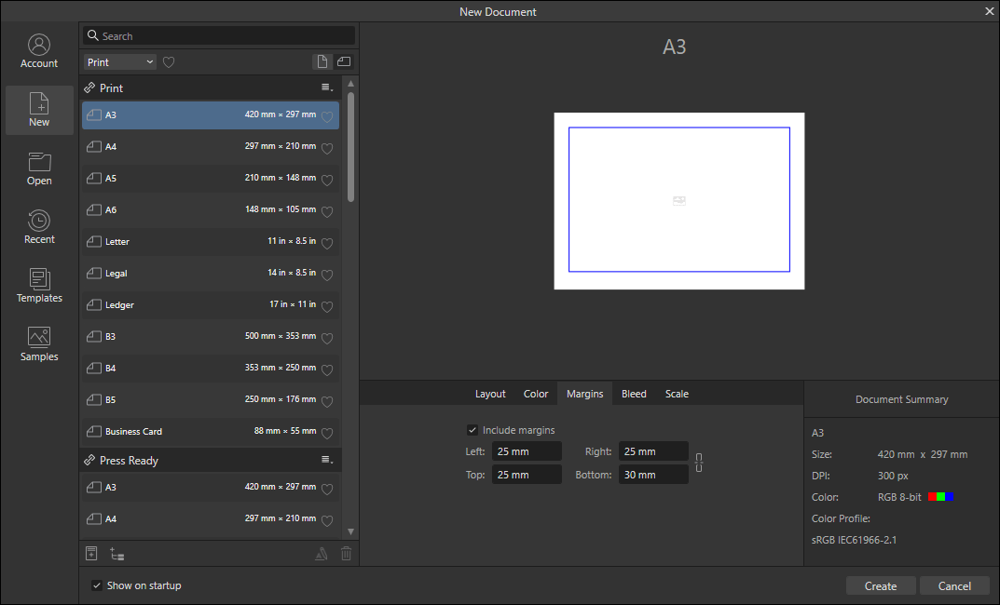
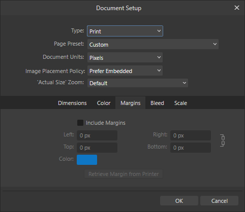

# Affinity – Mřížka a tipy

> Použití mřížky, výpočty zarovnání a řešení častých problémů v Affinity.

---

## Mřížka (Grid)

**Zobrazení a nastavení:**

1. **View → Show Grid** – zobrazí mřížku
2. **View → Grid and Axis…** – nastavení parametrů mřížky

---

## Výpočet zarovnání na střed

Příklad s hodnotami `gridWidth = 256 px`, `gridHeight = 256 px`, `offsetX = 256 px`:

---

## Řešení problémů

### Modrý čtverec uvnitř stránky

Modrý čtverec je způsoben aktivním odsazením (**Include margins**).

**Při vytváření nového dokumentu:**

**Pro již otevřený dokument:**

