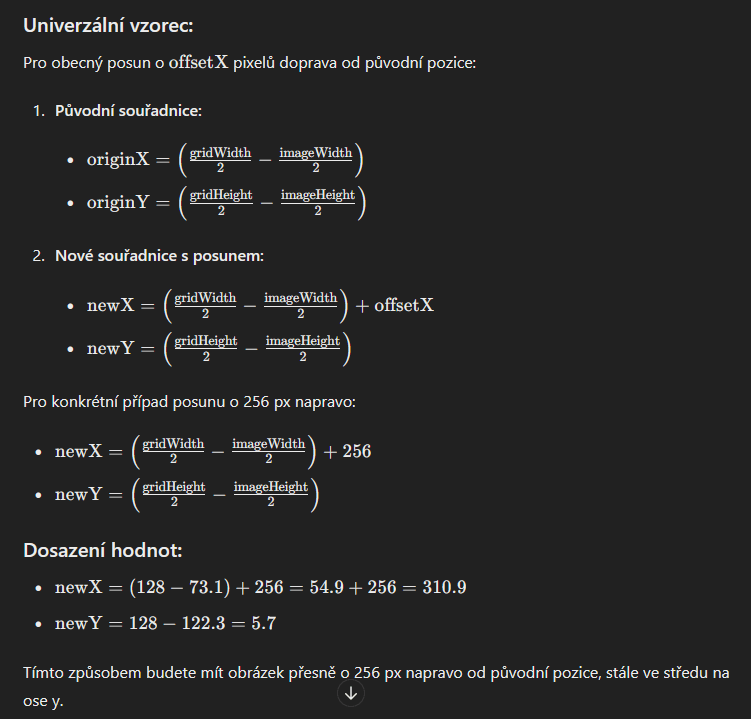
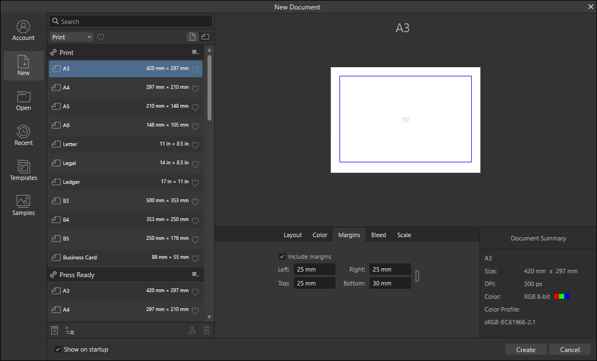
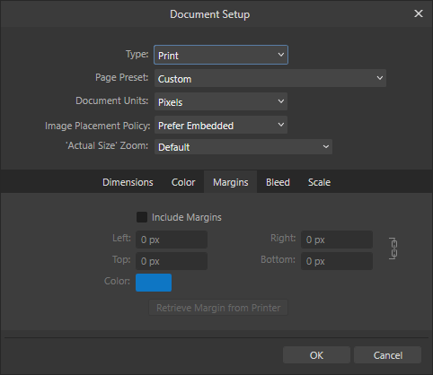

# Affinity Designer 2 – mřížka a okraje

Mřížka a okraje jsou pomocné čáry pro rozvržení dokumentu v Affinity Designeru 2 pro desktop.

## Mřížka (Grid)

**Zobrazení a nastavení:**

1. **View → Show Grid** – zobrazí mřížku
2. **View → Grid and Axis…** – nastavení parametrů mřížky

V režimu **Basic** nastav **Spacing** a **Divisions** podle požadovaného rozestupu a dělení. [Nastavení mřížky](https://affinity.help/designer2/en-US.lproj/pages/DesignAids/grids.html)

## Výpočet zarovnání na střed

Pro obdélník šířky `imageWidth` a výšky `imageHeight` je poloha jeho levého horního rohu ve středu oblasti dána následujícím vztahem.

```text
x = (gridWidth - imageWidth) / 2 + offsetX
y = (gridHeight - imageHeight) / 2
```

Odečtení rozměru obrázku rozdělí volné místo na obě strany a `offsetX` přidá posun doprava; pro posun doleva použij zápornou hodnotu.

Při oblasti `256 × 256 px`, obrázku `146,2 × 244,6 px` a posunu `256 px` vychází `x = 310,9 px` a `y = 5,7 px`.

V panelu Transform zvol referenční bod vlevo nahoře a stejnou souřadnicovou soustavu; při jiném bodu ukotvení mají X a Y jiný význam.



## Řešení problémů

### Modrý čtverec uvnitř stránky

Modrá obrysová čára může označovat okraje dokumentu; přepnutím **View → Show Margins** ověř, zda jde právě o tuto pomůcku.

Velikost okrajů upravíš v nastavení dokumentu; nejde o skutečný grafický objekt. [Okraje dokumentu](https://affinity.help/designer2/en-US.lproj/pages/DesignAids/margins.html)

**Při vytváření nového dokumentu:**



**Pro již otevřený dokument:**


