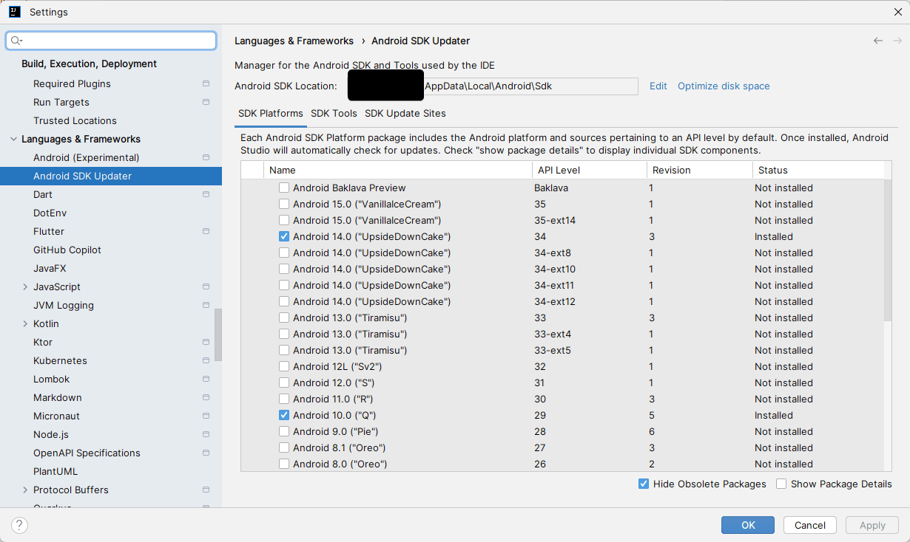

#### Propojení s mobilním zařízením

<details>
<summary><span style="color:#1E90FF;">Android</span></summary>

> [!IMPORTANT]
> Týká se těch, co mají CPU procesor od AMD
>
> Otevřít `BIOS` a najít konfiguraci pro CPU (advance settings) a změnit `SVM` na `Enabled`

1. Než začneme nastavovat Android SDK

    

    Umožňuje spravovat SDK uvnitř IDE a umožní následně i propojení s `Android Studio`

2. Nastavit Android SDK

    Uvnitř JetBrains IDE otevřete: `File` -> `Project Structure` -> `SDKs` -> `Project` a zde nastavíte SDK pro Android

    > [!TIP]
    > SDK pro android můžete stáhnout otevřením: `Android Studio` -> `More Actions` -> `SDK Manager`

3. Ověřte, že máte nainstalované základní komponenty pro práci v Androidu

    V sekci `SDK Tools` by měly být nainstalovány následující komponenty:
    
    | Komponenta                        | Popis                                                                 |
    |-----------------------------------|----------------------------------------------------------------------|
    | `Android SDK Built-Tools`         | Nástroje pro sestavení Android aplikací.                             |
    | `Android SDK Command-Line Tools`  | Příkazové nástroje pro správu Android SDK.                           |
    | `Android Emulator`                | Emulátor pro testování Android aplikací na různých zařízeních.       |
    | `Android Emulator hypervisor driver` | Ovladač pro zlepšení výkonu emulátoru na počítačích s Intel a AMD procesory. |
    | `Android SDK Platform-Tools`      | Nástroje pro komunikaci s Android zařízeními, jako je `adb`.         |

4. Nastavení AVD

   = AVD (Android Virtual Device) je emulátor, který umožňuje spouštět aplikace na různých zařízeních

   Přidat do proměnné prostředí: `C:\Users\<YourUsername>\AppData\Local\Android\Sdk\platform-tools`

   ADB (Android Debug Bridge) je nástroj, který umožňuje komunikaci mezi počítačem a Android zařízením

   - Nyní zkontrolujte, zda je emulátor správně nastavený

       <details>
       <summary><span style="color:#E95A84;">Zkontrolovat status emulátorů</span></summary>
       
       ```bash
       adb devices
       ```
       </details>
       
       <details>
       <summary><span style="color:#E95A84;">Restart ADB služby (v případě potřeby)</span></summary>
       
       ```bash
       adb kill-server
       adb start-server
       ```
       
       </details>    

5. Propojení s mobilním zařízením

   Otevřít `Android Studio` -> `More Actions` -> `Virtual Device Manager`

   Vytvořit nové virtuální zařízení a spustit

   Vybrat zařízení v JetBrains IDE, na kterém chcete aplikaci spustit a aplikaci spustit
</details>

#### XML komentáře

<details>
<summary><span style="color:#1E90FF;">Zalomení řádku</span></summary>

- Použijte:

  **`<para>&#160;</para>`**

  > [!WARNING]
  > `<para></para>` a `<br/>` nefungují pro zalomení řádku

  Příklad použití:

    ```c#
    /// <summary>
    ///     This sentence shows up when the type is hovered
    ///     <para>&#160;</para>
    ///     <para>int PrimaryKey</para>
    ///     <para>&#160;</para>
    ///     <para>virtual Relation Relation</para>
    /// </summary>
    ```

  Pro více
  informací: [XML zalomení komentáře](https://stackoverflow.com/questions/7279108/how-to-add-a-line-break-in-c-sharp-net-documentation)

</details>

#### Klávesové zkratky

<details>
<summary><span style="color:#1E90FF;">Parametry metody</span></summary>

- Informace o parametrech metody

  `Ctrl` + `Shift` + `Space`

</details>

<details>
<summary><span style="color:#1E90FF;">Procházení seznamu</span></summary>

- Vpřed

  `Ctrl` + `Shift` + `Space`

- Zpět

  `Ctrl` + `Shift` + `P`

</details>

#### Regulární výrazy

<details>
<summary><span style="color:#1E90FF;">Použití proměnné</span></summary>

Zkusíme naleznout proměnnou v textu, uložit ji do proměnné a následně použít k nahrazení.

<details>
<summary><span style="color:#E95A84;">Čiselná proměnná</span></summary>

Vyhledávání proměnné v textu:

```regex
<h2>(.*?)</h2>
```

Tento výraz vyhledá všechny nadpisy druhé úrovně a uloží je do proměnné.

Uložení do proměnné je možné pomocí závorek `()` a následně se na proměnnou odkazuje pomocí `$1`, `$2`, `$3` atd.


Nahrazení proměnné v textu:

```regex
<h2>Test $1</h2>
```

Tento výraz nahradí nalezené nadpisy druhé úrovně za nadpis `Test` a proměnnou, která byla uložena v prvním výrazu.
</details>

<details>
<summary><span style="color:#E95A84;">Pojmenovanná proměnná</span></summary>

Vyhledávání proměnné v textu:

```regex
<h2>(?<customName>.*?)</h2>
```

Tento výraz vyhledá všechny nadpisy druhé úrovně a uloží je do proměnné s názvem `customName`.

Uložení do proměnné je možné pomocí závorek `(?<customName>)` a následně se na proměnnou odkazuje pomocí `(?<customName>)`.

Nahrazení proměnné v textu:

```regex
<h2>Test ${customName}</h2>
```

Tento výraz nahradí nalezené nadpisy druhé úrovně za nadpis `Test` a proměnnou, která byla uložena v prvním výrazu.
</details>

</details>