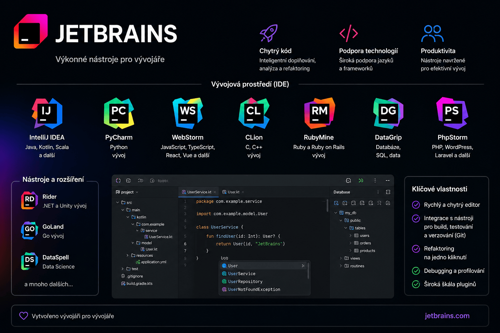

# JetBrains Rider – Tipy a nástroje

> Propojení s Androidem, XML komentáře, klávesové zkratky a regulární výrazy v JetBrains Rider.

---



## Propojení s mobilním zařízením (Android)

<details>
<summary>Kompletní postup nastavení Android emulátoru</summary>

1. **Nastavení BIOSu (AMD CPU)** – BIOS → CPU konfigurace → `SVM: Enabled`

2. **Správa Android SDK v Rideru** – `File → Project Structure → SDKs → Project` → nastav Android SDK.
   SDK lze stáhnout v Android Studio → `More Actions → SDK Manager`.

3. **Ověření základních komponent SDK** (sekce `SDK Tools`):

   | Komponenta | Popis |
   |------------|-------|
   | `Android SDK Built-Tools` | Sestavení aplikací |
   | `Android SDK Command-Line Tools` | Správa SDK |
   | `Android Emulator` | Testování aplikací |
   | `Android Emulator hypervisor driver` | Výkon emulátoru (Intel/AMD) |
   | `Android SDK Platform-Tools` | Komunikace s zařízeními (`adb`) |

4. **Nastavení proměnné prostředí:**
   `C:\Users\<YourUsername>\AppData\Local\Android\Sdk\platform-tools`

5. **Příkazy ADB:**

   ```bash
   # Stav emulátorů
   adb devices

   # Restart ADB služby
   adb kill-server
   adb start-server
   ```

6. **Spuštění** – Android Studio → `More Actions → Virtual Device Manager` → spusť virtuální zařízení → v Rideru vyber zařízení.

</details>

---

## XML komentáře

### Zalomení řádku

Pro zalomení řádku v XML dokumentačním komentáři použij `<para>&#160;</para>`:

```csharp
/// <summary>
///     Popis třídy nebo metody.
///     <para>&#160;</para>
///     <para>int PrimaryKey</para>
///     <para>&#160;</para>
///     <para>virtual Relation Relation</para>
/// </summary>
```

> [!WARNING]
> `<para></para>` ani `<br/>` pro zalomení řádku nefungují. Použij `<para>&#160;</para>`.

[Více informací (Stack Overflow)](https://stackoverflow.com/questions/7279108/how-to-add-a-line-break-in-c-sharp-net-documentation)

---

## Klávesové zkratky

| Akce | Zkratka |
|------|---------|
| Zobrazení informací o parametrech metody | `Ctrl` + `Shift` + `Space` |
| Procházení dopředu | `Ctrl` + `Shift` + `Space` |
| Procházení zpět | `Ctrl` + `Shift` + `P` |

---

## Regulární výrazy

### Číselná zachycená skupina

```regex
# Vyhledání
<h2>(.*?)</h2>

# Nahrazení
<h2>Test $1</h2>
```

### Pojmenovaná zachycená skupina

```regex
# Vyhledání
<h2>(?<customName>.*?)</h2>

# Nahrazení
<h2>Test ${customName}</h2>
```
