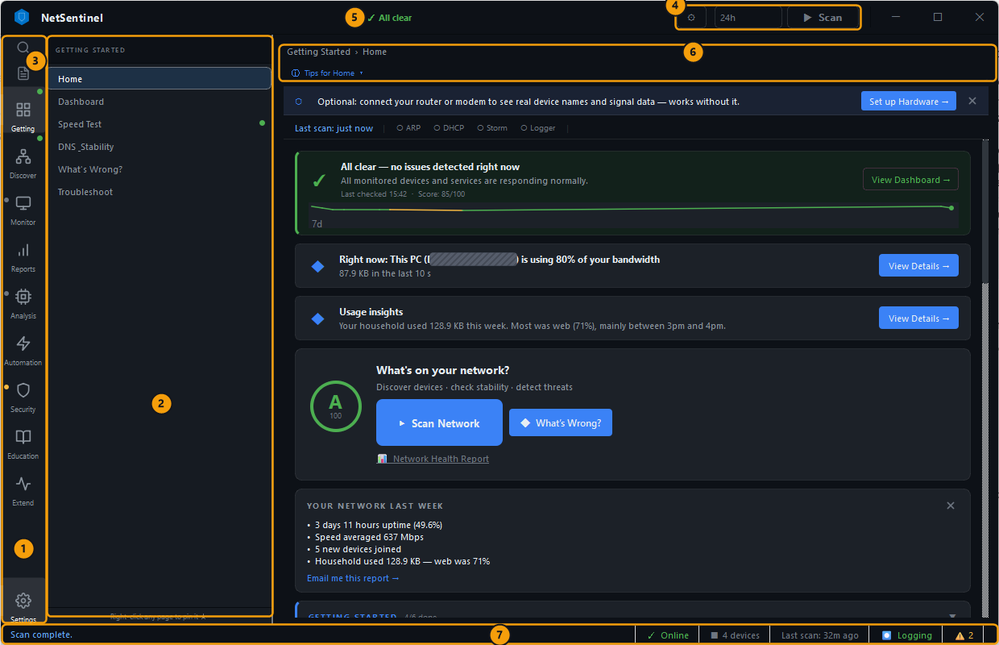
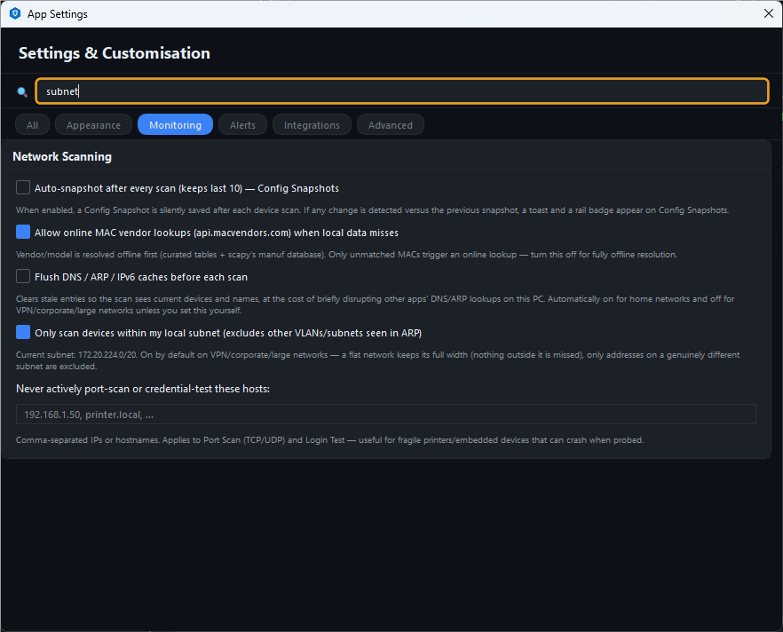

# NetSentinel – kontrola a sledování domácí sítě

**NetSentinel** je bezplatná desktopová aplikace, která ukáže zařízení v síti, kvalitu připojení a možné bezpečnostní problémy.

Hodí se pro domácí síť i malou kancelář a nepotřebuje účet ani vlastní server.

Návod odpovídá verzi **2.3.0** a je prakticky ověřený ve Windows 11.

## Vyber si podle cíle

| Chci | Začni zde |
|---|---|
| Poprvé zkontrolovat vlastní síť | [Základní kontrola sítě](netsentinel/basic-check.md) |
| Hlídat výpadky, změny a nová zařízení | [Sledování a automatizace](netsentinel/monitoring.md) |
| Prověřit porty, zranitelnosti nebo podezřelé chování | [Pokročilé kontroly](netsentinel/advanced-checks.md) |
| Odstranit nastavení, historii i uložená pověření | [Tovární reset](netsentinel/factory-reset.md) |
| Najít účel kterékoli ze 74 stránek | [Přehled všech funkcí](netsentinel/reference.md) |

## Než začneš

1. Připoj počítač k síti, kterou chceš kontrolovat.
2. Kontroluj jen vlastní síť nebo síť, k jejíž kontrole máš souhlas správce.
3. Nainstaluj NetSentinel z Microsoft Store, příkazem `winget install NetSentinel.NetSentinel` nebo instalátorem `NetSentinel-Setup-<verze>.exe` z [vydání na GitHubu](https://github.com/ossianericson/netsentinel/releases).
4. Ovladač [Npcap](https://npcap.com/) instaluj až pro funkce označené **Npcap**. Pro funkce označené **admin** spusť aplikaci přes **Spustit jako správce**.

Základní sken, seznam zařízení, známka sítě a běžná diagnostika fungují bez správce i bez Npcapu.

## První spuštění a orientace

Po spuštění zůstaň na **Getting Started → Home** a stiskni **Scan Network**.

Sken obvykle trvá jednu až dvě minuty. Průběh sleduj ve stavovém řádku dole; výsledek najdeš v **Discover → Devices**.

<figure class="docs-screenshot">
  
  <figcaption>Hlavní části okna. Kliknutím otevřeš snímek v plné velikosti.</figcaption>
</figure>

| Číslo | Část | Co v ní uděláš |
|---|---|---|
| 1 | Pruh sekcí | Vybereš skupinu nástrojů |
| 2 | Seznam stránek | Otevřeš konkrétní nástroj; pravým tlačítkem ho připneš |
| 3 | Hledání a nedávné | Přes `Ctrl+K` rychle najdeš stránku, zařízení nebo akci |
| 4 | Hlavička | Otevřeš nastavení, změníš čas grafů nebo spustíš úplný sken |
| 5 | Stav sítě | Kliknutím na souhrn otevřeš diagnostiku **What's Wrong?** |
| 6 | Obsah stránky | Provedeš kontrolu; panel **Tips** vysvětluje ovládání |
| 7 | Stavový řádek | Zkontroluješ průběh skenu, logger, počet zařízení a upozornění |

**Stav stránek:** zelená tečka označuje čerstvý výsledek, žlutá starší výsledek. Štítek **Npcap** vyžaduje ovladač Npcap a štítek **admin** spuštění aplikace jako správce.

## Doporučený postup

Při prvním použití postupuj v tomto pořadí:

1. **Getting Started → Home:** spusť úplný sken.
2. **Discover → Devices:** vysvětli si každé nalezené zařízení.
3. **Security Audit → Security Overview:** odliš čerstvé, staré a dosud neprovedené kontroly.
4. **Reports → Network Grade:** vytvoř výchozí známku sítě.
5. Teprve potom zapni [průběžné sledování](netsentinel/monitoring.md) nebo spusť vybranou [pokročilou kontrolu](netsentinel/advanced-checks.md).

Nespouštěj všechny bezpečnostní nástroje jen kvůli úplnosti. Vyber kontrolu podle konkrétní otázky a výsledek posuzuj spolu s časem posledního běhu.

## Kde co najdeš

| Potřeba | Sekce aplikace |
|---|---|
| Rychlý stav, rychlost, DNS a diagnostika | **Getting Started** |
| Zařízení, Wi-Fi, topologie a DHCP | **Discover** |
| Výpadky, provoz, spojení a historie | **Monitor** |
| Známka, reporty a upozornění | **Reports** |
| Diagnostika konkrétního problému | **Analysis** a **Security Audit** |
| Plánované běhy a integrace | **Automation** |
| Výuka, nápověda a hardwarové pluginy | **Education** a **Extend** |

Úplný seznam stránek je v [přehledu všech funkcí](netsentinel/reference.md).

## Nejdůležitější ovládání

| Zkratka nebo gesto | Akce |
|---|---|
| `Ctrl+K` nebo `Ctrl+F` | Najde stránku, zařízení nebo akci |
| `Ctrl+,` | Otevře nastavení |
| `Ctrl+L` | Otevře Network Logger |
| `Ctrl+Shift+H` | Otevře malé okno **Quick Check** |
| `Alt+2` až `Alt+5` | Otevře Devices, Speed Test, What's Wrong? nebo Network Logger |
| `Esc` | Zavře seznam stránek nebo paletu příkazů |
| `Ctrl+Q` | Skutečně ukončí aplikaci |
| Pravé tlačítko na zařízení | Nabídne sken portů, kopírování adres, Wake-on-LAN a další akce |

Ikona **?** na stránce otevře místní nápovědu. Nabídka **⚙︎ → About NetSentinel** ukáže nainstalovanou verzi.

## Nastavení, která zkontroluj

Nastavení otevři přes **Settings**, **⚙︎ → App Settings…** nebo `Ctrl+,`.

<figure class="docs-screenshot">
  
  <figcaption>Vyhledávání nastavení zkrátí cestu ke konkrétní volbě.</figcaption>
</figure>

Do pole **Search settings…** napiš část názvu volby, například `subnet`.

| Karta | Volba | Kdy ji změnit |
|---|---|---|
| **Network Scanning** | **Only scan devices within my local subnet** | Vypni, pokud **Current subnet** ukazuje WSL, Hyper-V nebo VPN místo sítě routeru |
| **Network Scanning** | **Allow online MAC vendor lookups** | Vypni, pokud nechceš odesílat MAC adresy internetové službě |
| **Network Scanning** | **Never actively port-scan or credential-test these hosts** | Přidej tiskárny a jiná křehká zařízení |
| **System Tray &amp; Startup** | Automatické spuštění a minimalizace do oznamovací oblasti | Zapni pro dlouhodobé sledování |
| **Maintenance** | **Export settings (JSON)** a **Export All Data (ZIP)** | Použij před migrací nebo resetem |
| **Danger Zone** | **Reset all settings to defaults** | Maže jen nastavení; nemaže databázi ani uložená pověření |

## Běh na pozadí a ukončení

Křížek vpravo nahoře může okno pouze skrýt do oznamovací oblasti. Logger, monitory a plánované skeny pak běží dál.

Aplikaci ukonči přes **⚙︎ → Quit NetSentinel** nebo `Ctrl+Q`.

Plánovač je součást aplikace, nikoli služba Windows. Po skutečném ukončení se zastaví.

## Data, soukromí a reset

| Data | Výchozí umístění ve Windows |
|---|---|
| Databáze, logy, pravidla, pluginy a další stav aplikace | `%LOCALAPPDATA%\NetSentinel` |
| Databáze instalované verze | `%LOCALAPPDATA%\NetSentinel\NetSentinel.db` |
| Nastavení | `HKCU\Software\NetSentinel\NetSentinel` |
| Hesla a tokeny integrací | Správce pověření Windows, záznamy začínající `NetSentinel` |
| CSV loggeru, reporty a základny zařízení | `%USERPROFILE%\Documents\NetSentinel` |
| Automatické reporty | `%USERPROFILE%\NetSentinel-Reports` |

Přenosná nebo vývojová verze může uložit `NetSentinel.db` vedle spustitelného souboru, pokud je tato složka zapisovatelná.

Vestavěné **Reset all settings to defaults** není úplný reset. Pro čisté spuštění bez staré historie použij [postup návratu do továrního stavu](netsentinel/factory-reset.md).

Před sdílením snímku, reportu nebo logu zakryj veřejnou IP adresu, MAC adresy, názvy zařízení a jméno poskytovatele.

Zdroje: [NetSentinel na GitHubu](https://github.com/ossianericson/netsentinel), [přehled funkcí verze 2.3.0](https://github.com/ossianericson/netsentinel/blob/v2.3.0/docs/feature-reference.md), [Npcap](https://npcap.com/).
