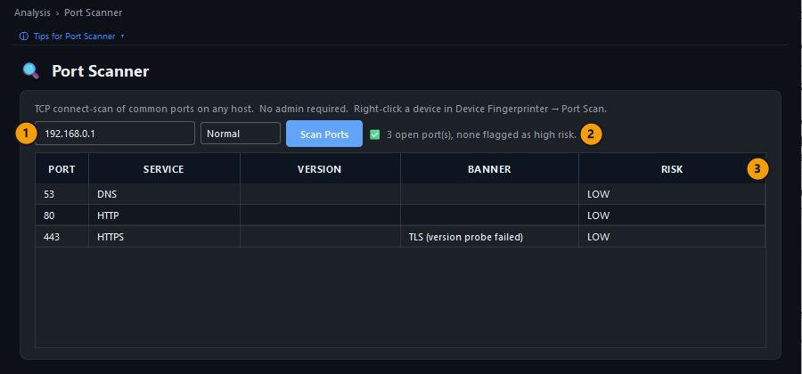
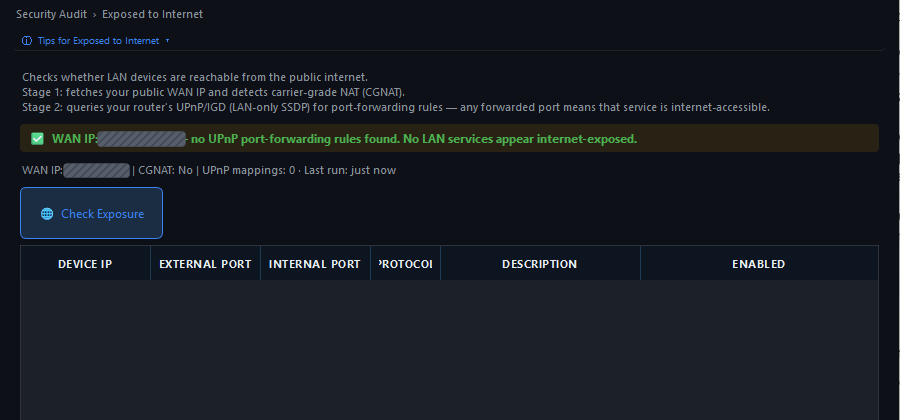
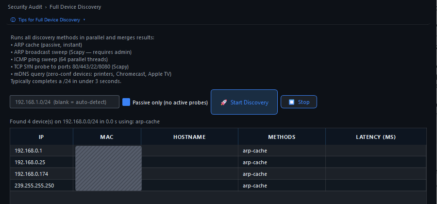
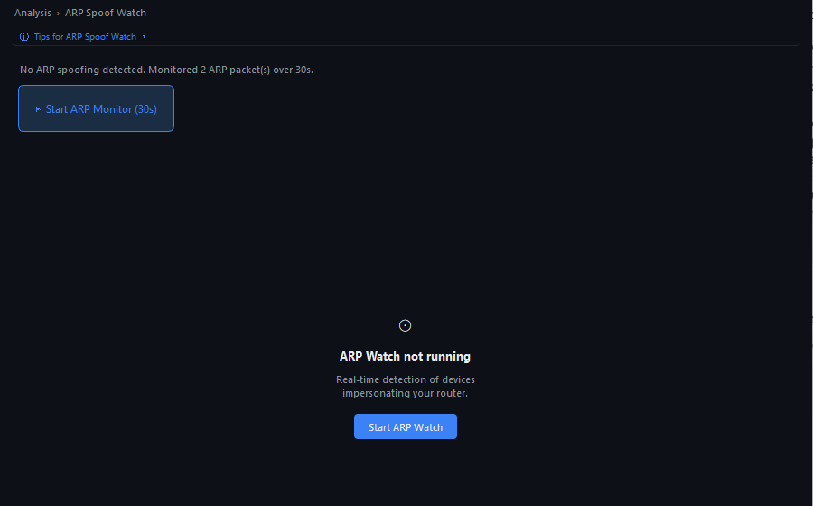
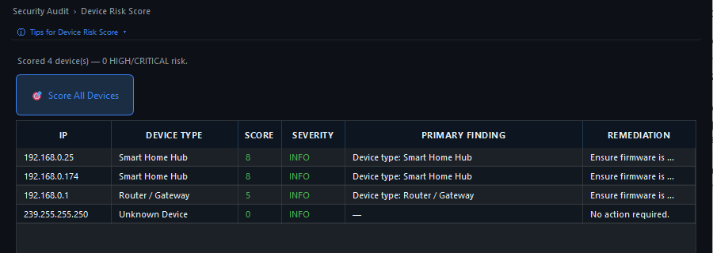
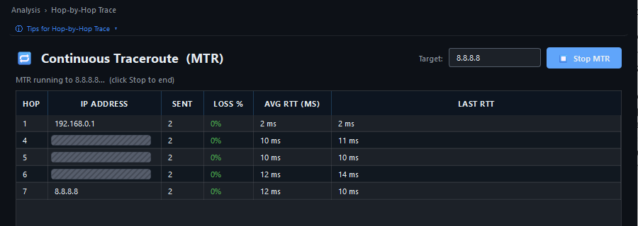

# NetSentinel – pokročilé kontroly

Pokročilé kontroly navazují na [základní kontrolu sítě](basic-check.md).

Nespouštěj je všechny najednou, vyber si tu, která odpovídá na tvou otázku.

## Vyber kontrolu podle otázky

| Potřebuji zjistit | Stránka | Vyžaduje |
|---|---|---|
| Které porty má zařízení otevřené | **Analysis → Port Scanner** | nic |
| Podrobný SYN nebo UDP sken portů | **Security Audit → Port Scan (TCP)** a **Port Scan (UDP)** | správce a Npcap |
| Zda mají služby známé zranitelnosti | **Security Audit → CVE Lookup** a **CVE Tracker** | verze služeb z předchozího skenu |
| Zda je něco dostupné z internetu | **Security Audit → Exposed to Internet** | nic |
| Proč chybí zařízení | **Security Audit → Full Device Discovery** | správce pro aktivní režim |
| Zda se někdo nevydává za router | **Analysis → ARP Spoof Watch** | Npcap |
| Zda v síti není cizí DHCP server | **Security Audit → DHCP Rogue Monitor** | správce a Npcap |
| Která zařízení jsou riziková | **Security Audit → Device Risk Score** a **Threat Intel** | nic |
| Kde po cestě k serveru vzniká zpoždění | **Analysis → Hop-by-Hop Trace** a **Service Diagnostics** | nic |
| Co je společnou příčinou potíží | **Analysis → Root Cause Correlator** | alespoň jeden sken |
| Zda síť zahlcuje broadcast nebo smyčka | **Analysis → Broadcast Storm** a **Rogue Bridge (STP)** | správce a Npcap |

## Před použitím

1. Kontroluj jen vlastní síť nebo síť se souhlasem správce, aktivní skeny cizích zařízení mohou být nezákonné.
2. Pro stránky se štítkem **admin** zavři NetSentinel a spusť ho znovu pravým tlačítkem přes **Spustit jako správce**.
3. Pro stránky se štítkem **Npcap** nainstaluj [Npcap](https://npcap.com/) a při instalaci ponech výchozí volby.
4. Křehká zařízení, například tiskárny, zapiš v nastavení do pole **Never actively port-scan or credential-test these hosts**.
5. Cílovou IP adresu opisuj ze stránky **Discover → Devices**.

Prázdná tabulka nebo hláška o chybějícím oprávnění není čistý výsledek, ale neprovedená kontrola.

Pro jednu otázku obvykle stačí jedna část článku. Po jejím dokončení přejdi rovnou na [uzavření kontroly](#jak-kontrolu-uzavřít).

## Otevřené porty

Otevřený port znamená službu, která na zařízení odpovídá, nikoli automaticky zranitelnost.

## [Bez oprávnění správce](#tab/port-scanner)

1. Otevři **Analysis → Port Scanner**.
2. Do pole zadej IP adresu jednoho zařízení, například routeru `192.168.0.1`.
3. Ponech režim **Normal** a stiskni **Scan Ports**.

<figure class="docs-screenshot">
  
  <figcaption>Port Scanner: cílová adresa, režim a nalezené služby.</figcaption>
</figure>

| Číslo | Co sledovat |
|---|---|
| 1 | Pole s cílovou adresou a režim skenu **Normal**, **Fast** nebo **Low Impact** pro křehká zařízení |
| 2 | Souhrn vedle tlačítka, například **3 open port(s), none flagged as high risk** |
| 3 | Tabulka s portem, službou, případnou verzí, bannerem a rizikem |

Stejný sken spustíš i pravým tlačítkem na řádek v **Devices → Port Scan**.

## [Se správcem a Npcap](#tab/syn-scan)

1. Otevři **Security Audit → Port Scan (TCP)**.
2. Zadej cílovou adresu, rychlost v paketech za sekundu a rozsah portů, výchozí je **Top 1000 ports**.
3. Stiskni **SYN Scan** a počkej na dokončení, u jednoho zařízení jde o desítky sekund.
4. Pro služby na UDP použij **Security Audit → Port Scan (UDP)**, kde chybějící odpověď znamená otevřený nebo filtrovaný port.

Nálezy se automaticky propíší do **Security Overview**.

***

## Zranitelnosti služeb

1. Nejdříve spusť některý sken portů, aby aplikace znala verze služeb.
2. Otevři **Security Audit → CVE Lookup** a stiskni **Lookup CVEs**.
3. Pokud sken verzi nezjistil, zapiš ji ručně, například `OpenSSH 8.9p1`, a vyhledávání zopakuj.
4. Nalezené záznamy sleduj na stránce **Security Audit → CVE Tracker**, kde je označíš jako opravené nebo přijaté.

Hláška **No service versions found** znamená, že sken žádnou verzi nezachytil, nikoli že zařízení nemá zranitelnosti.

Vyhledávání používá databázi NVD přes internet.

## Dostupnost z internetu

1. Otevři **Security Audit → Exposed to Internet**.
2. Stiskni **Check Exposure**.

<figure class="docs-screenshot">
  
  <figcaption>Exposed to Internet zkontroluje veřejnou adresu, CGNAT a pravidla UPnP.</figcaption>
</figure>

Zelený pruh **no UPnP port-forwarding rules found** znamená, že router nehlásí žádné automatické přesměrování portů.

Kontrola čte veřejnou adresu, detekci CGNAT a pravidla UPnP, nevidí však ruční přesměrování, DMZ ani vzdálenou správu routeru.

Tyto volby zkontroluj přímo v administraci routeru.

## Chybí zařízení

1. Otevři **Security Audit → Full Device Discovery**.
2. Pro první pokus zaškrtni **Passive only (no active probes)**, aplikace pak jen přečte ARP cache.
3. Stiskni **Start Discovery**.

<figure class="docs-screenshot">
  
  <figcaption>Pasivní režim Full Device Discovery pouze čte dostupné síťové tabulky.</figcaption>
</figure>

Bez zaškrtnutí a se správcem přidá aktivní ARP a ICMP sweep, TCP SYN sondy a mDNS dotaz, které najdou i zařízení, jež na běžný ping neodpovídají.

## Podvržený router

Podvržení ARP znamená, že cizí zařízení odpovídá na dotazy místo routeru a čte provoz.

1. Otevři **Analysis → ARP Spoof Watch**.
2. Stiskni **Start ARP Monitor (30s)** a během půl minuty síť běžně používej.

<figure class="docs-screenshot">
  
  <figcaption>Výsledek ARP kontroly je průkazný až po zachycení paketů.</figcaption>
</figure>

Výsledek **No ARP spoofing detected. Monitored 2 ARP packet(s)** je čistý jen s nenulovým počtem paketů.

Tlačítko **Start ARP Watch** spustí trvalé sledování, které běží, dokud ho nezastavíš.

## Cizí DHCP server

1. Spusť NetSentinel jako správce.
2. Otevři **Security Audit → DHCP Rogue Monitor** a stiskni **Send DHCP Discover**.
3. V tabulce má být jediný server, tvůj router, se sloupcem **Rogue?** prázdným.

Bez správce stránka vypíše **No DHCP offers received in scan window — try running as Administrator with Npcap**.

Stránka **Discover → DHCP Leases** ukazuje přidělené adresy, na Windows odvozené z ARP cache, a sloupec **DHCP Server** u každé z nich.

## Riziko zařízení a hrozby

1. Otevři **Security Audit → Device Risk Score** a stiskni **Score All Devices**.

<figure class="docs-screenshot">
  
  <figcaption>Device Risk Score řadí zařízení podle nálezů a navrhuje nápravu.</figcaption>
</figure>

Skóre roste s otevřenými porty, stářím systému, počtem CVE a rizikovým výrobcem, sloupec **Remediation** navrhuje nápravu.

2. Otevři **Security Audit → Threat Intel** a stiskni **Update Feeds**, aplikace stáhne seznamy známých škodlivých adres.
3. Do pole **Manual IP Lookup** zadej adresu, kterou chceš prověřit, a stiskni **Check IP**.

Shoda znamená, že zařízení komunikovalo s adresou vedenou jako škodlivá, a je důvodem zařízení prověřit.

## Cesta k serveru a pomalé služby

| Stránka | Postup | Co ukáže |
|---|---|---|
| **Analysis → Hop-by-Hop Trace** | Zadej cíl, například `8.8.8.8`, stiskni **Start MTR** a po minutě **Stop MTR** | Každý směrovač po cestě, ztrátu paketů a odezvu, takže poznáš, zda zpoždění vzniká doma nebo u poskytovatele |
| **Analysis → Service Diagnostics** | Vyber službu, například streamovací, a stiskni **Run Diagnostics** | Vrstvy DNS, dostupnost, latence a cesta s verdiktem, kde selhání vzniká |
| **Analysis → Root Cause Correlator** | Po skenu stiskni **Analyse Root Cause Now** | Jednu společnou příčinu potíží sestavenou ze všech nálezů |

<figure class="docs-screenshot">
  
  <figcaption>Continuous Traceroute ukáže ztrátu a odezvu na jednotlivých skocích.</figcaption>
</figure>

## Bouře, smyčky a bezdrátový provoz

Tyto kontroly zachytávají pakety, proto potřebují správce a Npcap.

| Stránka | Kdy použít | Postup |
|---|---|---|
| **Analysis → Broadcast Storm** | Síť je nárazově pomalá pro všechna zařízení | **Start Broadcast Capture** měří broadcast a multicast a určí zdroj |
| **Analysis → Rogue Bridge (STP)** | Připojení pravidelně na 30 až 45 sekund vypadává | **Start STP Capture** najde zařízení, které se prohlašuje za kořenový most |
| **Analysis → IoT Behaviour** | Chceš zachytit neobvyklé chování chytrých zařízení | **Learn Normal Behaviour** naučí běžný provoz, **Start Anomaly Monitor** hlásí odchylky |
| **Analysis → 802.11 Monitor** | Hledáš skryté SSID nebo deautentizační útoky | Vyber bezdrátové rozhraní s podporou monitor mode a stiskni **Start Capture** |

## Další bezpečnostní nástroje

| Stránka | K čemu slouží | Vyžaduje |
|---|---|---|
| **TLS &amp; Exposure** | Hlídá platnost certifikátů zadaných hostů a upozorní 30 dní před vypršením | nic |
| **Login Test** | Přihlásí se přes SSH vlastními údaji a sepíše balíčky, služby, uživatele a otevřené porty | správce a přístup SSH |
| **OS Detection** | Odhadne operační systém zařízení podle chování TCP/IP | správce |
| **Windows Shares (SMB)** | Vypíše sdílené složky a uživatele zařízení Windows nebo NAS | nic, s údaji více detailů |
| **Recon Plugins** | Spustí vlastní kontroly v Pythonu ze složky `plugins` | nic |
| **Private Endpoint Check** | Ověří, že firemní privátní endpointy míří na privátní adresy a mají platný certifikát | nic |
| **Cloud Metadata Probe** | Zjistí, zda počítač běží v cloudu a zda někdo neproxyuje metadata `169.254.169.254` | nic |

## Jak kontrolu uzavřít

Ke každé provedené kontrole si zapiš datum, cíl, výsledek a případnou nápravu.

Nález ověř ještě v nastavení zařízení nebo routeru, protože samotný otevřený port ani shoda v databázi nejsou důkazem útoku.

Souhrn všech kontrol včetně jejich stáří najdeš v **Security Audit → Security Overview** a tlačítko **Copy as Markdown** pod tabulkou zkopíruje stav do schránky.
