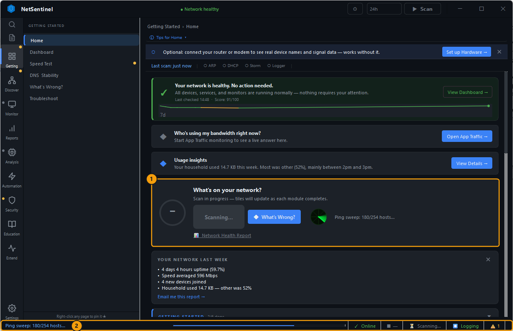
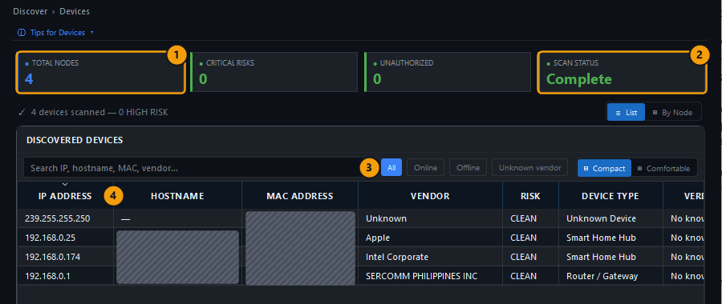
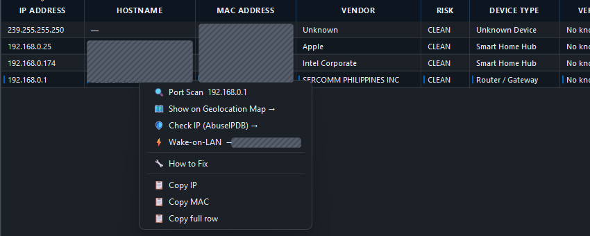
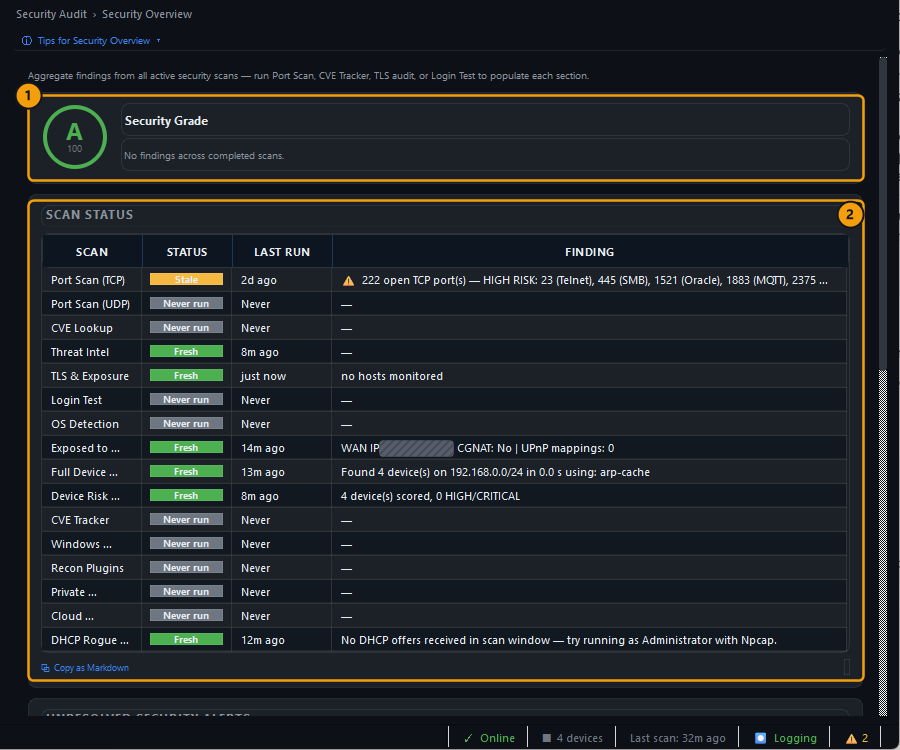
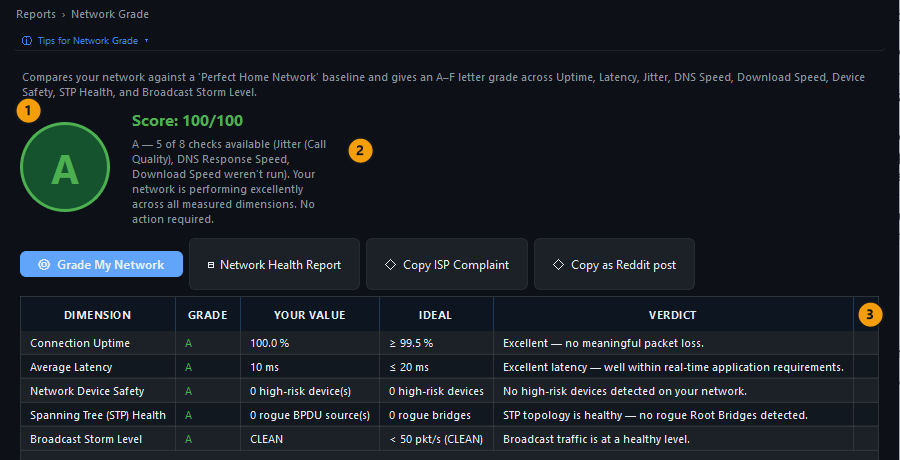
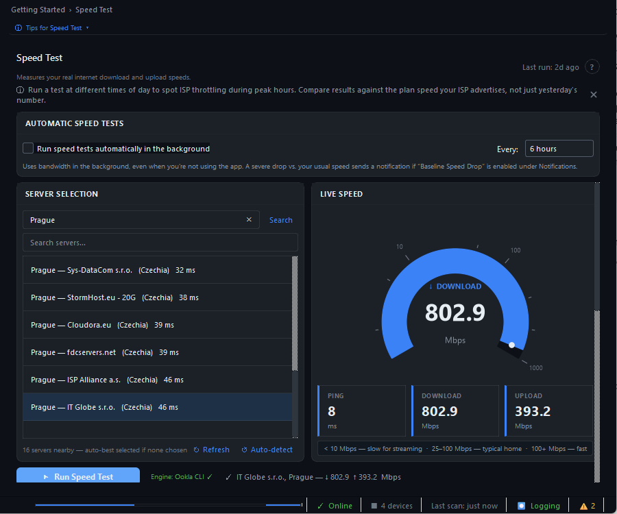
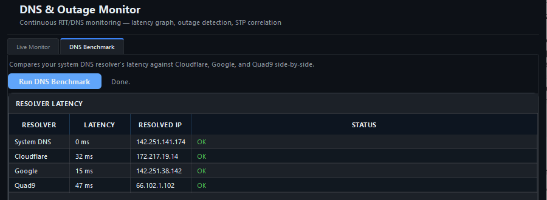
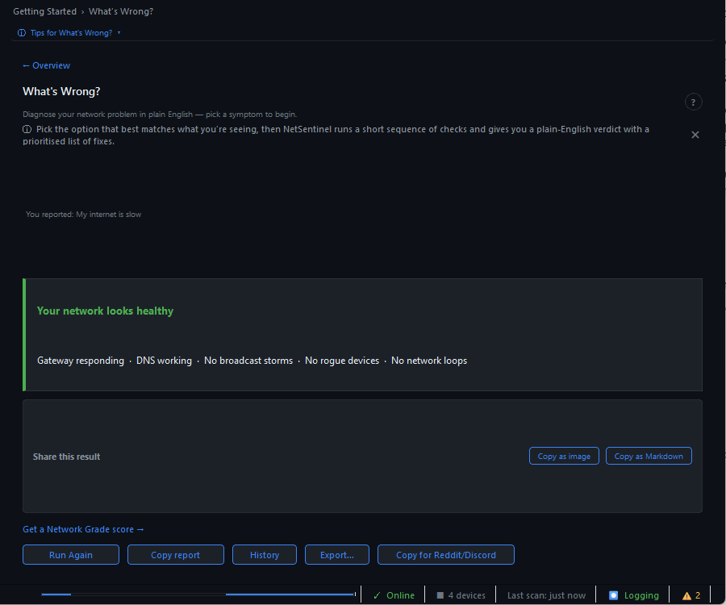
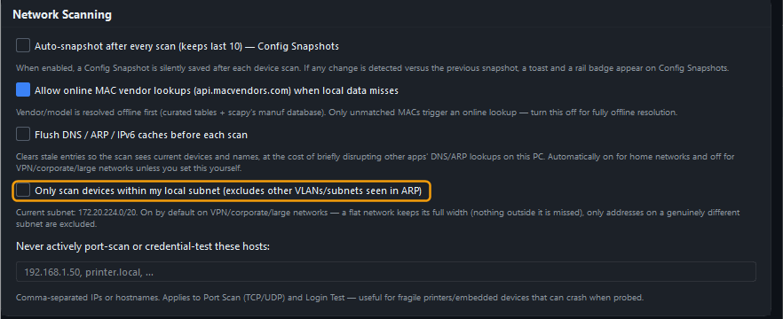

# NetSentinel – základní kontrola sítě

Základní kontrola odpoví na tři otázky: co je v síti připojené, zda je připojení v pořádku a zda bezpečnostní kontroly něco našly.

Zabere přibližně deset minut a nepotřebuje oprávnění správce ani Npcap.

Orientaci v okně a nastavení popisuje [přehled aplikace](../netsentinel.md).

Postupuj shora dolů. Pokud řešíš jen výpadek nebo pomalý internet, můžeš po skenu přejít rovnou na [rychlost a stabilitu](#5-změř-rychlost-a-stabilitu) nebo [diagnostiku](#6-když-internet-zlobí).

## Před použitím

1. Připoj počítač k síti, kterou kontroluješ, nejlépe stejnou Wi-Fi nebo kabelem jako ostatní zařízení.
2. Zapni zařízení, která chceš v seznamu vidět, například telefon, tiskárnu nebo síťové úložiště.
3. Pokud používáš VPN, dočasně ji odpoj, jinak sken uvidí síť VPN místo domácí.
4. Spusť NetSentinel a počkej na domovskou stránku **Getting Started → Home**.

## 1. Spusť sken sítě

Na domovské stránce stiskni **Scan Network**, nebo použij tlačítko **Scan** v hlavičce, které je dostupné z každé stránky.

<figure class="docs-screenshot">
  
  <figcaption>Průběh skenu je vidět na kartě i ve stavovém řádku.</figcaption>
</figure>

| Číslo | Co sledovat |
|---|---|
| 1 | Karta **What's on your network?** ukazuje tlačítko **Scanning…** a právě běžící krok, například **Ping sweep: 180/254 hosts** |
| 2 | Stavový řádek dole ukazuje průběh a po dokončení text **Scan complete.** |

Sken obvykle trvá jednu až dvě minuty a postupně hledá zařízení, čte síťové tabulky a provádí základní kontroly připojení.

Pokud se ti tlačítko **Scan** zdá bez odezvy, sleduj stavový řádek, který průběh vypisuje.

## 2. Zkontroluj nalezená zařízení

Otevři **Discover → Devices**.

<figure class="docs-screenshot">
  
  <figcaption>Seznam zařízení po dokončeném skenu.</figcaption>
</figure>

| Číslo | Co sledovat |
|---|---|
| 1 | **Total Nodes** je počet nalezených zařízení, **Critical Risks** a **Unauthorized** mají být `0` |
| 2 | **Scan Status** musí být **Complete**, jinak sken ještě běží nebo neproběhl |
| 3 | Přepínače **All**, **Online**, **Offline** a **Unknown vendor** filtrují tabulku, **Compact** a **Comfortable** mění výšku řádků |
| 4 | Sloupce **IP Address**, **Hostname**, **MAC Address**, **Vendor**, **Risk** a **Device Type** popisují každé zařízení |

Projdi tabulku a ke každému řádku si řekni, jaké zařízení to je.

| Co vidíš | Jak to číst |
|---|---|
| **Router / Gateway** ve sloupci Device Type | Tvůj router, obvykle s adresou končící `.1` |
| **Unknown** ve sloupci Vendor | Výrobce se nepodařilo určit z MAC adresy, zařízení nemusí být cizí |
| Adresa `239.255.255.250` | Není zařízení, ale skupinová adresa protokolu SSDP, kterou používají Windows i chytrá zařízení k hledání služeb |
| Zařízení, které nepoznáváš | Porovnej MAC adresu se seznamem klientů v administraci routeru a se štítky na zařízeních |

Pravým tlačítkem na řádek otevřeš nabídku **Port Scan**, **Wake-on-LAN**, **How to Fix**, **Copy IP** a **Copy MAC**.

<figure class="docs-screenshot docs-screenshot--medium">
  
  <figcaption>Další akce otevřeš pravým tlačítkem na zařízení.</figcaption>
</figure>

Po skenu se u nového zařízení objeví vpravo dole oznámení **New device** s tlačítkem **Name it**, kterým zařízení pojmenuješ.

## 3. Přečti bezpečnostní přehled

Otevři **Security Audit → Security Overview**.

<figure class="docs-screenshot">
  
  <figcaption>Bezpečnostní přehled rozlišuje čerstvé, staré a dosud neprovedené kontroly.</figcaption>
</figure>

| Číslo | Co sledovat |
|---|---|
| 1 | **Security Grade** shrnuje pouze kontroly, které už proběhly |
| 2 | Tabulka **Scan Status** má u každé kontroly stav, čas posledního běhu a nález |

| Stav | Význam | Co udělat |
|---|---|---|
| **Fresh** | Výsledek je aktuální | Přečti sloupec **Finding** |
| **Stale** | Výsledek je starší | Kontrolu spusť znovu, než z ní uděláš závěr |
| **Never run** | Kontrola ještě neběžela | Spusť ji podle [pokročilých kontrol](advanced-checks.md), pokud tě její oblast zajímá |

Známka **A** se stavy **Never run** znamená jen to, že dosud provedené kontroly nic nenašly.

Níže na stránce jsou přepínače **Scheduled Posture Scans**, kterými zapneš noční sken portů, kontrolu CVE, týdenní kontrolu dostupnosti z internetu a sledování ARP a DHCP na pozadí.

## 4. Oznámkuj síť

Otevři **Reports → Network Grade** a stiskni **Grade My Network**.

<figure class="docs-screenshot">
  
  <figcaption>Známka vychází jen z kontrol, pro které už má NetSentinel data.</figcaption>
</figure>

| Číslo | Co sledovat |
|---|---|
| 1 | Známka **A** až **F** a skóre porovnané s ideální domácí sítí |
| 2 | Text **5 of 8 checks available** říká, kolik dimenzí mělo data. Chybějící dimenze doplní **Speed Test** a **DNS &amp; Stability** |
| 3 | Tabulka s dimenzemi **Uptime**, **Latency**, **Device Safety**, **STP Health** a **Broadcast Storm Level**, jejich hodnotou, ideálem a verdiktem |

Tlačítka **Network Health Report**, **Copy ISP Complaint** a **Copy as Reddit post** připraví report nebo text pro poskytovatele internetu.

## 5. Změř rychlost a stabilitu

Otevři **Getting Started → Speed Test**, nech vybraný nejbližší server a stiskni **Run Speed Test**.

Porovnej **Download** a **Upload** s rychlostí, kterou máš u poskytovatele sjednanou.

Stránka **Getting Started → DNS &amp; Stability** ukazuje v záložce **Live Monitor** graf odezvy routeru a DNS a v záložce **DNS Benchmark** po stisknutí **Run DNS Benchmark** porovná tvůj DNS resolver s Cloudflare, Google a Quad9.

  <figure class="docs-screenshot">
    
    <figcaption>Speed Test: rychlost a ping.</figcaption>
  </figure>
  <figure class="docs-screenshot">
    
    <figcaption>DNS Benchmark: porovnání resolverů.</figcaption>
  </figure>

## 6. Když internet zlobí

Otevři **Getting Started → What's Wrong?**, vyber dlaždici s příznakem, například **My internet is slow**, a stiskni **Run Diagnosis**.

<figure class="docs-screenshot">
  
  <figcaption>Diagnostika shrne výsledek a nabídne další postup.</figcaption>
</figure>

Za půl minuty dostaneš verdikt s vysvětlením, například **Your network looks healthy**, nebo seznam kroků k nápravě.

Tlačítko **Quick test: Is this my ISP or my router?** rozliší, zda je problém u poskytovatele, nebo doma.

Stránka **Troubleshoot** nabízí stejné příznaky jako rozcestník s odkazy na správný nástroj.

## Ověření výsledku

Kontrola je hotová, když platí všechny body:

- stavový řádek ukázal **Scan complete.** a **Scan Status** je **Complete**,
- v **Devices** je router a všechna zapnutá zařízení, která znáš,
- **Critical Risks** a **Unauthorized** jsou `0` a každé neznámé zařízení jsi vysvětlil,
- v **Security Overview** nemá žádná kontrola se stavem **Fresh** vážný nález,
- **Network Grade** odpovídá tvému očekávání a rychlost odpovídá tarifu.

Pro opakovanou kontrolu zapni **Automation → Scheduled Scans** nebo upozornění na nová zařízení podle [sledování a automatizace](monitoring.md).

## Časté problémy

### Sken skončil s nula zařízeními

NetSentinel omezuje sken na místní podsíť, kterou určí jako nejširší z lokálních adaptérů.

Na počítači s WSL, Hyper-V, Dockerem nebo VPN to bývá virtuální adaptér, například `172.20.224.0/20`, a domácí síť `192.168.0.0/24` se vyloučí.

1. Otevři nastavení, do pole **Search settings…** napiš `subnet` a podívej se na text **Current subnet** v kartě **Network Scanning**.
2. Pokud neodpovídá tvému routeru, vypni **Only scan devices within my local subnet**.
3. Spusť sken dvakrát, protože první sken po změně ještě může použít starý rozsah.

<figure class="docs-screenshot">
  
  <figcaption>Při chybném rozsahu zkontroluj Current subnet a omezení na místní podsíť.</figcaption>
</figure>

Volba zůstane vypnutá, dokud ji znovu nezapneš, a na domácí síti nic nevynechá.

### Chybí zařízení, které je zapnuté

Zařízení v režimu spánku nebo v síti pro hosty na ping neodpovídá.

Spusť **Security Audit → Full Device Discovery** se zaškrtnutým **Passive only (no active probes)** podle [pokročilých kontrol](advanced-checks.md#chybí-zařízení), nebo zařízení krátce použij a sken zopakuj.

### Pruh Corporate network detected

Pruh se objeví, když DHCP přidělí doménovou příponu, například název routeru poskytovatele.

Aplikace pak ve výchozím stavu omezuje sken na místní podsíť, nepromazává DNS a ARP cache a zpomaluje SYN sken.

Na domácí síti pruh zavři křížkem a podle předchozího bodu zkontroluj **Current subnet**.

### Wi-Fi Networks ukazuje nula sítí

Windows 11 vyžaduje pro výpis Wi-Fi sítí zapnuté určování polohy.

Zapni **Nastavení → Soukromí a zabezpečení → Poloha** včetně přístupu pro desktopové aplikace a sken zopakuj.

### Známka má méně než osm kontrol

**Network Grade** hodnotí jen dimenze, které mají data.

Spusť **Speed Test** a nech pár minut běžet **DNS &amp; Stability**, potom známku spočítej znovu.
