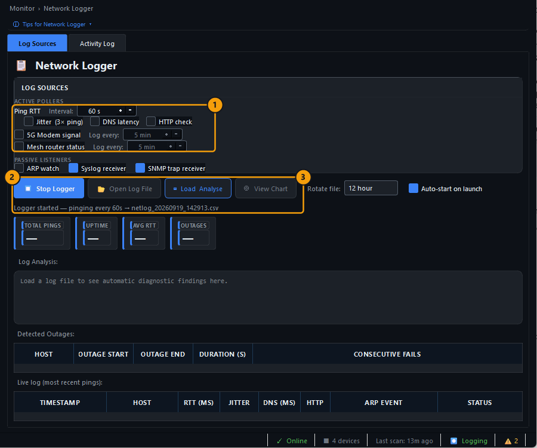
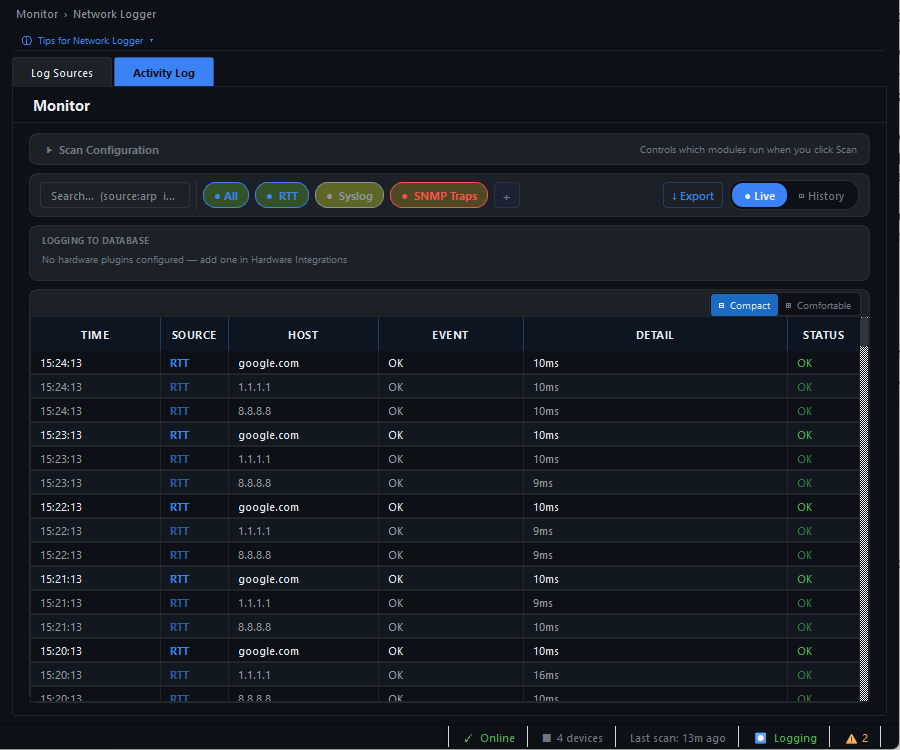
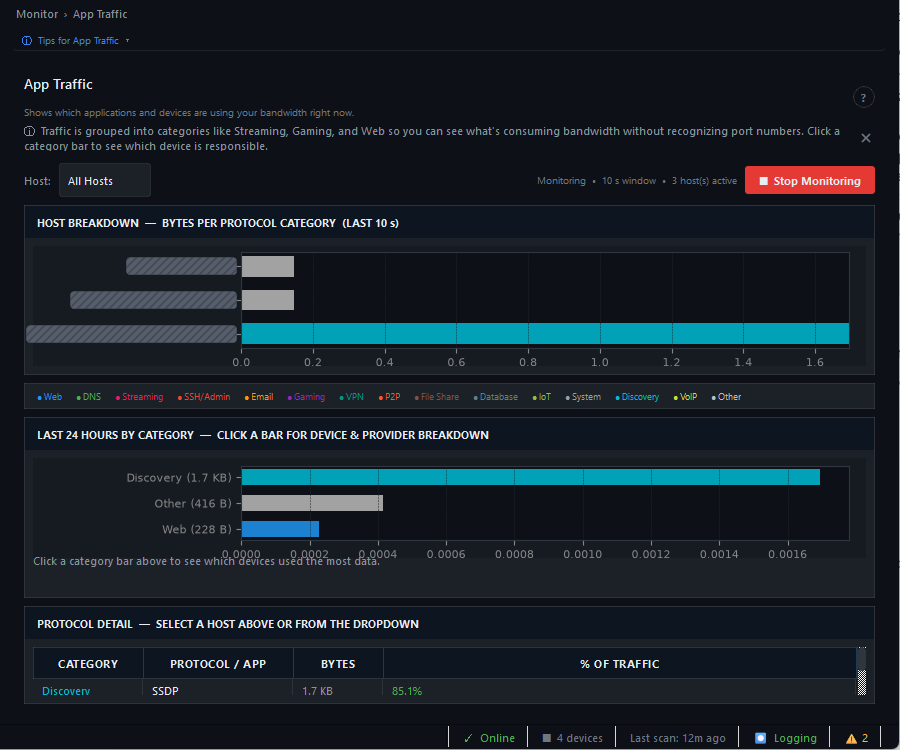
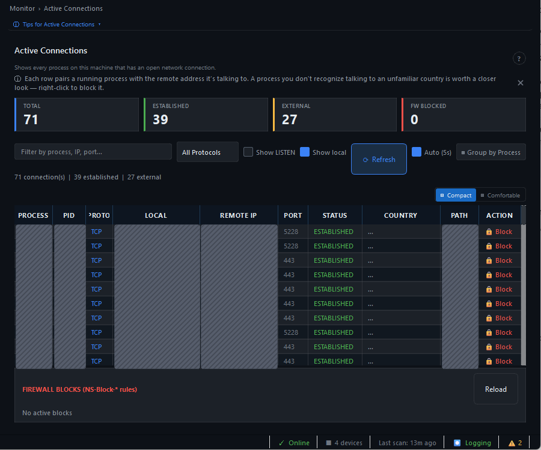
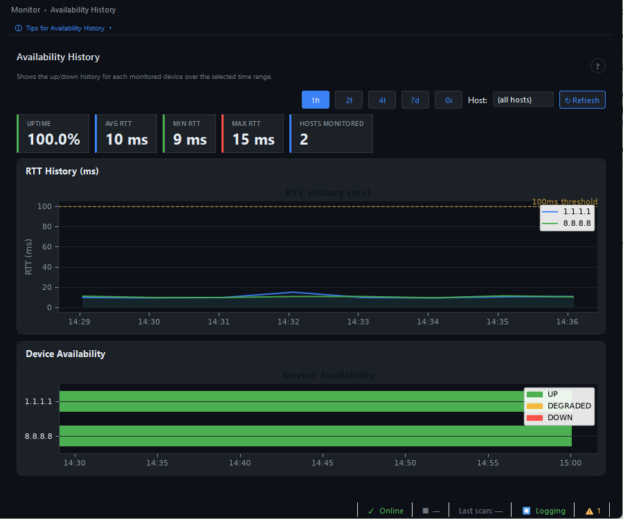
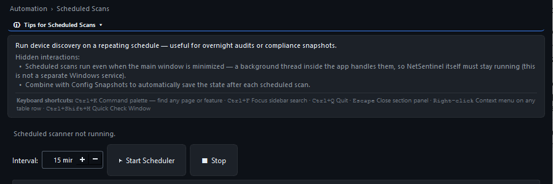
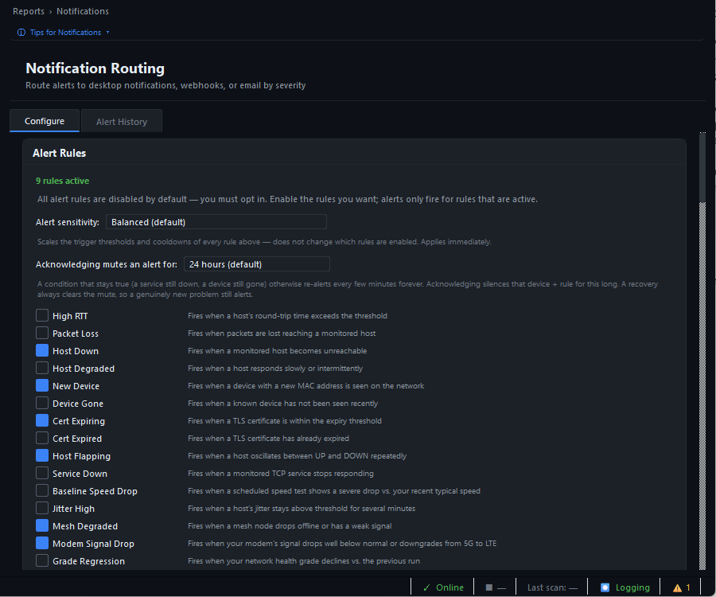
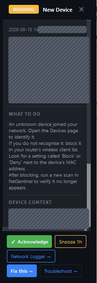

# NetSentinel – sledování a automatizace

Jednorázový sken ukáže stav v jednu chvíli.

Sekce **Monitor**, **Automation** a **Reports** sledují síť průběžně, zapisují výsledky a umějí tě upozornit.

Aplikace přitom musí zůstat spuštěná, klidně skrytá v oznamovací oblasti podle [přehledu aplikace](../netsentinel.md#běh-na-pozadí-a-ukončení).

## Vyber sledování podle cíle

| Potřebuji | Začni na stránce | Nech běžet |
|---|---|---|
| Doložit výpadky nebo kolísání odezvy | **Monitor → Network Logger** | hodiny až dny |
| Najít program nebo zařízení, které právě přenáší data | **Monitor → App Traffic** nebo **Active Connections** | několik minut |
| Pravidelně hledat nová zařízení | **Automation → Scheduled Scans** | trvale |
| Dostávat upozornění na změny | **Reports → Notifications** | trvale |
| Porovnat stav v čase | **Availability History**, **Network Timeline** nebo **Inventory Changes** | po nasbírání dat |

Nejdřív dokonči [základní kontrolu](basic-check.md), aby první úplný sken vytvořil známý výchozí stav.

Pro běh na pozadí zapni v **Settings → System Tray &amp; Startup** automatické spuštění a minimalizaci do oznamovací oblasti. Zachytávání paketů v **App Traffic** a **Bandwidth Usage** potřebuje Npcap; **Bandwidth Usage** navíc správce.

## Záznam výpadků a odezvy

Otevři **Monitor → Network Logger** (`Ctrl+L`).

  <figure class="docs-screenshot">
    
    <figcaption>Log Sources: zdroje, interval a ovládání loggeru.</figcaption>
  </figure>
  <figure class="docs-screenshot">
    
    <figcaption>Activity Log: živé záznamy a filtry.</figcaption>
  </figure>

| Číslo | Co nastavit |
|---|---|
| 1 | **Ping RTT** s intervalem, výchozích 60 s stačí. **Jitter**, **DNS latency** a **HTTP check** přidej při podezření na kolísání nebo pomalé DNS |
| 2 | **Start Logger** spustí zápis, tlačítko se změní na **Stop Logger** a text pod ním ukáže název souboru CSV |
| 3 | **Load &amp; Analyse** načte hotový soubor a vypíše výpadky, **View Chart** vykreslí graf odezvy |

**Auto-start on launch** vpravo zapne logger po každém startu aplikace.

Živé řádky měření jsou v záložce **Activity Log**, kde je lze filtrovat podle zdroje a exportovat.

Soubory CSV najdeš ve složce `Dokumenty\NetSentinel\logs`.

Rozbalovací panel **Scan Configuration** v této záložce určuje, které moduly běží při stisknutí **Scan**: **STP detection**, **Storm analysis**, **WiFi scan** a **DNS check**.

## Živý provoz

| Stránka | Co ukáže | Postup |
|---|---|---|
| **Monitor → Live Bandwidth** | Aktuální rychlost odesílání a stahování po rozhraních a špičky za 60 s | Vyber rozhraní v poli **Interface**, **Reset Peaks** vynuluje maxima |
| **Monitor → App Traffic** | Který počítač a jaká kategorie provozu, například web, streamování nebo hry, právě zatěžuje síť | **Start Monitoring**, po měření **Stop Monitoring**, klik na pruh kategorie ukáže zařízení |
| **Monitor → Bandwidth Usage** | Objem dat na zařízení během zachytávání | **Start Bandwidth Monitor**, vyžaduje správce a Npcap |
| **Monitor → Active Connections** | Každý proces tohoto počítače s otevřeným spojením, vzdálenou adresou, portem a zemí | **Refresh**, filtr podle procesu nebo adresy, **Block** vytvoří pravidlo firewallu pro proces |

**App Traffic** potřebuje Npcap, jinak zůstane graf prázdný.

Tlačítko **Block** v **Active Connections** přeruší spojení programu, používej ho až po ověření, o jaký proces jde.

  <figure class="docs-screenshot">
    
    <figcaption>App Traffic: provoz podle hostů a kategorií.</figcaption>
  </figure>
  <figure class="docs-screenshot">
    
    <figcaption>Active Connections: spojení jednotlivých procesů.</figcaption>
  </figure>

## Historie a změny

| Stránka | Co ukáže |
|---|---|
| **Monitor → Availability History** | Graf odezvy a dostupnosti sledovaných hostů za 1 h až 7 dní |
| **Monitor → Uptime &amp; SLA** | Procento dostupnosti každého zařízení za 24 h, 7 a 30 dní se stavy **HEALTHY** a **DEGRADED** |
| **Monitor → Network Timeline** | Časová osa všech událostí: připojení a odpojení zařízení, upozornění, CVE, testy rychlosti |
| **Monitor → Inventory Changes** | Aktuální zařízení, jejich štítky a události připojení a odpojení, tlačítko **Compare Scans** porovná dva skeny |
| **Monitor → Monitor Status** | Dlaždice se stavem všech detekčních monitorů, **Start Core Monitors** spustí základní sadu |
| **Monitor → Service Heartbeat** | Každou minutu ověří dostupnost zadaného hostitele a portu, například `192.168.0.1` a `443`, přidáš ho tlačítkem **Add Service** |
| **Monitor → IPv6 Devices** | **Scan IPv6** vypíše sousedy z IPv6 cache a ping na `fe80::/8` |
| **Monitor → Syslog Viewer** a **SNMP Trap Receiver** | Pasivně přijímají zprávy syslog a SNMP trap z routerů a switchů, které je posílají na tento počítač |

<figure class="docs-screenshot">
  
  <figcaption>Availability History: odezva a dostupnost v čase.</figcaption>
</figure>

Řádky **Uptime &amp; SLA** vycházejí ze vzorků na pozadí, proto zařízení, které bylo dlouho vypnuté, ukazuje nízkou dostupnost, i když je v pořádku.

## Plánované skeny

1. Ověř, že ruční sken vrací úplný seznam zařízení.
2. Otevři **Automation → Scheduled Scans**, nastav **Interval** a stiskni **Start Scheduler**.
3. Po prvním intervalu zkontroluj v **Monitor → Network Timeline**, že přibyl nový sken.

<figure class="docs-screenshot docs-screenshot--medium">
  
  <figcaption>Plánovač opakuje sken ve zvoleném intervalu.</figcaption>
</figure>

Plánovač je vlákno uvnitř aplikace, nikoli služba Windows, po ukončení aplikace se zastaví.

Denní sken v pevný čas nastavíš také v nastavení v kartě **Scheduled Full Scan**.

## Upozornění

Otevři **Reports → Notifications**.

1. V záložce **Configure** zaškrtni pravidla, která tě zajímají, například **Host Down**, **New Device** nebo **Cert Expiring**.
2. **Alert sensitivity** upravuje prahy všech pravidel najednou.
3. Níže nastav kanály: oznámení Windows, e-mail, webhook, Pushover, ntfy nebo Telegram, a každý ověř tlačítkem pro testovací zprávu.
4. Záložka **Alert History** ukazuje odeslaná upozornění a stav doručení.

Počet nevyřízených upozornění ukazuje stavový řádek vpravo dole, klik na něj otevře historii.

Klik na řádek historie otevře vpravo panel upozornění s popisem nálezu, doporučeným postupem **What to do**, údaji o zařízení a tlačítky **Acknowledge** a **Snooze 1h**.

  <figure class="docs-screenshot">
    
    <figcaption>Configure: pravidla, citlivost a kanály.</figcaption>
  </figure>
  <figure class="docs-screenshot">
    
    <figcaption>Detail nálezu a doporučený postup.</figcaption>
  </figure>

Během plánované údržby potlačíš upozornění vybraných zařízení v **Automation → Maintenance Windows**.

## Reporty

| Stránka nebo tlačítko | Výsledek |
|---|---|
| **Reports → Network Grade → Network Health Report** | Samostatný HTML report se známkou, zařízeními a nálezy, uložíš ho dialogem, výchozí složka je `Dokumenty\NetSentinel\reports` |
| **Reports → Network Doc → Scan &amp; Document** | HTML dokumentace sítě s topologií, zařízeními, otevřenými porty a certifikáty |
| **Dashboard → Share Card** | Obrázek 520 × 300 px se známkou a třemi hlavními nálezy pro sdílení |
| **Dashboard → Export…** | Export výsledků skenu |
| **Reports → IP Calculator** | Výpočet sítě, masky, rozsahu hostů a broadcastu z CIDR zápisu, například `192.168.1.0/24` |

Stránka **Reports → Network Health Report** umí reporty generovat automaticky v intervalu a posílat e-mailem, ve verzi 2.3.0 se však tlačítko **Generate Now** v testovaném prostředí nedokončilo a čítač **Errors** rostl.

Jednorázový report proto vytvářej z **Network Grade**.

## Integrace a rozšíření

| Stránka | K čemu slouží |
|---|---|
| **Automation → Automation Hooks** | Spustí příkaz nebo webhook při události, například při výpadku zařízení nebo připojení nového zařízení |
| **Automation → Custom Triggers** | Vlastní podmínky nad metrikami, například `avg(rtt["192.168.1.1"], 5m) > 80`, s tlačítkem **Test Now** |
| **Automation → MQTT / Home Assistant** | Publikuje stav zařízení a upozornění na MQTT broker, podporuje Home Assistant Discovery |
| **Automation → REST API** | Místní API jen pro čtení na portu `8765` s klíčem, po zapnutí vyžaduje restart aplikace |
| **Automation → Config Snapshots** | Snímky seznamu zařízení a portů pro porovnání v čase. Ve verzi 2.3.0 skončil pokus chybou **Scan error: _SnapshotWorker…**, změny proto porovnávej v **Inventory Changes** |
| **Extend → Hardware** | Pluginy pro routery ASUS, TP-Link Deco, FRITZ!Box, MikroTik, Netgear, OpenWrt, Synology, UniFi, modem ZTE a Home Assistant, které doplní názvy zařízení a sílu signálu |

Přihlašovací údaje k integracím se ukládají do úložiště pověření Windows a nejsou součástí exportu nastavení.

## Ověření sledování

Nastavení je hotové, když:

- Network Logger nebo vybraný monitor po očekávaném intervalu vytvořil nový záznam,
- **Network Timeline** ukazuje plánovaný sken,
- testovací upozornění dorazilo zvoleným kanálem,
- po zavření hlavního okna zůstává ikona NetSentinelu v oznamovací oblasti,
- po `Ctrl+Q` se monitory zastaví a aplikace zmizí i ze Správce úloh.

Před [továrním resetem](factory-reset.md) monitoring vždy zastav a aplikaci skutečně ukonči.
