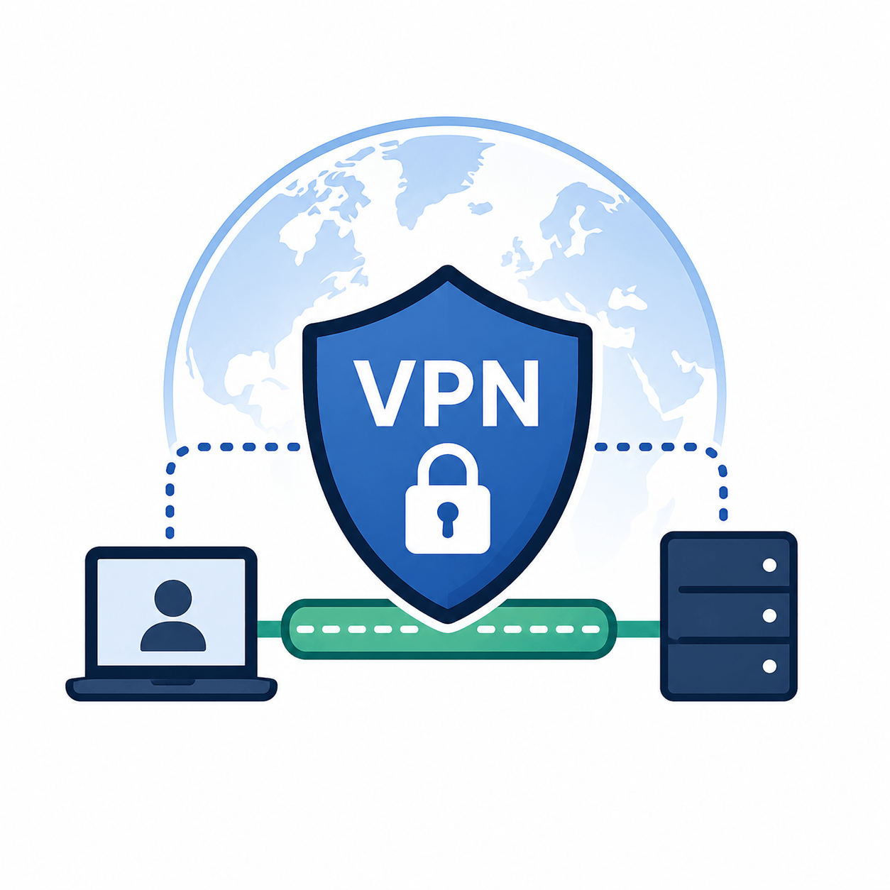

# VPN – Průvodce a přehled

> Přehled fungování VPN, výhod, příkladů použití a bezpečnostních doporučení.

---

## Co je VPN?

**Virtual Private Network** je technologie pro šifrované a zabezpečené připojení přes internet.

Hlavní funkce:
- Šifruje síťovou komunikaci.
- Chrání identitu a data před třetími stranami.
- Umožňuje bezpečný vzdálený přístup k firemním zdrojům.
- Maskuje skutečnou IP adresu a geografickou polohu.

---

## Jak VPN funguje

**Šifrování** – veškerá komunikace je při přenosu šifrována, takže ji třetí strany nemohou číst.

**Tunelování** – data procházejí zabezpečeným tunelem oddělujícím komunikaci od veřejné sítě.

**Maskování IP** – VPN server přidělí uživateli novou IP adresu, čímž skryje jeho skutečné umístění.

**Řízení přístupu** – umožňuje přístup k obsahu nebo systémům, které jsou jinak regionálně nebo síťově omezené.

---

## Srovnání: provoz s VPN a bez VPN

| Oblast | S VPN | Bez VPN |
|--------|-------|---------|
| **Zabezpečení dat** | Šifrováno, chráněno | Nešifrováno, riziko zachycení |
| **Přístup k firemním zdrojům** | Bezpečný vzdálený přístup | Omezený nebo nemožný |
| **Viditelnost IP adresy** | Skryta za VPN serverem | Plně viditelná |
| **Ochrana na veřejné Wi-Fi** | Komunikace chráněna | Vysoce riziková |

---

## Doporučení pro použití

- Vždy používejte VPN při připojení přes veřejné Wi-Fi sítě.
- Pro firemní přístup volte VPN ověřenou oddělením IT.
- Pravidelně aktualizujte VPN klienta.
- Ověřte, zda váš VPN provozovatel neuchovává logy aktivity.
