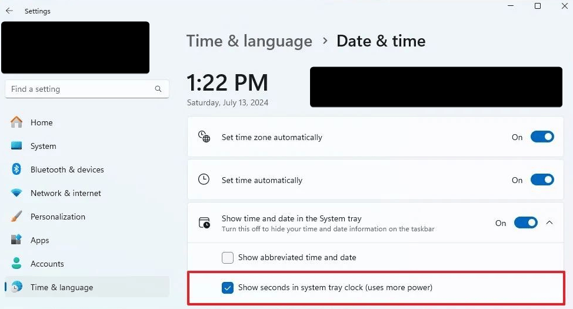
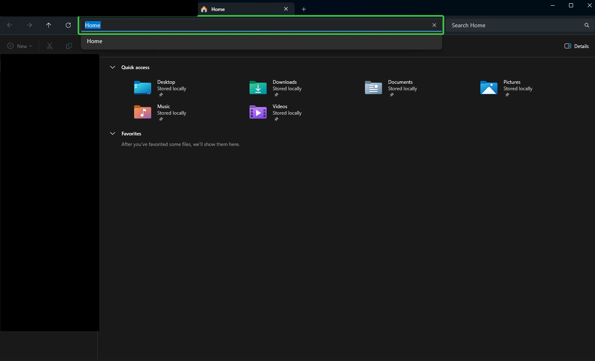

# Windows – Průvodce a tipy

> Instalace, nastavení, klávesové zkratky a řešení problémů ve Windows.

## Instalace Windows bez Microsoft účtu

Na začátku instalace při výběru jazyka:

1. Stiskni `Shift` + `F10` pro otevření příkazového řádku.
2. Zadej:

```
start ms-cxh:localonly
```

> [!TIP]
> Pokud příkaz nezafunguje, zkus místo toho:
> ```
> OOBE\BYPASSNRO
> ```

## Řešení neviditelného disku při instalaci

<details>
<summary>Postup načtení ovladače disku během instalace</summary>

1. Otevři příkazový řádek: `Shift` + `F10`
2. Zjisti informace o discích:
   ```
   wmic diskdrive list brief
   ```
3. Stáhni ovladač podle typu řadiče:
- **Intel RST VMD / Managed Controller** – pro RAID/NVMe/SATA
- **Intel Optane Memory and Storage Management** – pro Optane
- Ovladač stahuj z webu výrobce zařízení (Acer, Dell, HP…)
4. Rozbal ovladač na USB disk.
5. Na obrazovce výběru disků klikni na **Načíst ovladač (Load Driver)**.
6. Vlož USB a vyber soubor ovladače.

> [!NOTE]
> Novější verzi ovladače poznáš podle vyššího hexadecimálního čísla v názvu souboru (09AB > 08AB).

> [!IMPORTANT]
> Po načtení ovladače by měl být disk viditelný a připravený pro instalaci.

</details>

## Základní nastavení

### Zobrazení sekund v dolním panelu



## Klávesové zkratky

| Zkratka | Akce |
|---------|------|
| `Win` + `D` | Minimalizace / obnovení všech oken |
| `Alt` + `D` | Přechod na adresní řádek v Průzkumníku |
| `Shift` + `F10` | Náhrada chybějící kontextové klávesy |

### Skočení na adresní řádek



### Chybějící kontextová klávesa


Náhrada: `Shift` + `F10`
