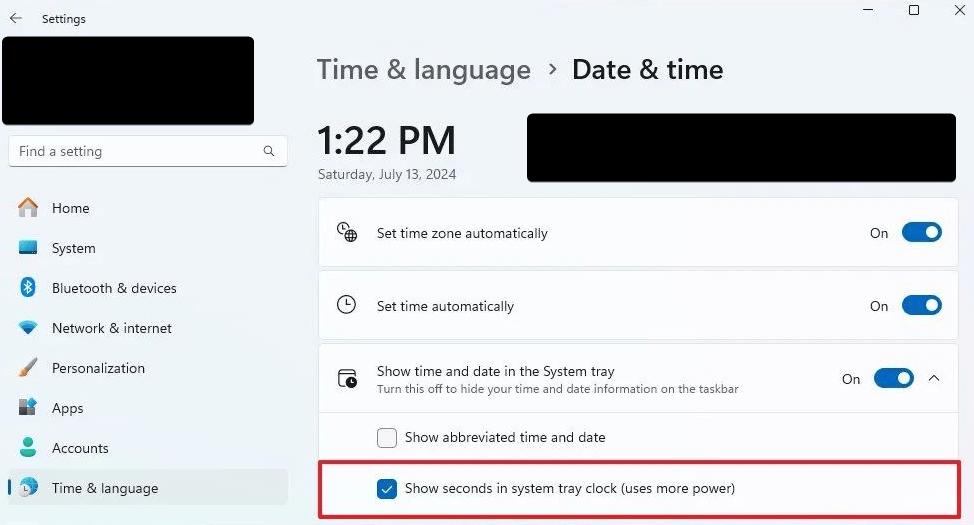
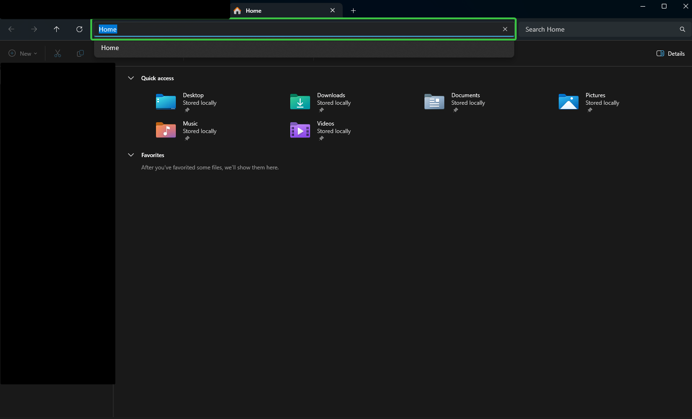

# Windows – nastavení a řešení problémů

Vyber konkrétní úlohu.

Pro práci v terminálu vždy rozliš CMD a PowerShell.

## Kam pokračovat

| Potřebuji | Postup |
|---|---|
| Pochopit závorky a hodnoty v příkazu | [Klíč syntaxe](../command-line-syntax.md) |
| Pracovat se soubory a skripty | [PowerShell](powershell.md) nebo [CMD](cmd.md) |
| Nastavit profil a prompt | [Prostředí PowerShellu](terminal.md) |
| Pořizovat snímky klávesou Print Screen | [Flameshot místo Výstřižků](flameshot.md) |
| Odstranit problematickou položku | [Diagnostika souboru a cesty](cannot-delete-item.md) |
| Zpřístupnit SSD instalátoru | [Ovladač řadiče a výběr disku](installation-missing-ssd.md) |

## Místní účet místo Microsoft účtu

Ve funkčních osobních Windows:

1. Otevři **Nastavení → Účty → Vaše informace**.
2. Zvol **Přihlásit se místo toho místním účtem**.
3. Dokonči ověření a nastav místní jméno a heslo.
4. Odhlas se, přihlas místním účtem a ověř své soubory i aplikace.

Přepnutí mění způsob přihlášení ke stávajícímu profilu.

OneDrive a další aplikace mohou mít samostatné účty.

Volby během první instalace závisejí na edici, sestavení a správě zařízení, proto používej přímo nabízenou podporovanou možnost a nestav postup na neudržovaných obchvatech OOBE.

Oficiální kroky a návrat popisuje [Microsoft: změna typu účtu](https://support.microsoft.com/en-us/accounts-billing/manage/change-from-a-local-account-to-a-microsoft-account-in-windows).

## Sekundy v hodinách Windows 11

V nastavení **Datum a čas** vyhledej zobrazení času v oznamovací oblasti a zapni **Zobrazovat sekundy**.

Ve starších sestaveních může být volba v **Přizpůsobení → Hlavní panel → Chování hlavního panelu**.

Následující snímek ukazuje nastavení v části Datum a čas.

[Zobrazit obrázek v původní velikosti](../../images/t9hZzZp1FO.png)

Zobrazení sekund může mírně zvýšit spotřebu.

Umístění volby popisuje [Microsoft: hlavní panel](https://support.microsoft.com/en-US/Windows/Experience/Personalization/customize-the-taskbar-in-windows).

## Užitečné zkratky Průzkumníku

| Zkratka | Výsledek |
|---|---|
| `Alt+D` | Vybere adresní řádek pro zadání nebo kopírování cesty |
| `Shift+F10` | Otevře kontextovou nabídku vybrané položky |
| `Win+D` | Zobrazí plochu nebo vrátí okna |

[Zobrazit obrázek v původní velikosti](../../images/windows_keyboard_explorerAddressBar.png)

Do vybraného řádku lze napsat `cmd` a otevřít CMD v této složce.

Neznamená to spuštění jako správce.
