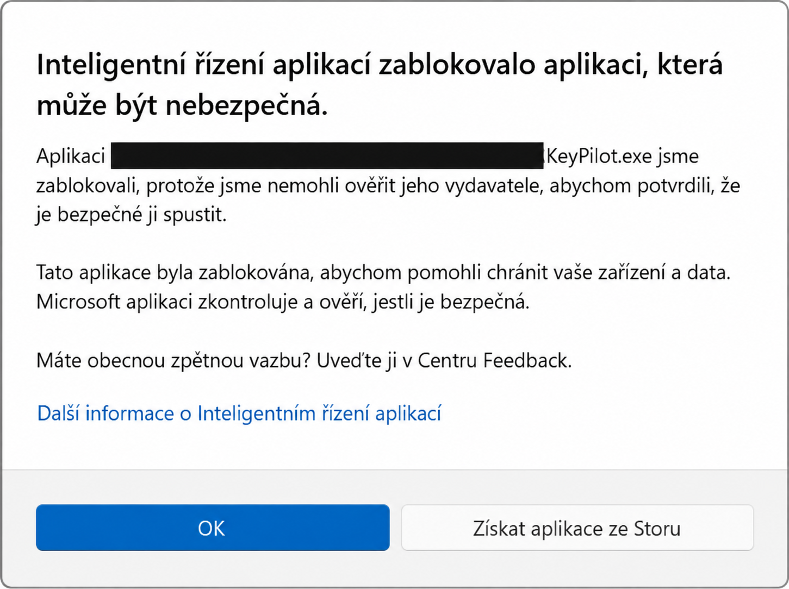

# Inteligentní řízení aplikací – zablokovaná aplikace

**Smart App Control**, česky **Inteligentní řízení aplikací**, ve Windows 11 blokuje aplikace, které vyhodnotí jako nebezpečné nebo nedůvěryhodné.

Pokud nedokáže určit jejich bezpečnost, kontroluje také důvěryhodný digitální podpis.

Proto může zastavit i vlastní nepodepsanou aplikaci. ([Microsoft: jak ochrana funguje](https://learn.microsoft.com/en-us/windows/apps/develop/smart-app-control/overview))

## Jak poznat toto blokování

Dialog uvádí **„Inteligentní řízení aplikací zablokovalo aplikaci, která může být nebezpečná.“** a název souboru, například `KeyPilot.exe`.

[Zobrazit upravený obrázek v plném rozlišení](../../images/smart-app-control-blocked.png)

Osobní adresáře jsou na obrázku zakryté.

Samotné hlášení nedokazuje přítomnost malwaru, ale ani bezpečnost souboru.

## Před použitím

Postup použij pro aplikaci, jejíž původ znáš a které důvěřuješ.

Před změnou ověř, zda autor nenabízí aktuální podepsanou verzi.

V Průzkumníku klikni pravým tlačítkem na soubor nebo složku aplikace a zvol **Zobrazit další možnosti → Zkontrolovat pomocí Microsoft Defender**.

Počkej na výsledek kontroly. ([Microsoft: kontrola souboru](https://support.microsoft.com/en-gb/windows/scan-an-item-with-windows-security-d1c8c01d-12ed-e768-cbb8-830ea8ccf8e6))

Pokud používáš jiný antivirus, proveď kontrolu jím.

Výsledek bez nálezu není zárukou bezpečnosti neznámé aplikace.

> [!WARNING]
> Vypnutí Inteligentního řízení aplikací platí pro celý počítač, nejen pro vybraný program.
>
> Výjimka pro jednu aplikaci není dostupná.
>
> Antivirovou ochranu ponech zapnutou.

Rozsah vypnutí a chybějící výjimky potvrzuje [FAQ Microsoftu](https://support.microsoft.com/en-us/windows/security/threat-malware-protection/smart-app-control-frequently-asked-questions).

## Postup krok za krokem

Ve Windows 11 s dostupným nastavením Smart App Control:

1. Zavři blokovací dialog tlačítkem **OK**.
2. Otevři **Start**, napiš **Zabezpečení Windows** a otevři nalezenou aplikaci.
3. Vyber **Řízení aplikací a prohlížečů**.
4. V části **Inteligentní řízení aplikací** otevři jeho **nastavení** (*Smart App Control settings*).
5. Přečti upozornění Windows a zvol **Vypnuto** (*Off*).
6. Potvrď případnou výzvu správce pouze tehdy, pokud tento počítač smíš spravovat.
7. Vrať se do složky aplikace a znovu otevři její `.exe` soubor, v uvedeném příkladu `KeyPilot.exe`.

Umístění voleb popisuje [Microsoft: řízení aplikací a prohlížečů](https://support.microsoft.com/en-us/windows/security/windows-security/app-browser-control-in-the-windows-security-app).

Na pracovním nebo školním zařízení s uzamčenými volbami řeš změnu se správcem.

## Ověření výsledku

V nastavení musí být vybrané **Vypnuto** a při novém spuštění má zmizet právě hlášení Inteligentního řízení aplikací.

Ověř také otevření hlavního okna aplikace.

Pokud se objeví jiné chybové hlášení, poznamenej jeho přesný text a řeš jeho příčinu samostatně.

Toto nastavení neopravuje chybějící soubory aplikace ani jiné ochrany Windows.

## Jak ochranu znovu zapnout

Vrať se stejnou cestou do nastavení Inteligentního řízení aplikací a vyber **Zapnuto** (*On*), pokud je tato možnost dostupná.

Potom nastavení znovu otevři a ověř vybraný stav.

Aktuální [FAQ Microsoftu](https://support.microsoft.com/en-us/windows/security/threat-malware-protection/smart-app-control-frequently-asked-questions) uvádí, že nedávné aktualizace umožňují opětovné zapnutí bez čisté instalace Windows na podporovaných zařízeních.

Na starších sestaveních může návrat vyžadovat reset nebo přeinstalaci, proto se před vypnutím řiď také upozorněním svého systému.

Pokud **Zapnuto** není dostupné, zkontroluj aktualizace a podmínky v odkazovaném FAQ.

Po opětovném zapnutí může být stejná nepodepsaná aplikace znovu zablokovaná.

## Řešení pro autora aplikace

Pro distribuci vlastní aplikace zajisti podpis kódu certifikátem od důvěryhodného poskytovatele.

Vlastní testovací certifikát sám tuto důvěru nenahrazuje.

Požadavky včetně podporovaných podpisů popisuje [Microsoft: podepsání aplikace pro Smart App Control](https://learn.microsoft.com/en-us/windows/apps/develop/smart-app-control/code-signing-for-smart-app-control).
