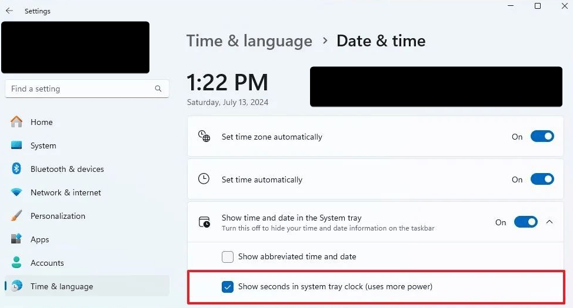
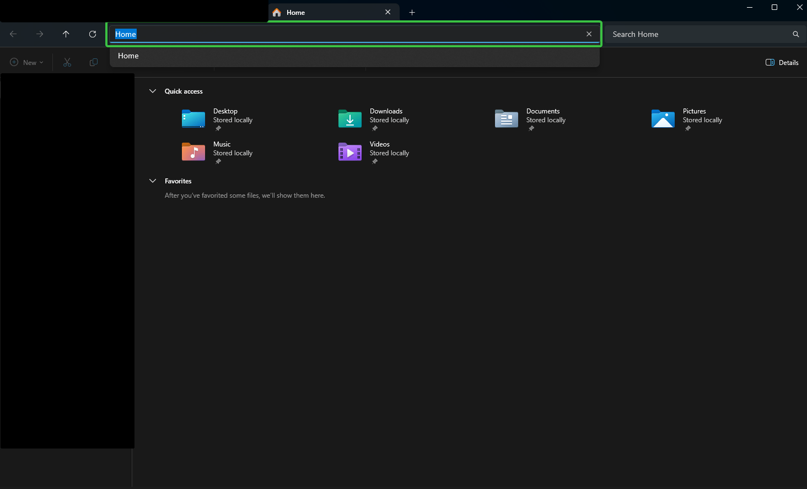

# 🗂️ Windows – Praktický průvodce & tipy

> 🚀 Moderní přehled instalace, nastavení, klávesových zkratek a řešení problémů ve Windows.

---

## 🪟 Instalace Windows bez Microsoft účtu

Na začátku instalace při výběru jazyka stiskněte:

1. `Shift` + `F10` pro otevření příkazového řádku.
2. Zadejte příkaz:

   `start ms-cxh:localonly`

   > [!TIP]
   > Pokud nezafunguje, zkuste místo toho:
   >
   > `OOBE\BYPASSNRO`

## 🛠️ Instalace Windows & řešení neviditelného disku

💾 Řešení problému s neviditelným diskem při instalaci

1. **Stáhněte si ovladač pro diskovou jednotku**
    - Otevřete příkazový řádek:  
      `Shift` + `F10`
    - Zobrazte informace o discích:  
      `wmic diskdrive list brief`
    - Pokud používáte **Intel RST (RAID)** nebo **Intel Optane**, stáhněte odpovídající ovladač:
        - **Intel RST VMD Managed Controller** / **Intel RST VMD Controller** pro RAID/NVMe/SATA
        - **Intel Optane Memory and Storage Management** pro Optane
    - Ovladač rozbalte na **USB disk**.

2. **Načtení ovladače během instalace**
    - Spusťte instalaci Windows.
    - Na obrazovce s výběrem disků klikněte na **Načíst ovladač (Load Driver)**.
    - Vložte USB disk s ovladačem a vyberte správný soubor.
    - Novější verzi poznáte podle vyššího hexadecimálního čísla v názvu (např. 09AB je novější než 08AB).

   > [!IMPORTANT]  
   > Po načtení ovladače by měl být disk viditelný a připravený pro instalaci.

---

## ⚙️ Základní nastavení

⏱️ Zobrazení sekund v dolním panelu

---

## ⌨️ Klávesnicové zkratky

🗔 Minimalizace/Maximalizace všech oken

`Win` + `D`

🔗 Skočení na adresní řádek

`Alt` + `D`

---

## 🖱️ Chybějící klávesy na klávesnici

🗂️ Kontextová klávesa

**Řešení:**  
`Shift` + `F10`

