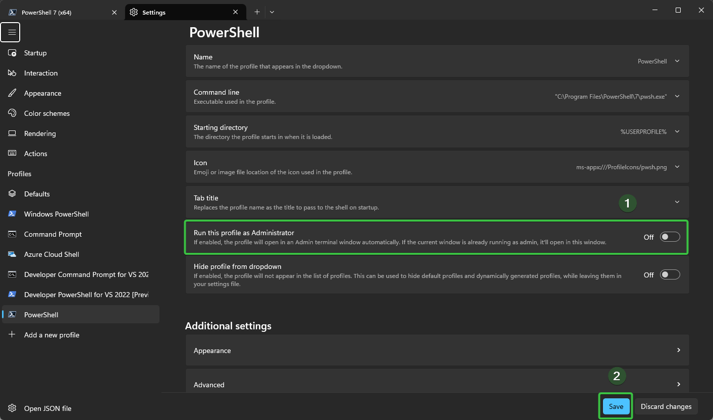
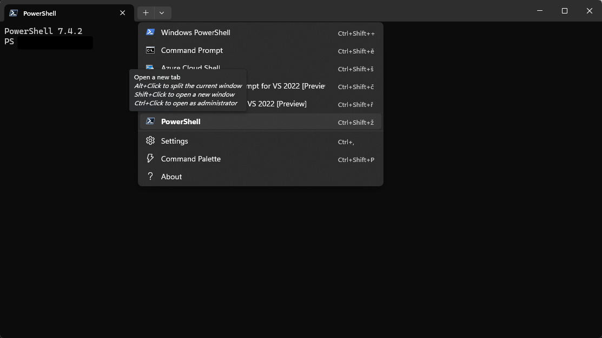

# PowerShell – Průvodce a reference

> Správa balíčků, oprávnění, přizpůsobení prostředí, práce se soubory a síť v PowerShellu.

---

## Správa balíčků

Umístění modulů: `C:\Users\{xxx}\Documents\PowerShell\Modules`

---

## Přizpůsobení prostředí (Oh My Posh)

<details>
<summary>Modernizace prostředí PowerShellu krok za krokem</summary>

**Původní vs. nový vzhled:**


**Postup:**

1. **Instalace PowerShell 7+** – zjisti verzi: `$PSVersionTable` → [Stáhnout](https://github.com/PowerShell/PowerShell)

2. **Instalace Windows Terminal** → [Stáhnout](https://github.com/microsoft/terminal)

3. **Spusť PowerShell jako administrátor**

   

4. **Nastav oprávnění na Bypass:**
   ```powershell
   Set-ExecutionPolicy -Scope CurrentUser Bypass
   ```

5. **Rozdělení okna na části** – klávesová zkratka: `Alt` + `Left Click`

   

6. **Instalace Oh My Posh a posh-git:**
   ```powershell
   Invoke-Expression ((New-Object System.Net.WebClient).DownloadString('https://ohmyposh.dev/install.ps1'))
   Install-Module posh-git
   ```

7. **Nastavení tématu:**
   ```powershell
   oh-my-posh init pwsh --config 'C:\Users\{xxx}\Themes\PowerShell\aliens.omp.json' | Invoke-Expression
   Import-Module posh-git
   ```

8. **Trvalé nastavení v profilu:**
   ```powershell
   notepad $PROFILE
   ```
   Vlož do souboru:
   ```powershell
   Import-Module posh-git
   oh-my-posh init pwsh --config 'C:\Users\{xxx}\themes\aliens.omp.json' | Invoke-Expression
   ```

9. **Vrať oprávnění na RemoteSigned:**
   ```powershell
   Set-ExecutionPolicy -Scope CurrentUser RemoteSigned
   ```

</details>

### Výběr a změna tématu

```powershell
# Zobrazení dostupných témat
Get-PoshThemes

# Aplikace tématu v profilu
oh-my-posh init pwsh --config 'C:\Users\{xxx}\Documents\themes\catppuccin.omp.json' | Invoke-Expression
```

[Šablony ke stažení](https://github.com/JanDeDobbeleer/oh-my-posh/tree/main/themes)

---

## Historie příkazů

```powershell
# Umístění souboru s historií
(Get-PSReadlineOption).HistorySavePath
```

---

## Oprávnění

### Zjištění aktuálního nastavení

```powershell
Get-ExecutionPolicy -Scope CurrentUser
```

| Hodnota | Popis |
|---------|-------|
| `Restricted` | Skripty nejsou povoleny |
| `AllSigned` | Pouze digitálně podepsané skripty |
| `RemoteSigned` | Skripty z internetu musí být podepsané |
| `Unrestricted` | Všechny skripty povoleny bez omezení |
| `Undefined` | Výchozí systémové nastavení |

### Změna oprávnění

```powershell
Set-ExecutionPolicy -Scope CurrentUser RemoteSigned
```

[Dokumentace parametrů](https://learn.microsoft.com/en-us/powershell/module/microsoft.powershell.security/set-executionpolicy?view=powershell-7.4#-executionpolicy)

### Spuštění skriptu bez trvalé změny oprávnění

```powershell
powershell -ExecutionPolicy Bypass -File "C:\{xxx}\Downloads\skript.ps1"
```

---

## Práce se soubory

### Změna metadat souboru

```powershell
# Změna času posledního zápisu
(Get-Item "C:\Users\{xxx}\FileA.docx").LastWriteTime = "2024.10.10 17:00:00"
```

**Úprava celkového času dokumentu Word:**

1. Přejmenuj `.docx` na `.zip`
2. Rozbal archiv
3. V souboru `docProps/app.xml` uprav hodnotu `<TotalTime>`
4. Zazipuj zpět a přejmenuj na `.docx`

### Kopírování souborů

```powershell
# Kopírování souboru ze síťového zdroje
xcopy /y /z "\\192.xxx.xx.xx\files\module.xml" "C:\Users\Test\Downloads\*"

# Kopírování do podsložek
for /D %%G in ("C:\Users\Test\Downloads\*") DO (
  xcopy /y /z "C:\Users\Test\Downloads\module.xml" "%%G\SubDirectory\*"
)
```

---

## Síť

```powershell
# Zjištění hostname podle IP adresy
Resolve-DnsName -Name <IP adresa> -Type PTR

# Zobrazení všech fyzických adaptérů
Get-NetAdapter -physical

# Zobrazení pouze aktivních adaptérů
Get-NetAdapter -physical | where status -eq 'up'
```
