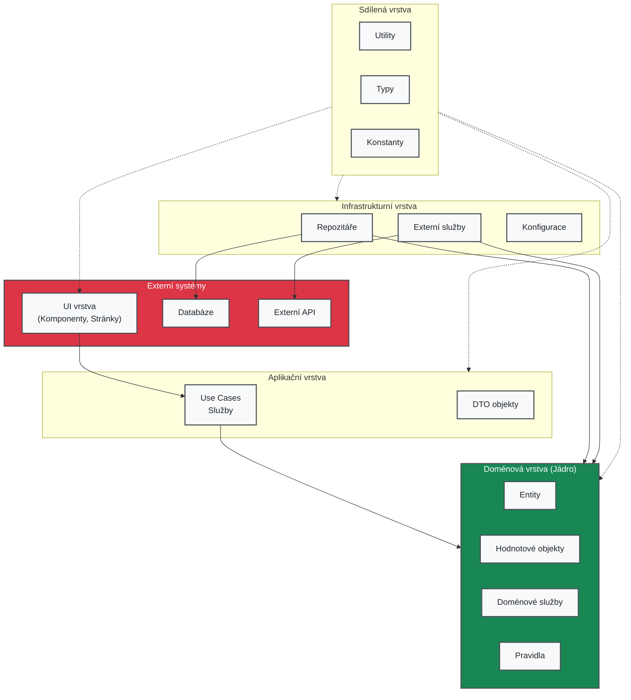

# Clean Architecture: Kompletní průvodce

## 👨‍💻 Úvod: Co je Clean Architecture?

**Clean Architecture** je metodika návrhu softwaru, která klade důraz na **oddělení byznys logiky** od technických detailů. 

Veškerý kód, který se zabývá obchodními pravidly, by měl být **nezávislý** na technologiích jako databáze, frameworky nebo externí služby.

Tato metoda podporuje:
- **Modularitu**: Kód je rozdělený do **vrstev** podle jeho odpovědnosti
- **Testovatelnost**: Díky oddělení logiky a implementací je snadné psát **jednotkové testy**
- **Údržbu**: Díky jasnému rozdělení odpovědností se aplikace lépe udržuje a rozšiřuje

Základem této architektury je, že **vnitřní vrstvy** aplikace (byznys logika, doménové modely) nesmí záviset na **vnějších vrstvách** (databáze, API, UI). 

To znamená, že můžeš snadno změnit technologii vnější vrstvy bez ovlivnění vnitřní logiky.



## 🌐 1. Architektonické vrstvy – Přehled

Vrstvy jsou základem **Clean Architecture** a každá vrstva má svůj specifický účel:

- **UI Layer**: Uživatelské rozhraní (UI), které zobrazuje data uživatelům a získává jejich vstupy
- **Application Layer**: Zajišťuje orchestraci akcí mezi UI a doménovou logikou, slouží pro byznys procesy
- **Domain Layer**: Obsahuje všechny obchodní logiky, entity a pravidla aplikace
- **Infrastructure Layer**: Implementace komunikace s externími systémy (databáze, API, služby třetích stran)
- **Shared Layer**: Sdílené komponenty, utility a typy, které jsou použitelné v celém projektu

### Struktura složek

```
📦 /src
├── ui/                ← Kód pro UI (React, Flutter, SwiftUI…)
├── application/       ← Orchestrace, služby, use-cases
├── domain/            ← Business logika, modely, pravidla
├── infrastructure/    ← Databáze, API, emailing, úložiště
└── shared/            ← Utility, types, společné věci
```

### Směr závislostí

Důležité pravidlo je, že závislosti směřují dovnitř:

- UI závisí na Application
- Application závisí na Domain
- Infrastructure implementuje rozhraní definované v Domain
- Domain nezávisí na žádné jiné vrstvě!

## 📚 2. Doménový návrh – Srdce aplikace

Cílem doménového návrhu je **oddělit byznys logiku** od technické implementace. Toto oddělení usnadňuje změny v technologických detailech, aniž by to ovlivnilo samotnou logiku aplikace.

### ✅ Entity

Entity jsou objekty s vlastní identitou a specifickým chováním v systému.

**Kam patří**: `/src/domain/entities/`  
**Příklady souborů**: `Order.js`, `User.js`, `Product.js`

```csharp
public class Order
{
    public Order(OrderId id, List<OrderItem> items, UserId userId)
    {
        Id = id;
        Items = items;
        UserId = userId;
    }

    public OrderId Id { get; }
    public List<OrderItem> Items { get; }
    public UserId UserId { get; }

    public Money GetTotal()
    {
        return Items.Aggregate(Money.Zero(), (sum, item) => sum.Add(item.GetSubtotal()));
    }
}
```

### 🧩 Value objekty

Value objekty jsou objekty, které jsou neměnné a nemají identitu. Jsou definovány svými hodnotami.

**Kam patří**: `/src/domain/valueObjects/`  
**Příklady souborů**: `Email.js`, `Money.js`, `Address.js`

```csharp
public class Email
{
    private readonly string value;
    
    public Email(string value)
    {
        if (!value.Contains("@")) throw new InvalidEmailException();
        this.value = value;
    }

    public string GetValue() => value;
}
```

### 🧠 Doménové služby

Doménové služby implementují logiku, která nepatří přímo do žádné entity a pracuje s více entitami.

**Kam patří**: `/src/domain/services/`  
**Příklady souborů**: `ShippingCostService.js`, `DiscountCalculator.js`

```csharp
public class ShippingCostService
{
    public Money Calculate(Order order)
    {
        return order.GetTotal().GreaterThan(new Money(1000)) 
            ? Money.Zero() 
            : new Money(99);
    }
}
```

### ⚖️ Policy objekty

Policy objekty definují pravidla, která určují, co je možné dělat s entitami.

**Kam patří**: `/src/domain/policies/`  
**Příklady souborů**: `OrderPolicy.js`, `AccessPolicy.js`

```csharp
public class OrderPolicy
{
    public static bool CanCancel(Order order, User user)
    {
        return order.BelongsTo(user) && order.Status == "NEW";
    }
}
```

## 🧭 3. Application Layer – Orchestrace akcí

Tato vrstva je zodpovědná za orchestraci akcí mezi ostatními vrstvami. Komunikuje s doménovou logikou a zajišťuje provádění konkrétních úkolů, jako je například vytvoření objednávky.

### 🛠 UseCase / Service

UseCases definují konkrétní funkce, které aplikace nabízí. Například **vytvoření objednávky**.

**Kam patří**: `/src/application/useCases/` nebo `/src/application/services/`  
**Příklady souborů**: `PlaceOrder.js`, `RegisterUser.js`, `GenerateReport.js`

```csharp
public interface IPlaceOrder
{
    Task Execute(PlaceOrderInput input);
}

public class PlaceOrder : IPlaceOrder
{
    private readonly IOrderRepository orderRepo;
    private readonly IEmailService emailService;

    public PlaceOrder(IOrderRepository orderRepo, IEmailService emailService)
    {
        this.orderRepo = orderRepo;
        this.emailService = emailService;
    }

    public async Task Execute(PlaceOrderInput input)
    {
        var order = new Order(input.UserId, input.Items);
        if (order.IsEmpty()) throw new EmptyCartException();
        
        await orderRepo.Save(order);
        await emailService.SendConfirmation(input.UserId, order);
    }
}
```

### 📋 DTO (Data Transfer Objects)

DTO objekty slouží k přenosu dat mezi vrstvami, zejména mezi Application a UI.

**Kam patří**: `/src/application/dtos/`  
**Příklady souborů**: `OrderDto.js`, `UserProfileDto.js`

## 🔌 4. Infrastructure Layer – Implementace závislostí

V této vrstvě implementujeme konkrétní technologické detaily, jako jsou připojení k databázi, emailové služby nebo API třetích stran.

### 📦 Repozitáře (DB)

Repozitáře poskytují abstrakci nad databází a umožňují interakci s entitami.

**Kam patří**: `/src/infrastructure/repositories/`  
**Příklady souborů**: `PostgresOrderRepository.js`, `MongoUserRepository.js`

```csharp
public interface IOrderRepository
{
    Task Save(Order order);
    Task<Order> FindById(OrderId id);
}

public class PostgresOrderRepository : IOrderRepository
{
    public async Task Save(Order order)
    {
        // implementace uložení do Postgres DB
    }

    public async Task<Order> FindById(OrderId id)
    {
        // implementace načítání objednávky z Postgres DB
        return null;
    }
}
```

### 📧 Služby (API, emailing, třetí strany)

Externí služby, jako je odesílání emailů nebo volání API třetí strany.

**Kam patří**: `/src/infrastructure/services/`  
**Příklady souborů**: `SendgridEmailService.js`, `StripePaymentService.js`

```csharp
public interface IEmailService
{
    Task SendConfirmation(string userId, Order order);
}

public class SendgridEmailService : IEmailService
{
    public async Task SendConfirmation(string userId, Order order)
    {
        // Zavolání SendGrid API pro odeslání potvrzení
    }
}
```

### ⚙️ Konfigurace

Konfigurace a nastavení aplikace, včetně integrace závislostí (dependency injection).

**Kam patří**: `/src/infrastructure/config/`  
**Příklady souborů**: `dependencyInjection.js`, `dbConfig.js`

## 🎨 5. UI Layer – Vstupy & Výstupy

UI vrstva je zodpovědná pouze za interakci s uživatelem a volání příslušného use case nebo služby. Nikdy neobsahuje byznys logiku!

### 🔲 Kontrolery, Komponenty a Presentery

UI vrstva zajišťuje interakci s uživatelem pro zadání objednávky.

**Kam patří**: `/src/ui/controllers/`, `/src/ui/components/`, `/src/ui/pages/`  
**Příklady souborů**: `OrderController.js`, `ProductList.jsx`, `CheckoutPage.vue`

```csharp
public class OrderController : Controller
{
    private readonly IPlaceOrder placeOrder;

    public OrderController(IPlaceOrder placeOrder)
    {
        this.placeOrder = placeOrder;
    }

    public async Task<IActionResult> CreateOrder(OrderInputModel input)
    {
        await placeOrder.Execute(input);
        return Ok();
    }
}
```

### 📱 Modely a Validátory

Modely pro příjem dat od uživatele a jejich validace.

**Kam patří**: `/src/ui/models/`, `/src/ui/validators/`  
**Příklady souborů**: `OrderInputModel.js`, `UserFormValidator.js`

## 🔄 6. Shared Layer – Sdílená funkcionalita

Shared vrstva obsahuje kód, který je používán napříč celou aplikací a nepatří do jedné konkrétní vrstvy.

**Kam patří**: `/src/shared/`  
**Příklady souborů**: `types.js`, `constants.js`, `utils.js`, `logger.js`

### 🧰 Utility a pomocné funkce

Univerzální pomocné funkce používané v celém projektu.

```javascript
export function formatDate(date) {
  return new Intl.DateTimeFormat('cs-CZ').format(date);
}

export function generateId() {
  return Math.random().toString(36).substr(2, 9);
}
```

### 🏷️ Typy a konstanty

Sdílené typy a konstanty pro celou aplikaci.

```javascript
export const ORDER_STATUS = {
  NEW: 'NEW',
  PENDING: 'PENDING',
  SHIPPED: 'SHIPPED',
  DELIVERED: 'DELIVERED',
  CANCELLED: 'CANCELLED'
};
```