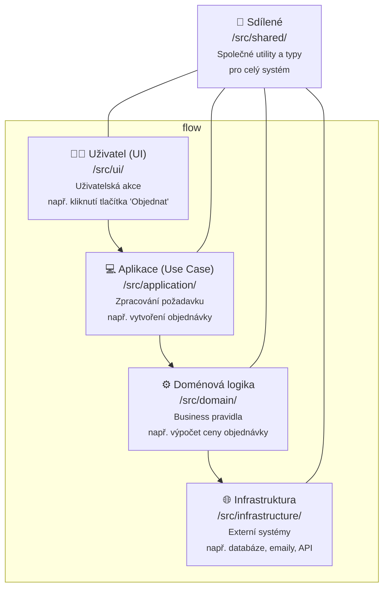

**🏗️ Kompletní návrhový návod – Clean Architecture**

<details>
<summary><span style="color:#1E90FF;"> Workflow</span></summary>



</details>

---

Postup:

<details>
<summary><span style="color:#1E90FF;"> 🌐 1. Architektonické vrstvy – přehled </span></summary>

Struktura složek by měla být co nejvíce intuitivní a reflektovat jednotlivé vrstvy architektury.

```text
📦 /src
├── ui/                ← Kód pro UI (React, Flutter, SwiftUI…)
├── application/       ← Orchestrace, služby, use-cases
├── domain/            ← Business logika, modely, pravidla
├── infrastructure/    ← Databáze, API, emailing, úložiště
└── shared/            ← Utility, types, společné věci
```

</details>

<details>
<summary><span style="color:#1E90FF;"> 📚 2. Doménový návrh – Srdce aplikace </span></summary>

Cíl: Oddělit business logiku (pravidla a procesy aplikace) od technické implementace (konkrétní technologie a frameworky, které je realizují).

Umístění v projektu📦: `/domain/`

<details>
<summary><span style="color:#E95A84;">✅ Entity</span></summary>

Představují jedinečné objekty s vlastní identitou (ID) a specifickým chováním v systému.

>[!NOTE]
> Mějte na paměti, že **entity** by měly být pojmenovány jasně podle doménového významu.

**Příklad:** `src/domain/entities/order.cs`, `src/domain/entities/user.cs`

```csharp
public class Order
{
    public Order(OrderId id, List<OrderItem> items, UserId userId)
    {
        Id = id;
        Items = items;
        UserId = userId;
    }

    public OrderId Id { get; }
    public List<OrderItem> Items { get; }
    public UserId UserId { get; }

    public Money GetTotal()
    {
        return Items.Aggregate(Money.Zero(), (sum, item) => sum.Add(item.GetSubtotal()));
    }

    public bool IsEmpty() => Items.Count == 0;
}
```

</details>

<details>
<summary><span style="color:#E95A84;">🧩 Value objekty</span></summary>

Value objekty mají tyto hlavní vlastnosti:

- Jsou neměnné (immutable) - po vytvoření je nelze změnit
- Nemají identitu (ID) - jsou definovány svými vlastnostmi
- Při stejných vlastnostech jsou považovány za stejné objekty

>[!NOTE]
> Pojmenování je klíčové pro rozpoznání jejich role.

**Příklad:** `src/domain/valueObjects/email.cs`, `src/domain/valueObjects/money.cs`

```csharp
public class Email
{
    private readonly string value;

    public Email(string value)
    {
        if (!value.Contains("@")) throw new InvalidEmailException();
        this.value = value;
    }

    public string GetValue() => value;
}
```

</details>

<details>
<summary><span style="color:#E95A84;">🧠 Doménové služby</span></summary>

Doménové služby použijte, když potřebujete logiku, která:

- pracuje s více entitami najednou
- nepatří přímo do žádné entity
- provádí komplexní operace mezi entitami

**Příklad:** `src/domain/services/shippingCost.cs`

```csharp
public class ShippingCostService
{
    public Money Calculate(Order order)
    {
        return order.GetTotal().GreaterThan(new Money(1000)) ? Money.Zero() : new Money(99);
    }
}
```

</details>

<details>
<summary><span style="color:#E95A84;">⚖️ Policy objekty</span></summary>

Jedná se o pravidla, která říkají, co je povoleno a co ne pro entity.

**Příklad:** `src/domain/policies/orderPolicy.cs`

```csharp
public class OrderPolicy
{
    public static bool CanCancel(Order order, User user)
    {
        return order.BelongsTo(user) && order.Status == "NEW";
    }
}
```

</details>

---

</details>

<details>
<summary><span style="color:#1E90FF;"> 🧭 3. Application Layer – Orchestrace akcí </span></summary>

**Cíl:** Tento layer slouží k orchestrace akcí bez znalosti implementace (tzn. bez závislosti na konkrétní technologii).

🛠 **UseCase / Service**

UseCases slouží k vykonávání logiky v aplikaci a jsou zaměřeny na konkrétní funkce systému.

**Vytvoření Interface pro použití v Application Layer:** Vytvoříme **interface**, který je implementován konkrétními službami (např. `PlaceOrder`).

**Umístění:** `/src/application/usecases/`

```csharp
public interface IPlaceOrder
{
    Task Execute(PlaceOrderInput input);
}
```

**Implementace interface v konkrétní službě:**

```csharp
public class PlaceOrder : IPlaceOrder
{
    private readonly IOrderRepository orderRepo;
    private readonly IEmailService emailService;

    public PlaceOrder(IOrderRepository orderRepo, IEmailService emailService)
    {
        this.orderRepo = orderRepo;
        this.emailService = emailService;
    }

    public async Task Execute(PlaceOrderInput input)
    {
        var order = new Order(input.UserId, input.Items);
        if (order.IsEmpty()) throw new EmptyCartException();
        await orderRepo.Save(order);
        await emailService.SendConfirmation(input.UserId, order);
    }
}
```

</details>

<details>
<summary><span style="color:#1E90FF;">🔌 &nbsp;4. Infrastructure Layer – Implementace závislostí</span></summary>

Tato vrstva obsahuje implementace externích systémů, jako je databáze, emailové služby nebo API třetích stran atd.

Příklady:

<details>
<summary><span style="color:#E95A84;">📦 Repozitáře (DB)</span></summary>

**Vytvoření interface pro práci s daty – IOrderRepository**

Tento interface definuje operace, které budou prováděny na entitách jako `Order`. Jakmile máme tento interface, můžeme implementovat různé způsoby uložení (např. do Postgres, MongoDB, nebo jiné databáze).

**Umístění:** `/src/infrastructure/db/`  
**Interface:** `/src/application/interfaces/IOrderRepository.cs`

```csharp
public interface IOrderRepository
{
    Task Save(Order order);
    Task<Order> FindById(OrderId id);
}
```

**Implementace interface v konkrétní službě:**

```csharp
public class PostgresOrderRepository : IOrderRepository
{
    public async Task Save(Order order)
    {
        // implementace uložení do Postgres DB
    }

    public async Task<Order> FindById(OrderId id)
    {
        // implementace načítání objednávky z Postgres DB
        return null;
    }
}
```
</details>

<details>
<summary><span style="color:#E95A84;">📧 Služby (API, emailing, třetí strany)</span></summary>

**Vytvoření interface pro emailovou službu – IEmailService**

**Umístění:** `/src/application/interfaces/IEmailService.cs`

```csharp
public interface IEmailService
{
    Task SendConfirmation(string userId, Order order);
}
```

**Implementace emailové služby:**

```csharp
public class SendgridEmailService : IEmailService
{
    public async Task SendConfirmation(string userId, Order order)
    {
        // Zavolání SendGrid API pro odeslání potvrzení
    }
}
```
</details>

</details>

<details>
<summary><span style="color:#1E90FF;">🎨  &nbsp5. UI Layer – Vstupy & Výstupy</span></summary>

UI pouze volá **UseCase** nebo **Service**.

> [!IMPORTANT]
> UI nikdy neobsahuje business logiku.

**Umístění:** `/src/Presentation/`

### **Příklad pro React:**

```tsx
const CheckoutPage = () => {
  const placeOrder = async () => {
    await placeOrderUseCase.execute({
      userId: auth.user.id,
      items: cart.items.map(i => ({ productId: i.id, quantity: i.qty })),
    })
  }

  return <button onClick={placeOrder}>Objednat</button>
}
```
</details>

---

<details>
<summary><span style="color:#1E90FF;">🧪Testování</span></summary>


- 🧪 **Jednotkové testy domény**

    Jednotkové testy by měly být zaměřeny na testování business logiky bez závislosti na technologiích.

    ```csharp
    [Test]
    public void TestOrderTotalCalculation()
    {
        var order = new Order("user1", new List<OrderItem> { new OrderItem("p1", 100, 2) });
        Assert.AreEqual(200, order.GetTotal().Value);
    }
    ```

- 🧪 **Test UseCase**

    Tyto testy by měly ověřit, že UseCase správně volá potřebné závislosti a provádí očekávané akce.

    ```csharp
    [Test]
    public async Task TestPlaceOrderEmailSent()
    {
        var emailService = new FakeEmailService();
        var useCase = new PlaceOrder(fakeRepo, emailService);
        await useCase.Execute(new PlaceOrderInput { UserId = "user1", Items = ... });
        Assert.IsTrue(emailService.WasCalled);
    }
    ```

</details>

<details>
<summary><span style="color:#1E90FF;">📁 základní univerzální struktura</span></summary>

```text
📦 Solution/
│   Řešení
│
├── 📂 src/
│   Zdrojový kód
│   
│   ├── 📂 Domain/
│   │   Doména - jádro aplikace obsahující business logiku a pravidla systému. Zachycuje základní koncepty, procesy
│   │   a jejich vzájemné vztahy nezávisle na technologických detailech implementace
│   │   
│   │   ├── 📂 Entities/
│   │   │   Entity - třídy s identitou reprezentující hlavní objekty systému, např. Uživatel, Objednávka, Produkt,
│   │   │   nesou svá data a business logiku, mají jedinečné ID a životní cyklus v systému
│   │   │
│   │   ├── 📂 ValueObjects/
│   │   │   Hodnotové objekty - neměnné objekty definované svými vlastnostmi bez vlastní identity, např. EmailAddress,
│   │   │   Money, PhoneNumber, kde dvě instance se stejnými hodnotami jsou považovány za identické
│   │   │
│   │   ├── 📂 Events/
│   │   │   Události - zachycení a publikování významných změn v doméně jako je dokončení objednávky,
│   │   │   změna stavu zboží nebo notifikace o důležitých operacích
│   │   │
│   │   ├── 📂 Exceptions/
│   │   │   Výjimky - vlastní chybové stavy specifické pro doménu, např. NedostatekZboziException,
│   │   │   NeplatnaObjednavkaException, slouží k zachycení a správě chyb v business logice
│   │   │
│   │   ├── 📂 Services/
│   │   │   Služby - zajišťují operace napříč více entitami a implementují business logiku,
│   │   │   která nepatří do konkrétní entity, např. výpočet celkové ceny objednávky nebo sestavení fakturace
│   │   │
│   │   └── 📂 Policies/
│   │       Pravidla - třídy definující obchodní pravidla a omezení, např. OrderCancellationPolicy,
│   │       DiscountEligibilityPolicy
│   │
│   ├── 📂 Application/
│   │   Aplikační vrstva - obsahuje orchestraci business procesů, koordinuje tok dat mezi UI a doménou,
│   │   implementuje aplikační logiku a use-cases
│   │   
│   │   ├── 📂 Interfaces/
│   │   │   Rozhraní - definice kontraktů pro komunikaci mezi vrstvami, abstraktní deklarace metod
│   │   │   a vlastností bez konkrétní implementace
│   │   │
│   │   ├── 📂 UseCases/
│   │   │   Případy užití - zpracování konkrétních funkcí systému jako odeslání objednávky,
│   │   │   registrace uživatele, zobrazení detailu produktu
│   │   │   
│   │   │   ├── 📂 Commands/
│   │   │   │   Příkazy - akce měnící stav systému, např. vytvoření objednávky, aktualizace uživatele,
│   │   │   │   smazání produktu
│   │   │   │
│   │   │   └── 📂 Queries/
│   │   │       Dotazy - operace pro čtení dat z databáze nebo jiných zdrojů, které nemění stav systému
│   │   │
│   │   └── 📂 DTOs/
│   │       Data Transfer Objects - objekty pro přenos dat mezi vrstvami, zjednodušené verze entit
│   │       bez business logiky
│   │
│   ├── 📂 Infrastructure/
│   │   Infrastruktura - obsahuje implementace externích systémů jako databáze, API, emailing,
│   │   logování, komunikace s externími službami
│   │
│   ├── 📂 Presentation/
│   │   Prezentační vrstva - uživatelské rozhraní, kontrolery a další komponenty pro interakci s uživatelem
│   │
│   └── 📂 Common/
│       Společné
│       
│       ├── 📂 Constants/
│       │   Konstanty - konstanty např. pro API
│       │
│       └── 📂 Utils/
│           Utility - zjednodušené pomocné třídy a rozšíření
│
└── 📂 tests/
    Testy
```

</details>

<details>
<summary><span style="color:#1E90FF;">🧠 Extra tipy pro Clean Architecture</span></summary>

1. **SOLID pravidla** 📝

    **📌 Jedna odpovědnost**: Každá třída by měla mít jen jednu odpovědnost (mít jen jednu věc, kterou dělá).

    **📌 Rozšíření bez změny**: Nové funkce by měly být přidávány, aniž by bylo potřeba měnit stávající kód.

    **📌 Nahraditelnost**: Třídy by měly být snadno nahraditelné bez toho, že by to narušilo zbytek aplikace.

    **📌 Jednoduchá rozhraní**: Rozhraní by měla být malá a jednoduchá, ne složitá.

    **📌 Závislost na rozhraní**: Třídy by měly záviset na rozhraní (což definuje, jak se třída používá), ne na konkrétních implementacích.

2. **Inverze závislostí 🔄**

    Když programátor píše kód, třídy by neměly záviset přímo na konkrétních technologiích (např. databáze nebo knihovny). ➡️ místo toho by měly používat rozhraní. 

    To usnadňuje změny a umožňuje snadněji vyměnit technologii, aniž by bylo nutné měnit celý kód.

3. **Doména nikdy neimportuje infrastrukturu 🚫**

    Logika aplikace (např. výpočty a pravidla) by měla být nezávislá na technologiích jako databáze, API nebo jiných externích systémech. 

    Tak se zajistí, že změna technologie nebude mít vliv na hlavní část aplikace.

4. **Testování bez závislosti na technologiích 🧪**

    Při testování logiky aplikace (např. výpočtů) není potřeba mít připojení k databázi nebo externím API. 

    Testy by měly běžet rychle a jednoduše, bez nutnosti zavádění složitých systémů.

5. **Dobré pojmenování 🏷️**

    Třídy a metody by měly být pojmenovány jasně a srozumitelně, aby každý, kdo čte kód, věděl, co daná třída nebo metoda dělá. 

    Například `OrderProcessor` pro třídu, která zpracovává objednávky.

</details>