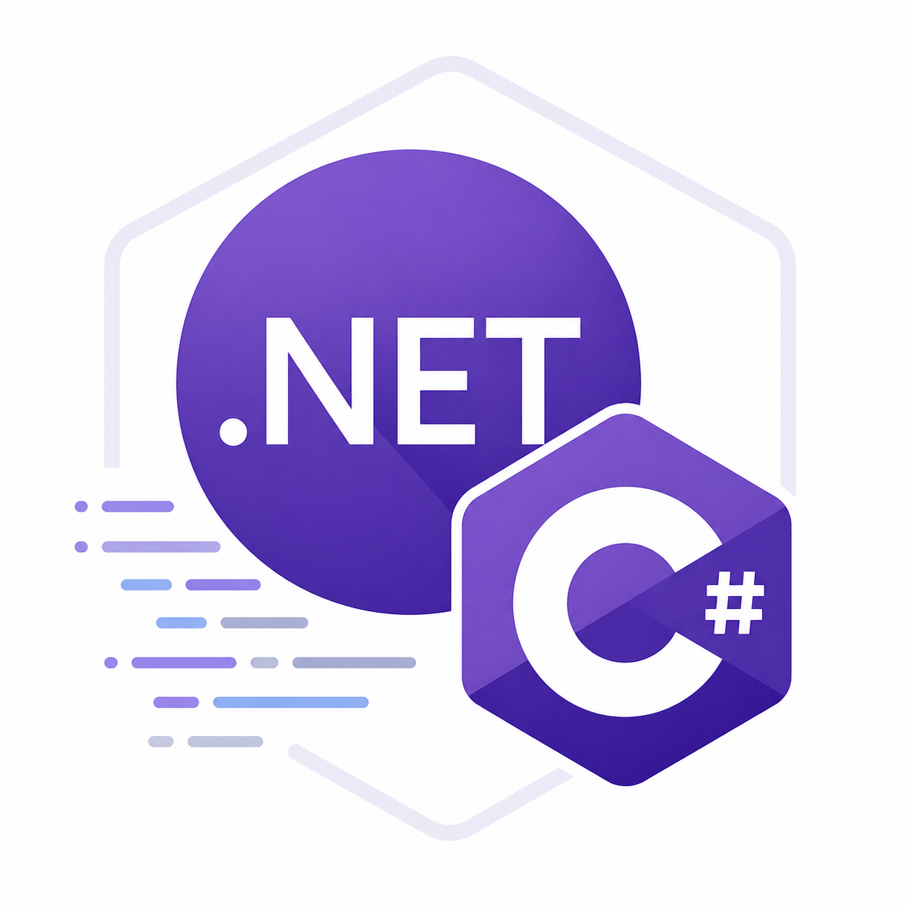

# .NET – Modifikátory, Runtimes & PInvoke

> Praktické rady pro správu přístupu, multiplatformní nasazení, uvolnění zdrojů a volání nativních DLL v .NET.

---



## Modifikátory přístupu

<details>
<summary>Přehled modifikátorů</summary>

Určuje, kdo má přístup k danému prvku.

| 📍 Odkud voláno                        | public | protected internal | protected | internal | private protected | private | file |
|----------------------------------------|--------|--------------------|-----------|----------|-------------------|---------|------|
| V rámci souboru                        | ✔️     | ✔️                 | ✔️        | ✔️       | ✔️                | ✔️      | ✔️   |
| V rámci třídy                          | ✔️     | ✔️                 | ✔️        | ✔️       | ✔️                | ✔️      | ❌   |
| Odvozená třída (stejná assembly)       | ✔️     | ✔️                 | ✔️        | ✔️       | ✔️                | ❌      | ❌   |
| Neodvozená třída (stejná assembly)     | ✔️     | ✔️                 | ❌        | ✔️       | ❌                | ❌      | ❌   |
| Odvozená třída (jiná assembly)         | ✔️     | ✔️                 | ✔️        | ❌       | ❌                | ❌      | ❌   |
| Neodvozená třída (jiná assembly)       | ✔️     | ❌                 | ❌        | ❌       | ❌                | ❌      | ❌   |

📖 Více podrobností [zde](https://learn.microsoft.com/en-us/dotnet/csharp/programming-guide/classes-and-structs/access-modifiers#summary-table).
</details>

---

## Složka `runtimes` & multiplatformní nasazení

<details>
<summary>K čemu slouží složka `runtimes`?</summary>

- Obsahuje **platformově specifické knihovny a binární soubory**.
- Umožňuje běh aplikace na různých OS a architekturách.
- V Unity obdobně slouží složka `Plugins`.

</details>

<details>
<summary>Typy nasazení</summary>

### Self-contained deployment

- Aplikace obsahuje **vlastní .NET runtime**.
- Běží nezávisle na systému uživatele.
- Větší velikost, ale maximální kompatibilita.

```xml
<PropertyGroup>
    <SelfContained>true</SelfContained>
    <RuntimeIdentifiers>win-x64;linux-x64;osx-x64</RuntimeIdentifiers>
</PropertyGroup>
```

### Framework-dependent deployment

- Aplikace **vyžaduje .NET runtime** na cílovém systému.
- Menší velikost, závislost na prostředí.

```xml
<PropertyGroup>
    <SelfContained>false</SelfContained>
</PropertyGroup>
```

> [!TIP]
> **Runtime Identifiers (RID)** určují cílovou platformu (např. `win-x64`, `linux-x64`, `osx-x64`).

</details>

---

## Uvolnění zdrojů

<details>
<summary>Řízené vs. neřízené zdroje</summary>

- **Řízené zdroje**: spravuje garbage collector, není nutné explicitně uvolňovat.
- **Neřízené zdroje**: soubory, DB, síť – nutné explicitně uvolnit.

</details>

<details>
<summary>Destruktor & Dispose</summary>

### Destruktor

- Syntaxe: `~ClassName()`
- Volán automaticky GC, není deterministický.

### Dispose

- Implementace `IDisposable`.
- Volán explicitně programátorem pro okamžité uvolnění zdrojů.

```csharp
public class MyResource : IDisposable
{
    public void Dispose()
    {
        // Uvolnění zdrojů
    }
}
```
</details>

---

## Volání funkcí z externích DLL (PInvoke)

<details>
<summary>Jak volat nativní kód?</summary>

- Použij `DllImport` z `System.Runtime.InteropServices`.

```csharp
using System.Runtime.InteropServices;

public class MyProgram
{
    [DllImport("User32.dll")]
    public static extern int MessageBox(IntPtr h, string m, string c, int type);
}
```

> [!TIP]
> Funkce z C++ DLL musí být exportována pomocí `extern "C"` a `__declspec(dllexport)`.

```c++
extern "C" __declspec(dllexport) int MessageBox(HWND h, LPCSTR m, LPCSTR c, int type)
{
    return MessageBoxA(h, m, c, type);
}
```
</details>

<details>
<summary>Speciální případ: `__Internal`</summary>

- Funkce se hledá přímo v hlavním spustitelném souboru.

```csharp
[DllImport("__Internal")]
public static extern int MyFunction();
```
</details>

<details>
<summary>PInvoke v Unity (AppleAuth příklad)</summary>

```csharp
private static class PInvoke
{
#if UNITY_IOS || UNITY_TVOS
    private const string DllName = "__Internal";
#elif UNITY_STANDALONE_OSX
    private const string DllName = "MacOSAppleAuthManager";
#endif

    [DllImport(DllName)]
    public static extern bool AppleAuth_IsCurrentPlatformSupported();
}
```

📖 Více info [zde](https://github.com/lupidan/apple-signin-unity/blob/master/AppleAuth/AppleAuthManager.cs).
</details>