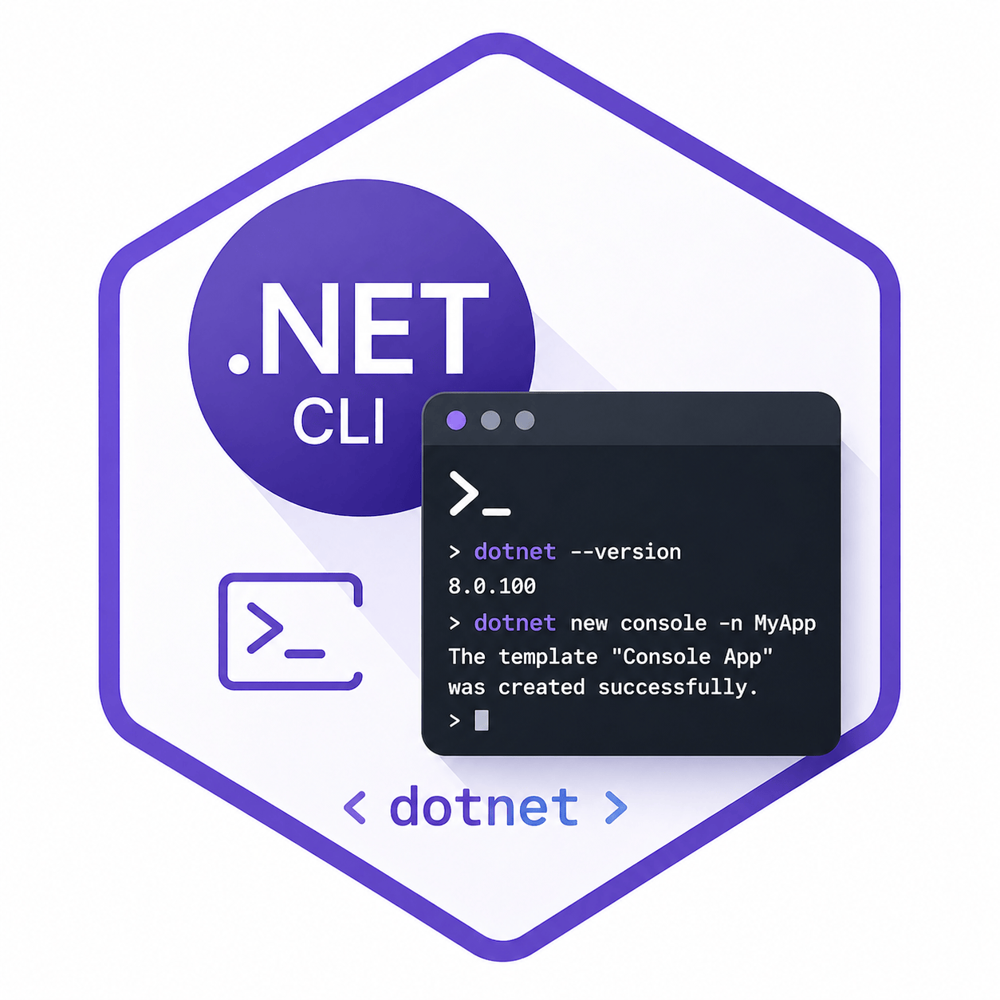

# .NET CLI (Command Line Interface)

> Pro práci je nutné mít nainstalovaný **.NET SDK** a **.NET Runtime**

---

## Umístění balíčků a nástrojů

| 🖥️ Operační systém | 📁 Cesta k nástrojům         | 🔍 Zjištění cesty ke spustitelnému souboru |
|--------------------|-----------------------------|--------------------------------------------|
| 🪟 Windows         | `%USERPROFILE%\.dotnet\tools` | `where dotnet`                            |
| 🐧 macOS / Linux   | `~/.dotnet/tools`           | `which dotnet`                             |

---

## Správa nástrojů (.NET Tools)

| ⚡ Akce             | 🌍 Globálně                                 | 📂 Lokálně                                 |
|--------------------|---------------------------------------------|--------------------------------------------|
| **Seznam nástrojů**| `dotnet tool list -g`                       | `dotnet tool list`                         |
| **Instalace**      | `dotnet tool install -g <název_balíčku>`    | `dotnet tool install <název_balíčku>`      |
| **Zastaralé**      | `dotnet tool list -g --outdated`            | `dotnet tool list --outdated`              |
| **Aktualizace**    | `dotnet tool update -g <název_balíčku>`     | `dotnet tool update <název_balíčku>`       |
| **Odinstalace**    | `dotnet tool uninstall -g <název_balíčku>`  | `dotnet tool uninstall <název_balíčku>`    |

---

## Záloha a obnova globálních nástrojů

### Záloha

1. 📋 Získejte seznam nainstalovaných nástrojů:
   `dotnet tool list -g`
2. 📝 Zaznamenejte názvy a verze pro pozdější obnovu.
3. 💾 Zálohujte adresář s nástroji:
   - 🪟 Windows: `%USERPROFILE%\.dotnet\tools`
   - 🐧 macOS / Linux: `~/.dotnet/tools`

### Obnova

1. 📂 Zkopírujte zálohovaný adresář zpět na původní místo.
2. 🔄 Restartujte terminál.
3. ✅ Ověřte instalaci:
   `dotnet tool list -g`