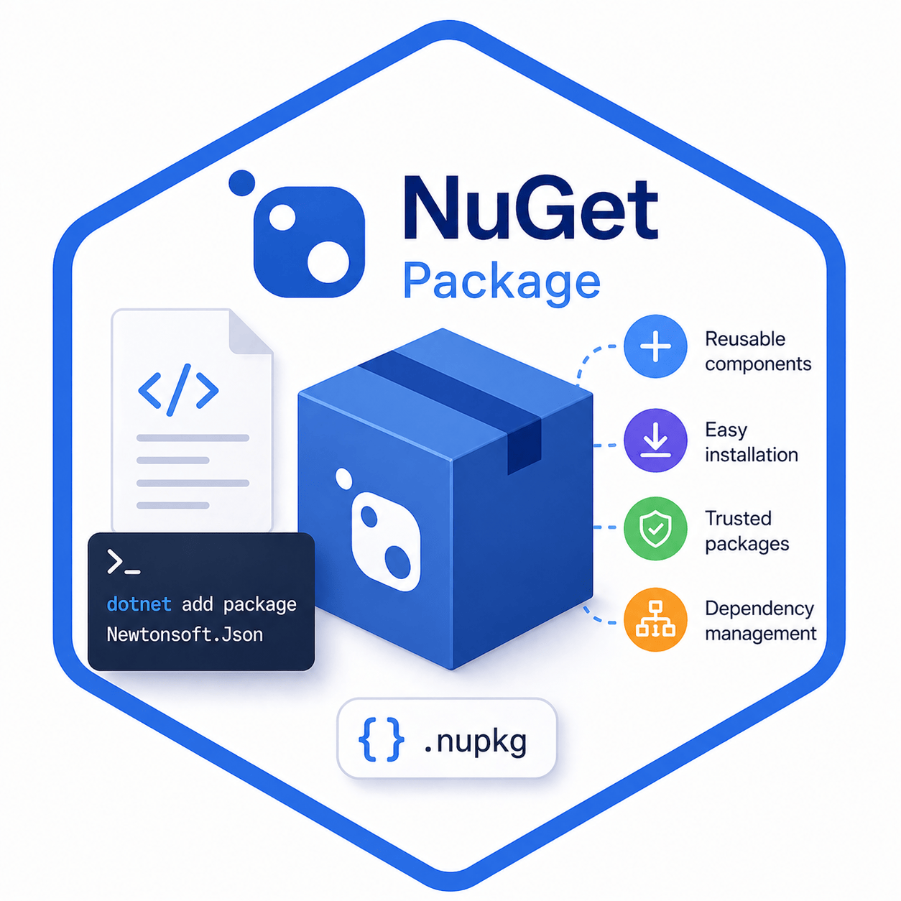

# NuGet Packages

> Pro správu balíčků je potřeba mít nainstalovaný **NuGet CLI** nebo používat integrované nástroje v IDE.

---



## Správa balíčků

<details>
<summary>Způsoby správy balíčků</summary>

| 💡 Typ              | 📄 Popis                                                                                   | 🕒 Používáno od/do |
|---------------------|-------------------------------------------------------------------------------------------|--------------------|
| packages.config    | Ukládá seznam všech balíčků v projektu **včetně závislostí**.<br>Balíčky jsou kopírovány do složky projektu.<br>Pomalejší buildy, větší repozitář. | < 2017             |
| PackageReference   | Balíčky se načítají přímo z **globální složky**.<br>Závislosti se spravují automaticky.<br>Rychlejší buildy, menší repozitář. | 2017+              |

---

### Detaily

#### packages.config
- Balíčky jsou uloženy v projektu (`packages` složka).
- Závislosti jsou explicitně uvedeny.
- Pomalejší buildy, větší velikost repozitáře.
- Používané před rokem 2017.

> Každý projekt má vlastní složku s balíčky, `.csproj` obsahuje pouze cesty.

---

#### PackageReference
- Balíčky se nestahují do projektu, ale do **globální složky**.
- Závislosti se spravují automaticky.
- Rychlejší buildy, menší nároky na prostor.
- Výchozí formát od roku 2017.

> Balíčky jsou spravovány centrálně, projekt využívá globální umístění.

</details>

---

## Globální složka balíčků

<details>
<summary>Umístění globální složky</summary>

| 🖥️ Operační systém | 📂 Cesta k balíčkům                |
|--------------------|-------------------------------------|
| 🪟 Windows         | `%userprofile%\.nuget\packages`     |
| 🐧 Mac/Linux       | `~/.nuget/packages`                 |

> Výchozí umístění lze změnit pomocí proměnné prostředí `NUGET_PACKAGES`.

</details>

Doplnil jsem příklad a tabulky příkazů pro práci s NuGet balíčky v .NET. Vložte následující úsek do souboru `programming/packages/nugetPackage.md` na vhodné místo (např. pod sekci "Správa balíčků").

---

## ‍ Příklady použití balíčku

```bash
dotnet add package SixLabors.ImageSharp.Drawing --version 2.1.7
```

---

## Přehled základních příkazů

### Správa balíčků

| Příkaz                                         | Popis                                                                                   |
|------------------------------------------------|----------------------------------------------------------------------------------------|
| `dotnet add package <název> --version <verze>` | Přidá nebo aktualizuje konkrétní NuGet balíček na zadanou verzi v projektu.             |
| `dotnet remove package <název>`                | Odebere balíček z projektu.                                                            |
| `dotnet restore`                               | Obnoví všechny závislosti projektu podle souboru `csproj` nebo `packages.config`.      |

### Kontrola a aktualizace

| Příkaz                                         | Popis                                                                                   |
|------------------------------------------------|----------------------------------------------------------------------------------------|
| `dotnet outdated`                              | Zobrazí seznam zastaralých NuGet balíčků v projektu a navrhne novější verze.           |
| `dotnet outdated --upgrade`                    | Automaticky aktualizuje všechny zastaralé NuGet balíčky na nejnovější verze.           |

### Správa zdrojů a cache

| Příkaz                                         | Popis                                                                                   |
|------------------------------------------------|----------------------------------------------------------------------------------------|
| `dotnet nuget list source`                     | Zobrazí seznam zdrojů NuGet balíčků (repozitářů).                                      |
| `dotnet nuget locals all --clear`              | Vyčistí lokální cache NuGet balíčků (odstraní staré verze ze složky s balíčky).         |