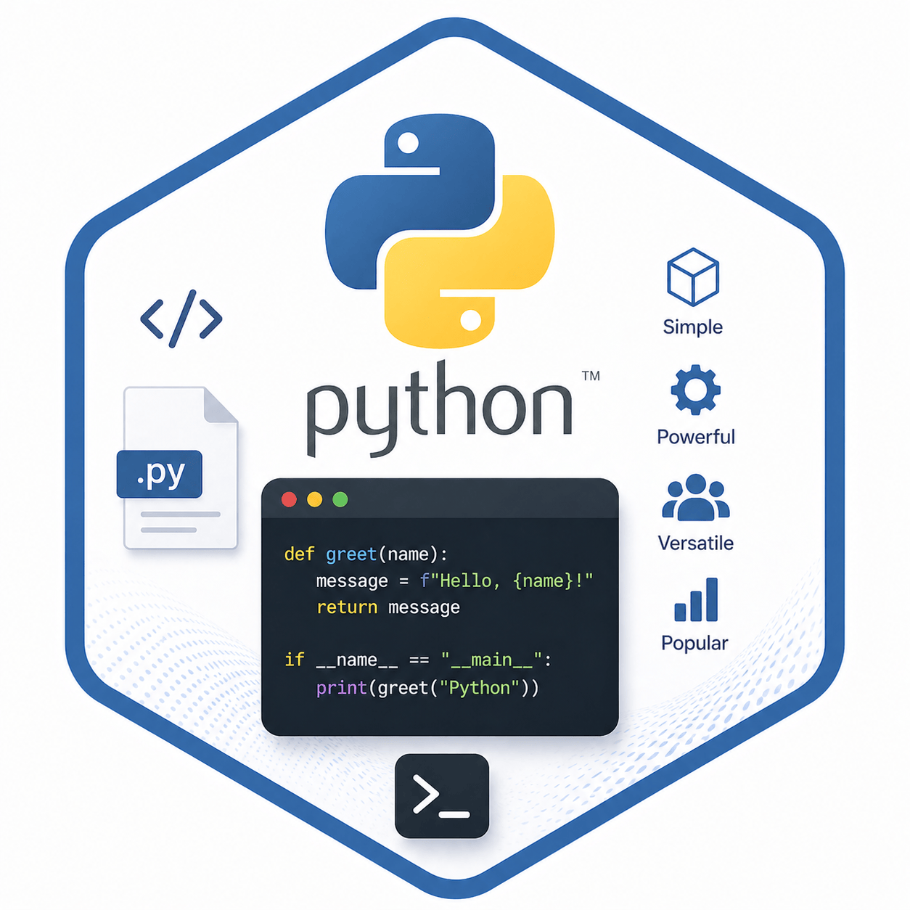

# Python – Balíčky & Tipy

> Praktické rady pro správu Python balíčků, zálohování, offline instalaci a užitečné příkazy.

---



## Co jsou Python balíčky?

<details>
<summary>Základní principy</summary>

- Balíčky rozšiřují možnosti Pythonu o nové knihovny a nástroje.
- Správa balíčků probíhá nejčastěji pomocí **pip**.
- Balíčky lze instalovat, zálohovat i používat offline.

</details>

---

## Záloha balíčků

<details>
<summary>Jak zálohovat balíčky?</summary>

1. Použij příkaz pro stažení balíčku a jeho závislostí do složky:

```bash
pip download <název\_balíčku> -d <cesta\_k\_adresáři>
```

- Všechny potřebné soubory se uloží do zvolené složky.
- Vhodné pro instalaci na počítač bez internetu.

</details>

---

## Instalace balíčků ze zálohy

<details>
<summary>Offline instalace</summary>

1. Nainstaluj balíčky ze zálohy pomocí:

```bash
pip install --no-index --find-links <cesta\_k\_adresáři>
```

- `--no-index` zakáže hledání online.
- `--find-links` určí složku se staženými balíčky.

> [!NOTE]
> Tento postup je ideální pro offline prostředí nebo firemní instalace.

</details>