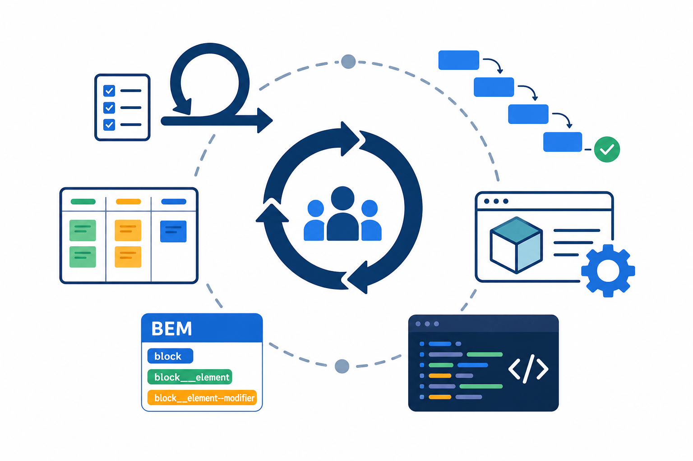

# Vývojové metodiky a konvence

> Přehled metodologií řízení projektů, rychlého prototypování a konvencí pojmenování v kódu.

---



## Vývojové metodiky

### Agilní metodika (Scrum)

Zaměřuje se na spolupráci, zákaznickou spokojenost a rychlou reakci na změny. Práce probíhá v krátkých iteracích nazývaných **sprinty** (2–4 týdny).

| Fáze | Popis |
|------|-------|
| **Plánování sprintu** | Tým vybírá úkoly z backlogu a plánuje jejich provedení |
| **Vývoj a Daily Scrum** | Denní schůzky, průběžné testování, řešení překážek |
| **Revize sprintu** | Prezentace výsledků zákazníkovi, získání zpětné vazby |
| **Retrospektiva** | Zhodnocení procesu, návrhy na zlepšení |

> [!NOTE]
> Scrum je vhodný pro projekty s proměnnými požadavky a nutností rychlé adaptace. Nevhodné pro projekty s pevným plánem a jasně definovanými výstupy.

---

### Vodopádová metodika

Sekvenční přístup – každá fáze musí být zcela dokončena před zahájením další.

| Fáze | Popis |
|------|-------|
| **Analýza požadavků** | Shromažďování a analýza potřeb zákazníka |
| **Návrh** | Plánování struktury a funkcí systému |
| **Implementace** | Převod návrhu do zdrojového kódu |
| **Testování** | Ověření funkčnosti a hledání chyb |
| **Nasazení** | Přechod do produkčního prostředí |
| **Údržba** | Opravy, vylepšení, sledování výkonu |

> [!NOTE]
> Vhodné pro projekty s jasně definovanými a neměnnými požadavky.

---

### Kanban

Vizuální řízení práce pomocí tabule a karet. Průběžná dodávka bez pevných iterací.

- Tabule je rozdělena na sloupce (např. Backlog → In Progress → Done).
- Karty reprezentují jednotlivé úkoly.
- Klíčový princip: omezení počtu rozpracovaných úkolů (**WIP limit**).
- Průběžné hodnocení procesu a optimalizace.

> [!NOTE]
> Kanban je vhodný pro provozní týmy a podpůrné procesy. Nevhodné pro projekty s pevnými termíny a milníky.

---

## Rychlé prototypování

Rychlé prototypování slouží k ověření konceptu co nejdříve – cílem je funkční model, ne dokonalý produkt.

1. **Definice konceptu** – jasná představa, klíčové mechaniky a cíle.
2. **Vytvoření základní scény** – např. v Unity nebo jiném nástroji.
3. **Přidání objektů** – jednoduché tvary reprezentující prvky (krychle, koule).
4. **Implementace mechanik** – skriptování, základní funkce.
5. **Testování a iterace** – získání zpětné vazby, úpravy.
6. **Opakování cyklu** – iterativní vylepšování.

> [!IMPORTANT]
> Rychlost a zpětná vazba jsou prioritou. Neztrácejte čas perfektní grafikou nebo architekturou v rané fázi.

---

## BEM metodika

**BEM = Block Element Modifier** – strukturované pojmenování tříd v HTML/CSS.

```html
<div class="block">
  <div class="block__element"></div>
  <div class="block__element--modifier"></div>
</div>
```

```css
.block { ... }
.block__element { ... }
.block__element--modifier { ... }
```

| Typ | Oddělovač | Příklad |
|-----|-----------|---------|
| Block | *(žádný)* | `.menu` |
| Element | `__` | `.menu__item` |
| Modifier | `--` | `.menu__item--active` |

---

## Konvence pojmenování v kódu

| Pravidlo | Příklad |
|----------|---------|
| Popisné názvy, bez zkratek | `userRepository` místo `ur` |
| Boolovské proměnné s předponou `is`, `has`, `can` | `isAvailable`, `hasAccess` |
| Název funkce začíná slovesem | `getUserName()`, `calculateTotalPrice()` |
| Konzistentní styl napříč projektem | `camelCase` nebo `snake_case` |
| Pole v množném čísle | `users`, `products`, `orders` |
| Magické hodnoty jako pojmenované konstanty | `MAX_RETRIES = 3` místo `3` |
