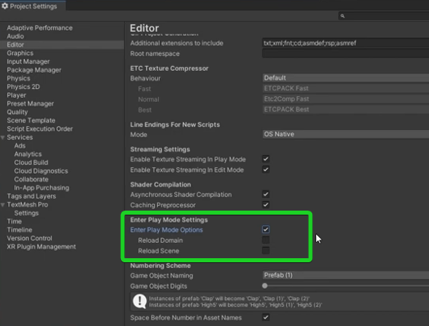

# Unity – Základy a rychlý start

> Efektivní práce v Unity, rychlé prototypování a výběr správného typu projektu.

---

## Rychlejší vstup do Play módu

Vypnutím voleb **Reload Domain** a **Reload Scene** se výrazně zkrátí čas spuštění Play módu. Unity tak přeskočí časově náročné reinicializace.

| Možnost | Popis |
|---------|-------|
| **Reload Domain** | Znovunačte všechny skripty – zaručí čistý stav, ale zpomaluje vstup do hry. |
| **Reload Scene** | Znovunačte aktuální scénu – vhodné pro čistý stav objektů. |

---

## Videa – doporučené zdroje

### Výběr 2D vs. 3D projektu

<iframe width="560" height="315" src="https://www.youtube.com/embed/jp4xyrW7GYA?si=izxgdHwJw2UC-rpq" title="YouTube video player" frameborder="0" allow="accelerometer; autoplay; clipboard-write; encrypted-media; gyroscope; picture-in-picture; web-share" referrerpolicy="strict-origin-when-cross-origin" allowfullscreen></iframe>

### Rychlé prototypování

<iframe width="560" height="315" src="https://www.youtube.com/embed/x10P0RNHm4M?si=mic5u9umNO_LTWdw" title="YouTube video player" frameborder="0" allow="accelerometer; autoplay; clipboard-write; encrypted-media; gyroscope; picture-in-picture; web-share" referrerpolicy="strict-origin-when-cross-origin" allowfullscreen></iframe>

### Klíčová slova v Unity

<iframe width="560" height="315" src="https://www.youtube.com/embed/yGQbk4OeCI4?si=XOAgsp79gsvCaU9I" title="YouTube video player" frameborder="0" allow="accelerometer; autoplay; clipboard-write; encrypted-media; gyroscope; picture-in-picture; web-share" referrerpolicy="strict-origin-when-cross-origin" allowfullscreen></iframe>

### Vývojové vzory v Unity

<iframe width="560" height="315" src="https://www.youtube.com/embed/BwA36em_DnA?si=fUcXu99az5utsf5C" title="YouTube video player" frameborder="0" allow="accelerometer; autoplay; clipboard-write; encrypted-media; gyroscope; picture-in-picture; web-share" referrerpolicy="strict-origin-when-cross-origin" allowfullscreen></iframe>
