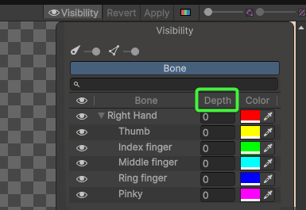
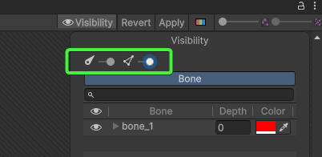
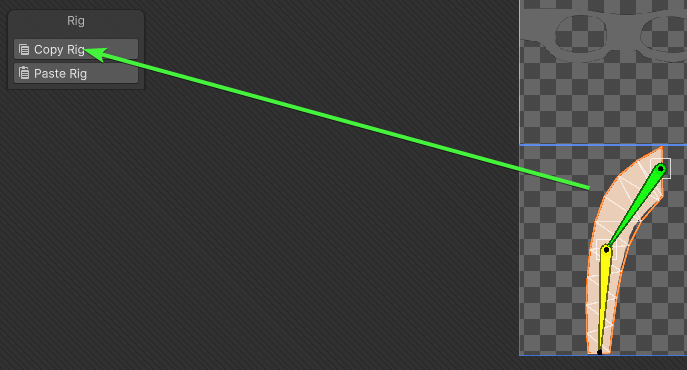
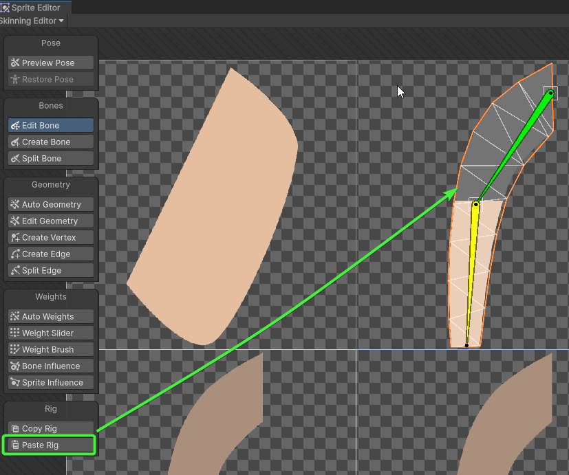
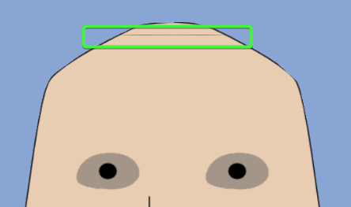
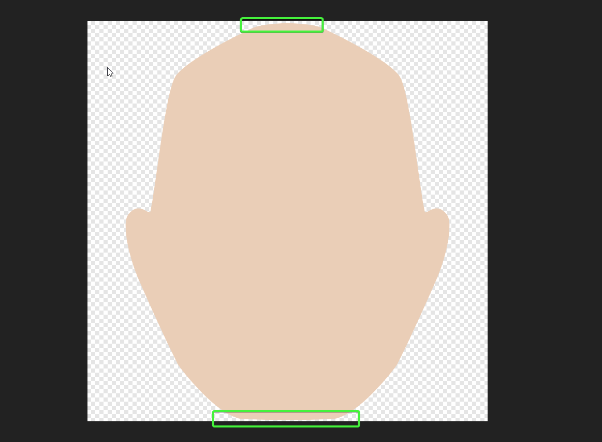
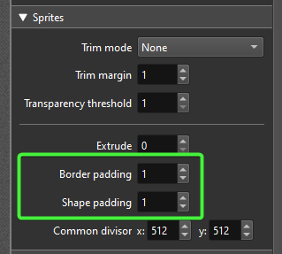
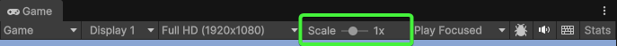

# Unity 2D: sprity, Tilemap a velikost grafiky

SpriteRenderer zobrazuje samostatný sprite, zatímco Tilemap skládá dlaždice do buněk mřížky.

Pro opakované pozadí nebo mapu se hodí Tilemap, pro samostatně pohyblivou postavu obvykle SpriteRenderer.

## Před použitím

Ukázka je pro Unity 6 s 2D Tilemap Editor a běžným Tile assetem.

Vytvoř **Grid → Tilemap**, připrav dlaždici se spritem a ověř, že ji kamera vidí.

## Tilemap: vytvoření a obarvení dlaždic

Ulož `TilemapExample.cs`, přidej jej na samostatný objekt a v Inspectoru přiřaď výukovou Tilemap i Tile asset.

Ukázka při startu vymaže obsah přiřazené Tilemap, proto nepoužívej hotovou ručně vytvořenou mapu.

```csharp
using UnityEngine;
using UnityEngine.Tilemaps;

/// <summary>Vytvoří a obarví obdélník dlaždic ve výukové mapě.</summary>
public class TilemapExample : MonoBehaviour
{
    [SerializeField] private Tilemap tilemap;
    [SerializeField] private TileBase tile;
    [SerializeField, Min(1)] private int width = 8;
    [SerializeField, Min(1)] private int height = 4;
    [SerializeField] private Color tint = Color.cyan;

    private void Start()
    {
        if (tilemap == null || tile == null)
        {
            Debug.LogError("Přiřaď Tilemap i Tile asset.", this);
            return;
        }
        tilemap.ClearAllTiles();
        for (int x = 0; x < width; x++)
        for (int y = 0; y < height; y++)
        {
            var position = new Vector3Int(x, y, 0);
            tilemap.SetTile(position, tile);
            // Odemkni jen barvu; ostatní příznaky dlaždice zachovej.
            var flags = tilemap.GetTileFlags(position);
            tilemap.SetTileFlags(position, flags & ~TileFlags.LockColor);
            tilemap.SetColor(position, tint);
        }
    }
}
```

Po spuštění očekávej obdélník 8 × 4 dlaždic s azurovým tónováním.

Dva oddělené cykly nejsou obecnou podmínkou změny barvy; zásadní je pořadí vložení dlaždice a příznak `LockColor`.

Příznaky vysvětluje [Unity TileFlags](https://docs.unity3d.com/6000.0/Documentation/ScriptReference/Tilemaps.TileFlags.html).

Vlastní RuleTile může při obnově nastavovat vlastní barvu, proto u něj ověř i implementaci pravidel.

## Velikost obrázku a PPU

**Pixels Per Unit** určuje počet pixelů zdrojového spritu na jednu světovou jednotku při měřítku Transformu 1.

Šířka ve scéně je `šířka v pixelech / PPU`, nikoli pevně daná vzdáleností od kamery.

| Sprite | PPU | Velikost ve scéně |
|---|---|---|
| 32 × 32 px | 32 | 1 × 1 jednotka |
| 64 × 32 px | 32 | 2 × 1 jednotka |
| 256 × 256 px | 256 | 1 × 1 jednotka |

Pro společnou pixelovou kresbu drž konzistentní PPU a rozlišení vybírej podle požadovaného detailu při cílovém zobrazení.

Mocniny dvou mohou být relevantní pro textury, kompresi a atlas, ale nejsou univerzální povinností pro rozměr každého jednotlivého spritu.

## Animace: předpoklady

Následující obrázkové postupy vyžadují kompatibilní balíček **2D Animation**, Sprite Editor a připravenou geometrii spritu.

Kosti určují transformace, weights vliv kostí na vrcholy a depth pořadí překrývajících se částí.

Při kopírování rigu ověř názvy kostí, geometrii a váhy nového spritu; podobný obrázek sám nezaručuje stejné deformace.

## Animace obrázku

<details>
<summary>Hloubka (Depth) u kostí</summary>

> Hloubka ovlivňuje pořadí vykreslení Sprite Mesh.

1. Otevři `Sprite Editor`
2. Přepni do `Skinning Editor`
3. Nastav hloubku u kostí



</details>

<details>
<summary>Univerzální Rigging</summary>

1. Otevři `Sprite Editor`
2. Přepni do `Skinning Editor` (aktivuj `Visibility`)
3. Vytvoř kosti (bones)
4. Nastav Geometry a Weights

> Pokud se část nevykresluje barevně, zkontroluj nastavení posuvníků:



5. Zkopíruj rig

   

6. Otevři nový sprite
7. Vlož rig

   

</details>

## Řešení chyb při vykreslování spritu

Nejprve ověř import textury, atlas a cílové rozlišení; [Pixel Perfect Camera](camera.md#pixel-perfect-camera) pomáhá pixel artu, ale není povinná pro všechny 2D projekty.

<details>
<summary>Černé čáry</summary>



**Řešení:**

- Zkontroluj umístění obrázku

  

- Nastav padding v `TexturePacker`

  

| Typ paddingu | Popis |
|-------------------|-----------------------------------------------|
| Border padding | Mezera kolem okrajů celého sheetu |
| Shape padding | Mezera mezi jednotlivými sprites na sheetu |

> Zvyš padding, pokud se problém opakuje.

</details>

<details>
<summary>Problikávání</summary>

Zkontroluj měřítko v herním okně, že je nastaveno na **1x**.



</details>
