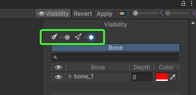
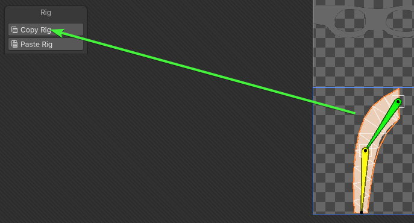
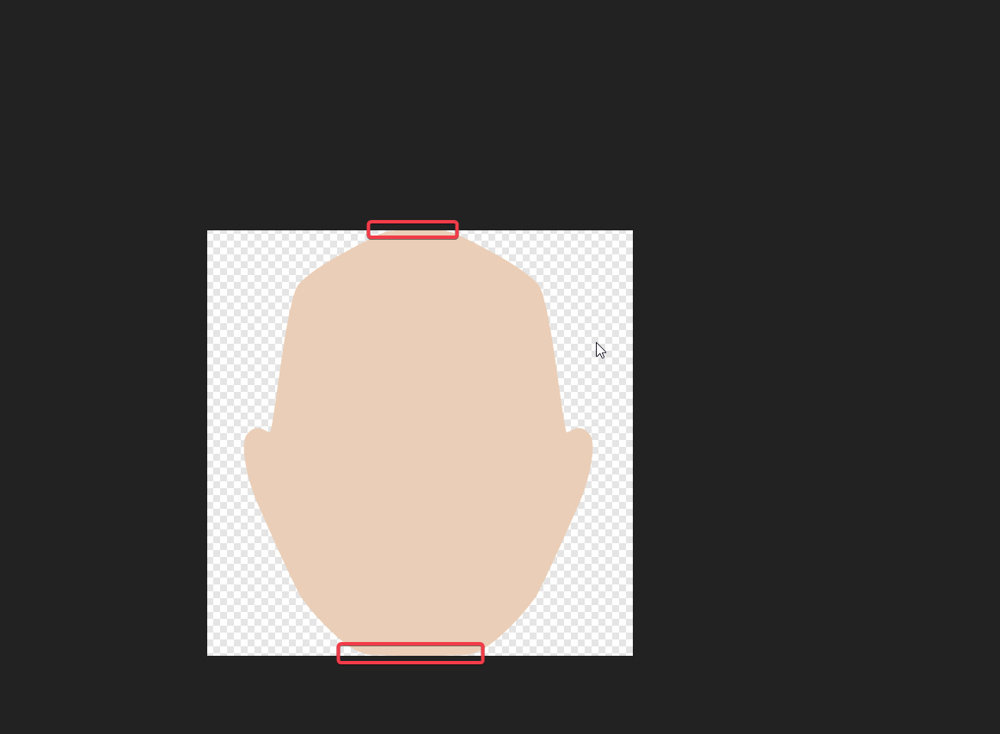
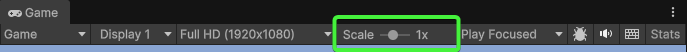

## 2D

### Tilemap x Sprite Renderer


### Tilemap

<details>
<summary><span style="color:#1E90FF;">Vykreslit a nastavit barvu na dlaždici</span></summary>

> [!IMPORTANT]
> Z nějakého důvodu kód funguje pouze pokud je to takto oddělený.

```c#
        public void GenerateTilemap(int width, int height, Color color)
        {
            // Delete all tiles
            this.ClearTiles();

            for (int x = 0; x < width; x++)
            for (int y = 0; y < height; y++)
            {
                this.Tilemap.SetTile(new(x, y, 0), this.TileBase);
            }

            for (int x = 0; x < width; x++)
            for (int y = 0; y < height; y++)
            {
                this.Tilemap.SetColor(new(x, y, 0), color);
            }
        }
```

</details>

<details>
<summary><span style="color:#1E90FF;">Pravidla pro Tilemap</span></summary>


</details>

### Velikost obrázku

<details>
<summary><span style="color:#1E90FF;">Definice velikostí</span></summary>

> [!NOTE]
> Používají se mocniny čísla 2.
>
>Například: 16x16 px, 32x32 px, 64x64 px, 128x128 px, 256x256 px, 512x512 px, atd...

16x16 px

- **Ikony a jednoduché grafiky**
- Používá se pro základní UI prvky a malé ikony.
- **Vzdálenost od kamery:** Velmi daleko, nedůležitý detail.

32x32 px

- **Malé UI prvky**
- Ideální pro malé ikony a základní grafiky v uživatelském rozhraní.
- **Vzdálenost od kamery:** Velmi daleko, nedůležitý detail.

64x64 px

- **Menší objekty**
- Vhodné pro objekty s mírným detailem, jako jsou malé herní prvky.
- **Vzdálenost od kamery:** Střední vzdálenost, detail je stále mírně rozmazaný.

128x128 px

- **Střední objekty**
- Dobré pro středně velké herní prvky a detaily v prostředí.
- **Vzdálenost od kamery:** Blízká vzdálenost, viditelný detail.

256x256 px

- **Větší objekty a detailní textury**
- Používá se pro detailnější objekty a textury v herním prostředí.
- **Vzdálenost od kamery:** Střední až blízká vzdálenost, detailní zobrazení.

512x512 px

- **Velmi detailní objekty**
- Vhodné pro blízké záběry a detailní textury.
- **Vzdálenost od kamery:** Blízká vzdálenost, vysoká úroveň detailu.

1024x1024 px

- **Velké objekty a textury**
- Ideální pro velmi detailní textury a objekty z blízka.
- **Vzdálenost od kamery:** Velmi blízká vzdálenost, extrémní detail.

2048x2048 px a více

- **Maximální detail**
- Nejvyšší kvalita textur pro extrémně detailní objekty a prostředí.
- **Vzdálenost od kamery:** Extrémně blízká vzdálenost, maximální detail.

</details>

<details>
<summary><span style="color:#1E90FF;">Nastavení velikosti</span></summary>

Například obrázek o velikosti 64x64 pixelů.


> [!WARNING]
> Pixel Per Unit (PPU) - kolik pixelů je na jednotku v Unity.
>
> Určuje velikost Sprite
>
> Je důležité nastavit dle velikosti grafiky, aby byla správně zobrazena.
>
> Například pro obrázky o velikosti 256x256 pixelů ve sprite sheet, použijeme PPU 256 na sprite sheet.

Příklad:

Vytvořit dlaždici o velikosti 1x1 jednotka.

Pokud nastavíte PPU na 32, pak sprite o rozměrech 32x32 dokonale zabere celou dlaždici (1x1).

Nyní chcete dlaždici 2x2, pak byste nastavili PPU 16, takže pro každou jednotku použije 16 pixelů ze spritu. (16 / 32 =
2 jednotky).

Například pro dlaždici o velikosti 1x2, pokud byste nastavili PPU 32, tak by rozměr obrázku byl 32x16 px.
(32/32 = 1, 32/16=2) px

Pro více
informací <a href="https://www.reddit.com/r/aseprite/comments/vq2mq9/what_size_should_sprites_be_for_a_2d_game/">
zde</a>.

</details>

### Animace obrázku

<details>
<summary><span style="color:#1E90FF;">Hloubka (Depth) u kostí</span></summary>

> [!IMPORTANT]
> Ovlivňuje **pořadí vykreslení vybraného Sprite (Sprite Mesh)**.
>
> Příklad:
>
> Pokud máte levou paži (arm L), která je ovlivněna třemi kostmi.
>
>Nastavíte například hloubku jedné z kostí `forearm_l` na `-5`, zatímco ostatní kosti budou mít hloubku `0`.
>
> Tak se tato `forearm_l` vykreslí pod ostatními částmi tohoto Sprite Mesh.

1. Otevřít `Sprite Editor`
2. Přepnout do `Skinning Editor`

   > [!NOTE]
   > Aktivovat `Visibility`, pokud není aktivní

3. Nastavit u kostí `depth`

   

</details>

<details>
<summary><span style="color:#1E90FF;">Univerzální Rigging </span></summary>

1. Otevřít `Sprite Editor`
2. Přepnout do `Skinning Editor`

   > [!NOTE]
   > Aktivovat `Visibility`, pokud není aktivní
3. Vytvořit kosti (bones)
4. Nastavit Geometry a Weights

   > [!IMPORTANT]
   > Pokud se nevykresluje barevně část, která je ovlivněna kostí, může to být způsobeno tímto nastavením:
   >
   > 
   >
   > Ujistěte se, že máte oba posuvníky posunuté úplně do prava.

4. Zkopírovat rig
   

5. Otevřít nový sprite
6. Vložit rig
   

</details>

### Řešení chyb při vykreslování sprite

> [!IMPORTANT]
> Na kameře musí být přidána komponenta `Pixel Perfect Camera` pro 2D
>
> Zabraňuje deformacím, rozmazání a trhání obrazu

<details>
<summary><span style="color:#1E90FF;">Černé čáry</span></summary>

Problém, viz. níže:


Řešení:

- Zkontrolujte obrázek, zda je správně umístěn.

  

  > [!NOTE]
  > Upravit obrázek hlavy, aby byla umístěna uvnitř rozsahu

  > [!CAUTION]
  > Takto vypadá špatně umístěný obrázek v dokumentu
  >
  > 

- Nastavit padding v `TexturePacker`

  

  > [!NOTE]
  > Pomůže zabránit problémům, jako je "bleeding" efekt. (Přetekání obrázku přes okraje.)

  Nastavte libovolnou velikost výplně, která bude větší než 0 pro:

    - **Border padding**

      Mezera kolem okrajů celého `sheetu`.

      > [!NOTE]
      > Pomáhá předejít vizuálním artefaktům (nechtěným chybám jako jsou rozmazání nebo barevné okraje) na okrajích
      `sheetu`.

    - **Shape padding**

      Mezera mezi jednotlivými `sprites` na `sheetu`.

      > [!NOTE]
      > Zabraňuje vzájemnému překrývání a nežádoucím vlivům mezi jednotlivými `sprites`.

> [!TIP]
> Objeví-li se později znovu černé čáry, stačí zvýšit velikost výplně (padding)

</details>

<details>
<summary><span style="color:#1E90FF;">Problikávání</span></summary>

Zkontrolujte měřítko v herním okně, že je nastaveno na **1x**



</details>