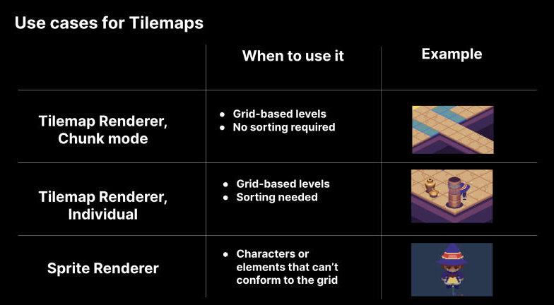
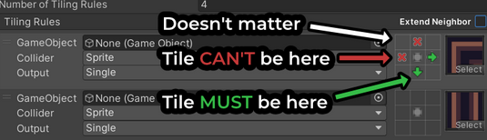
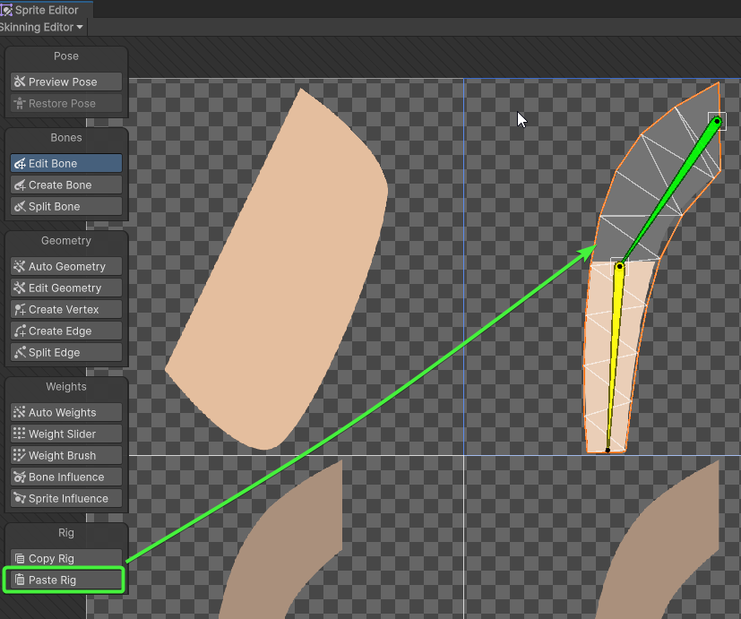

# 🖼️ Unity 2D – Tilemap, Sprity & Tipy

> 🚀 Praktické rady pro práci s 2D grafikou v Unity, nastavení Tilemap, velikosti obrázků, animace a řešení běžných problémů.

---

## 🧩 Tilemap vs Sprite Renderer



---

## 🗺️ Tilemap

<details>
<summary><span style="color:#1E90FF;">🎨 Vykreslení a nastavení barvy dlaždic</span></summary>

> ⚠️ Kód funguje pouze pokud je rozdělen do dvou cyklů.

```csharp
public void GenerateTilemap(int width, int height, Color color)
{
    // Smazání všech dlaždic
    this.ClearTiles();

    for (int x = 0; x < width; x++)
    for (int y = 0; y < height; y++)
    {
        this.Tilemap.SetTile(new(x, y, 0), this.TileBase);
    }

    for (int x = 0; x < width; x++)
    for (int y = 0; y < height; y++)
    {
        this.Tilemap.SetColor(new(x, y, 0), color);
    }
}
```
</details>

<details>
<summary><span style="color:#1E90FF;">📏 Pravidla pro Tilemap</span></summary>



</details>

---

## 🖼️ Velikost obrázku

<details>
<summary><span style="color:#1E90FF;">📐 Definice velikostí</span></summary>

| 📏 Rozměr      | 💡 Použití                        | 👁️ Vzdálenost od kamery         |
|----------------|----------------------------------|----------------------------------|
| 16x16 px       | Ikony, jednoduché UI             | Velmi daleko, detail není důležitý |
| 32x32 px       | Malé UI prvky, ikony             | Velmi daleko                     |
| 64x64 px       | Menší objekty                    | Střední vzdálenost               |
| 128x128 px     | Střední objekty                  | Blízká vzdálenost                |
| 256x256 px     | Větší objekty, detailní textury  | Střední až blízká vzdálenost     |
| 512x512 px     | Velmi detailní objekty           | Blízká vzdálenost                |
| 1024x1024 px   | Velké objekty, textury           | Velmi blízká vzdálenost          |
| 2048x2048+ px  | Maximální detail                 | Extrémně blízká vzdálenost       |

> 📌 Používejte mocniny čísla 2 pro optimální výkon.

</details>

<details>
<summary><span style="color:#1E90FF;">⚙️ Nastavení velikosti (PPU)</span></summary>


> ⚠️ **Pixel Per Unit (PPU)** určuje, kolik pixelů tvoří jednu jednotku v Unity. Nastavte podle velikosti grafiky pro správné zobrazení.

| 🖼️ Rozměr spritu | ⚙️ PPU | 📏 Výsledek na scéně |
|------------------|--------|---------------------|
| 32x32 px         | 32     | 1x1 jednotka        |
| 256x256 px       | 256    | 1x1 jednotka        |

> Pro více informací [reddit: Jakou velikost spritů použít?](https://www.reddit.com/r/aseprite/comments/vq2mq9/what_size_should_sprites_be_for_a_2d_game/)

</details>

---

## 🎬 Animace obrázku

<details>
<summary><span style="color:#1E90FF;">🦴 Hloubka (Depth) u kostí</span></summary>

> 🗝️ Hloubka ovlivňuje pořadí vykreslení Sprite Mesh.

1. Otevři `Sprite Editor`
2. Přepni do `Skinning Editor`
3. Nastav hloubku u kostí


</details>

<details>
<summary><span style="color:#1E90FF;">🦴 Univerzální Rigging</span></summary>

1. Otevři `Sprite Editor`
2. Přepni do `Skinning Editor` (aktivuj `Visibility`)
3. Vytvoř kosti (bones)
4. Nastav Geometry a Weights

> ⚠️ Pokud se část nevykresluje barevně, zkontroluj nastavení posuvníků:


4. Zkopíruj rig  
   
5. Otevři nový sprite
6. Vlož rig  
   

</details>

---

## 🛠️ Řešení chyb při vykreslování sprite

> 🟢 Na kameře musí být komponenta `Pixel Perfect Camera` pro 2D!

<details>
<summary><span style="color:#1E90FF;">🖤 Černé čáry</span></summary>


**Řešení:**

- Zkontroluj umístění obrázku  
  

- Nastav padding v `TexturePacker`  
  

| 🏷️ Typ paddingu   | 💡 Popis                                      |
|-------------------|-----------------------------------------------|
| Border padding    | Mezera kolem okrajů celého sheetu             |
| Shape padding     | Mezera mezi jednotlivými sprites na sheetu    |

> 📌 Zvyš padding, pokud se problém opakuje.

</details>

<details>
<summary><span style="color:#1E90FF;">✨ Problikávání</span></summary>

Zkontroluj měřítko v herním okně, že je nastaveno na **1x**.


</details>