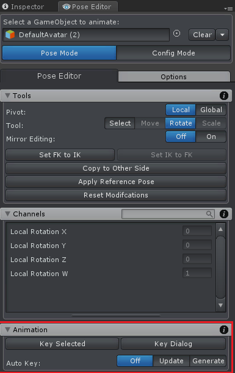

## UMotion

Uložení změn

Existuje několik způsobů (můžete použít kterýkoli z těchto 3):

- Pomocí "Key Selected" vytvořte/upravte klíče pro vybrané kosti/transformace
- Povolte "Auto Key", aby UMotion automaticky vytvořil klíče/upravil klíče
- Použijte "Key Dialog" pro získání pěkného přehledu o tom, co jste změnili a co by mělo být klíčováno

	

