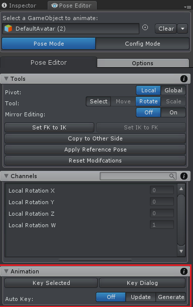

# UMotion – Klíčování animací v Unity

> Praktické tipy pro efektivní práci s UMotion při ukládání změn animací.

---

## Uložení změn v UMotion

Jak klíčovat změny?

| 🏷️ Způsob         | 💡 Popis                                                                 |
|-------------------|--------------------------------------------------------------------------|
| Key Selected      | Vytvoř nebo uprav klíče pro vybrané kosti/transformace.                  |
| Auto Key          | UMotion automaticky klíčuje změny při úpravě.                            |
| Key Dialog        | Přehledně zobrazí změny a umožní je klíčovat.                            |

---

## Postup klíčování

Krok za krokem

1. Vyber kosti nebo transformace, které chceš animovat.
2. Použij **Key Selected** pro ruční klíčování, nebo aktivuj **Auto Key** pro automatické klíčování.
3. Otevři **Key Dialog** pro kontrolu a úpravu klíčů.
4. Ulož změny animace.

