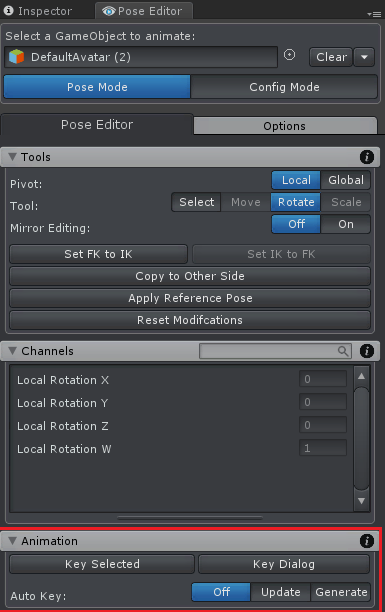

# UMotion – Klíčování animací v Unity

> Praktické tipy pro efektivní práci s UMotion při ukládání změn animací.

UMotion je doplněk editoru pro práci s animacemi.

Potřebuješ nainstalovanou kompatibilní verzi, otevřený UMotion projekt a vybraný klip.

Změna pózy sama není uložený animační klíč ani exportovaný AnimationClip.

## Uložení změn v UMotion

| 🏷️ Způsob | 💡 Popis |
|-------------------|--------------------------------------------------------------------------|
| Key Selected | Vytvoř nebo uprav klíče pro vybrané kosti/transformace. |
| Auto Key | UMotion automaticky klíčuje změny při úpravě. |
| Key Dialog | Přehledně zobrazí změny a umožní je klíčovat. |

[Zobrazit obrázek v původní velikosti](../../images/WHDIpG6Uzg.png)

## Postup klíčování

1. Vyber kosti nebo transformace, které chceš animovat.
2. Použij **Key Selected** pro ruční klíčování, nebo aktivuj **Auto Key** pro automatické klíčování.
3. Otevři **Key Dialog** pro kontrolu a úpravu klíčů.
4. Ulož změny animace.

## Ověření a důležité poznámky

Po vytvoření klíče přesuň časový kurzor jinam a vrať jej zpět.

Očekávaná póza musí zůstat zachovaná.

Ulož UMotion projekt a při použití v Animatoru ověř i exportovaný klip, protože jde o samostatné artefakty.

Auto Key zapínej vědomě, aby při pouhé úpravě pózy nevznikly nechtěné klíče.

Detaily exportu a rozdíly formátů ověř v [manuálu UMotion](https://soxware.com/umotion-manual/ImportExport.html).
