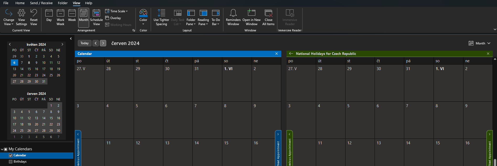
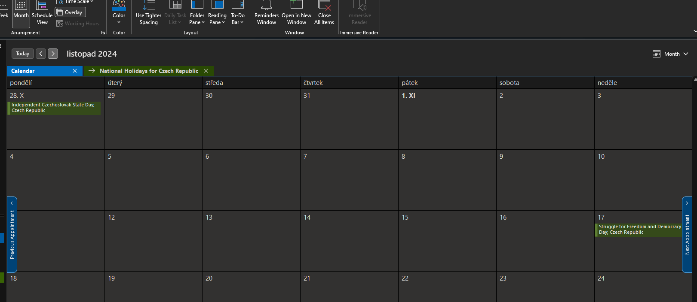

## Zobrazení

Sloučení/Oddělení panelů kalendáře

View ➡ Overlay

- Pokud je vypnuto, každý kalendář se zobrazí v samostatném okně

    

- Pokud je zapnuto, kalendáře se zobrazí v jednom okně

    

