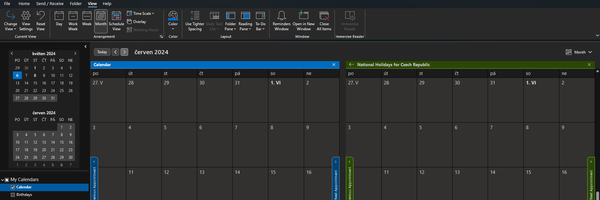
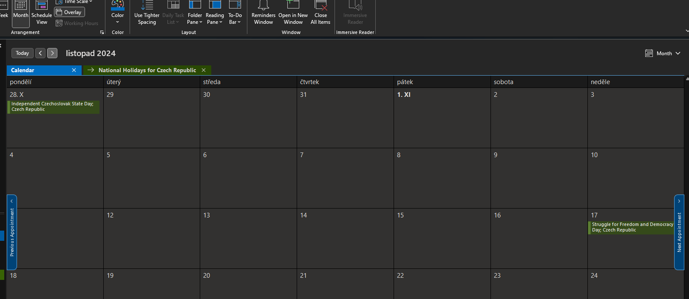

# Outlook – Kalendář

> Přehled funkcí zobrazení a správy kalendáře v Outlooku.

---

## Zobrazení kalendáře

### Sloučené a oddělené zobrazení

Pomocí **View → Overlay** lze přepínat mezi oddělením a sloučením více kalendářů do jednoho okna.

**Oddělené zobrazení** – každý kalendář je zobrazen samostatně:

**Sloučené zobrazení** – všechny kalendáře jsou zobrazeny v jednom okně:

