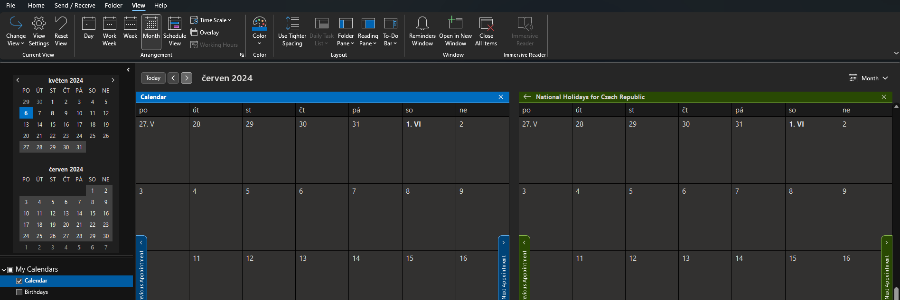
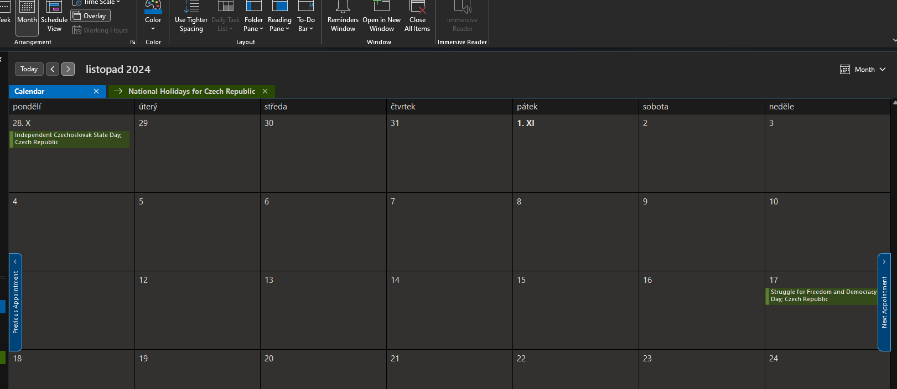

# Outlook – zobrazení více kalendářů

Kalendáře lze zobrazit vedle sebe nebo překrýt pro snadnější porovnání termínů.

## Klasický Outlook pro Windows

1. V kalendáři zaškrtni další kalendář v levém panelu.
2. Na jeho záložce vyber šipku **View in Overlay Mode**.
3. Pro návrat vedle sebe použij **View in Side-by-Side Mode**.

Jde o změnu zobrazení, nikoli sloučení událostí do jednoho kalendáře. [Porovnání kalendářů](https://support.microsoft.com/en-US/Outlook/calendar/view-multiple-calendars-at-the-same-time-in-outlook)

### Oddělené zobrazení

### Překryté zobrazení

## Nový Outlook a web

Vyber požadované kalendáře a v nabídce uspořádání zapni **Split view** pro zobrazení vedle sebe.

Vypnutím této volby je překryješ. [Postup pro nový Outlook a web](https://support.microsoft.com/en-US/Outlook/calendar/view-multiple-calendars-at-the-same-time-in-outlook)
