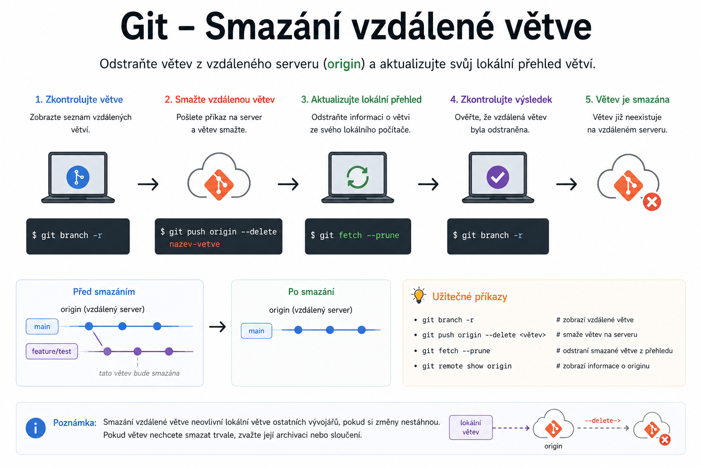

# Git – Smazání vzdálené větve

> Praktické rady pro bezpečné odstranění větve z Git serveru (např. GitHub, GitLab).

---



## Upozornění

> [!WARNING]
> Smazání vzdálené větve je **nevratná operace**.
> Ujisti se, že větev už nepotřebuješ a všechny důležité změny jsou začleněny jinde.

---

## Postup krok za krokem

<details>
<summary>Krok 1: Zobrazení všech větví</summary>

```bash
git branch -a
```
- Zobrazí seznam lokálních i vzdálených větví.
</details>

<details>
<summary>Krok 2: Smazání vzdálené větve</summary>

```bash
git push origin --delete <nazev-vetve>
# nebo kratší varianta
git push origin :<nazev-vetve>
```
- Nahraď `<nazev-vetve>` skutečným názvem větve, kterou chceš smazat.

> [!NOTE]
> Obě varianty provedou totéž – smažou větev na serveru.
</details>

<details>
<summary>Krok 3: Vyčištění lokálních referencí</summary>

```bash
git fetch --prune
```
- Odstraní lokální reference na smazané vzdálené větve.

> [!TIP]
> Tento krok není povinný, ale pomáhá udržet repozitář přehledný.
</details>