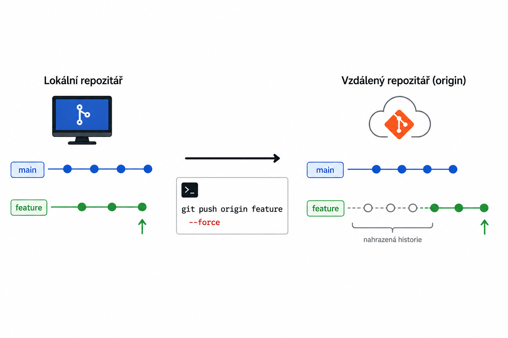

# Git – Nahrazení vzdálené větve z lokální větve

> Praktický návod, jak kompletně nahradit historii vzdálené větve pomocí nové lokální větve.

---



## Kdy použít tento postup?

- Chceš začít s čistou historií commitů (např. po refaktoringu).
- Potřebuješ odstranit veškerou předchozí historii z hlavní větve (`main`/`master`).
- Vhodné pro projekty, kde je nutné kompletní "reset" repozitáře.

---

## Postup krok za krokem

<details>
<summary>Krok 1: Vytvoření nové větve bez historie</summary>

```bash
git checkout --orphan latest_branch
```
- Vytvoří novou větev bez historie commitů.

> [!NOTE]
> `--orphan` znamená, že větev nemá žádné předchozí commity.
</details>

<details>
<summary>Krok 2: Přidání všech souborů</summary>

```bash
git add -A
```
- Přidá všechny soubory do stage.
</details>

<details>
<summary>Krok 3: První commit</summary>

```bash
git commit -am "Initialize commit"
```
- Vytvoří první commit v nové větvi.

> [!TIP]
> `-am` je zkrácený zápis pro `--all` a `--message`.
</details>

<details>
<summary>Krok 4: Smazání původní hlavní větve</summary>

```bash
git branch -D main
```
- Smaže hlavní větev (`main` nebo `master`).

> [!WARNING]
> Ověř název hlavní větve před smazáním!
</details>

<details>
<summary>Krok 5: Přejmenování nové větve na hlavní</summary>

```bash
git branch -m main
```
- Přejmenuje aktuální větev na `main`.

> [!WARNING]
> Použij správný název hlavní větve.
</details>

<details>
<summary>Krok 6: Force push do vzdáleného repozitáře</summary>

```bash
git push -f origin main
```
- Nahraje novou historii do vzdáleného repozitáře.

> [!TIP]
> `-f` (force) přepíše historii na serveru.
</details>