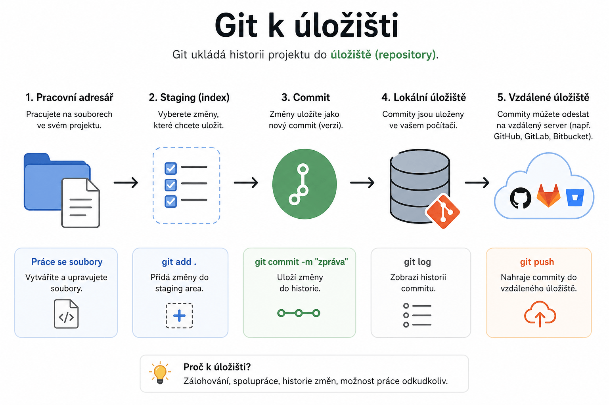

# Git – Práce s úložištěm

> Praktické rady pro vytvoření a použití Git úložiště na lokálním i online prostředí.

---



## Vytvoření úložiště

<details>
<summary>Kompletní postup</summary>

1. **Inicializace bare úložiště**
   Spusťte v terminálu:

   ```bash
   git init --bare <cesta>
   ```

    - `<cesta>` = cílová složka, musí končit `.git`
      *Např.:* `C:\projekty\moje-repozitar.git`

> [!WARNING]
> Cesta musí mít na konci `.git`, jinak nebude úložiště správně rozpoznáno.

</details>

---

## Klonování úložiště

<details>
<summary>Použití v pracovním prostředí</summary>

1. **Klonování úložiště**
   Spusťte v terminálu:

   ```bash
   git clone <cesta>
   ```

    - `<cesta>` = adresa k úložišti (lokální nebo online), musí končit `.git`
      *Např.:* `C:\projekty\moje-repozitar.git` nebo `https://github.com/uzivatel/projekt.git`

> [!TIP]
> Cestu lze použít jak lokální, tak online (např. GitHub, GitLab).

</details>