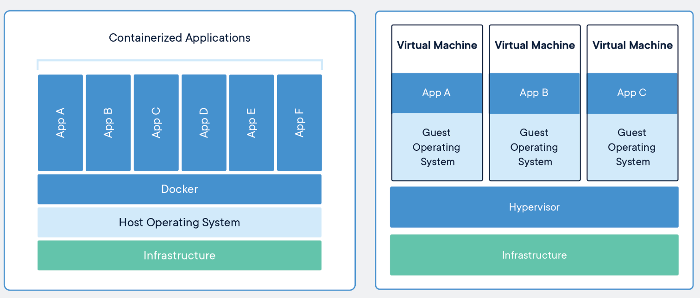

## Docker

Instalace

> [!IMPORTANT]
> Pro instalaci Dockeru na Windows potřebujete mít nainstalovaný WSL (Windows Subsystem for Linux).
>
> Návod na instalaci WSL najdete v sekci [WSL](wsl.md).

---

Základní informace

<details>
<summary><span style="color:#1E90FF;">Vysvětlení dockeru</span></summary>

- **Docker** je platforma pro vývoj, doručování a běh aplikací pomocí kontejnerizace.

- Izoluje aplikace se všemi jejími knihovnami, konfiguračními soubory a dalšími závislými soubory do kontejnerů.

  > [!NOTE]
  > Kontejnery zajišťují, že aplikace mohou být spuštěny v jakémkoli prostředí.

- Docker se stará o celý životní cyklus kontejnerů.

  **Kontejner** ➜ **Vytvoření** ➜ **Spuštění** ➜ **Zastavení**

  > [!TIP]
  > - Kontejnerizace je virtualizací jádra operačního systému.
      >
      >    Všechny kontejnery běží v rámci jednoho operačního systému a sdílejí paměť, knihovny a další zdroje.
  >
  > - Zdroje se tímto způsobem využívají efektivnější než klasická virtualizace.
      >
      >    Spuštění kontejneru je navíc mnohem rychlejší než spuštění virtuálního stroje s instalací operačního systému.
  >
  > - Malá režie a na stejném hardwaru můžete spustit více docker kontejnerů než virtuálních strojů
  >
  > 

</details>

<details>
<summary><span style="color:#1E90FF;">Soubory dockeru</span></summary>

- Seznam souborů:

  <details>
  <summary><span style="color:#E95A84;">dockerd.exe</span></summary>

  Spouští Docker Daemon, což je hlavní služba, která spravuje kontejnery a poslouchá na socketu či TCP portu.

  </details>

  <details>
  <summary><span style="color:#E95A84;">docker.exe</span></summary>

  Klientský nástroj, který posílá příkazy daemonu (např. `docker run`, `docker ps`).

  </details>

  <details>
  <summary><span style="color:#E95A84;">docker-compose.exe</span></summary>

  Umožňuje definovat a spouštět více Docker kontejnerů jako součásti jedné aplikace.

  Pomocí souboru `docker-compose.yml` můžete definovat všechny služby (kontejnery), které mají běžet, včetně jejich
  konfigurací, závislostí a propojení mezi nimi.

  </details>

  <details>
  <summary><span style="color:#E95A84;">docker-compose.yml</span></summary>

  Konfigurační soubor, který popisuje, jaké kontejnery (služby) mají být spuštěny, jaké obrazové soubory mají používat,
  jaké porty mají být mapovány a jaké další nastavení kontejnery potřebují.

  Tento soubor je zpracován příkazem `docker-compose up`, který automaticky spustí všechny definované kontejnery.

  </details>

</details>

<details>
<summary><span style="color:#1E90FF;">Základní pojmy</span></summary>

- Sezmam základních pojmů:

  <details>
  <summary><span style="color:#E95A84;">dockerfile</span></summary>

  Textový soubor s instrukcemi k vytvoření `Docker image`.

  Specifikuje operační systém, na kterém bude běžet kontejner, jazyky, lokace, porty a další komponenty.

  </details>

  <details>
  <summary><span style="color:#E95A84;">docker image</span></summary>

  Komprimovaná, samostatná část softwaru vytvořená příkazy v `Dockerfile`.

  Je to "šablona" (aplikace plus požadované knihovny a binární soubory) potřebná k vytvoření a spuštění Docker
  kontejneru.

  </details>

  <details>
  <summary><span style="color:#E95A84;">docker run</span></summary>

  Příkaz, který spouští kontejnery.

  > [!NOTE]
  > Každý kontejner je instancí jednoho image.

  </details>

  <details>
  <summary><span style="color:#E95A84;">docker hub</span></summary>

  Oficiální úložiště pro sdílení `docker image`.

  > [!TIP]
  > Obsahuje officiální `docker image` z open-source projektů a neoficiální od komunity.
  >
  > Možnost pracovat i s lokálními docker úložišti.

  </details>

  <details>
  <summary><span style="color:#E95A84;">docker engine</span></summary>

  Jádro softwaru docker.

  Technologie na principu klient-server, která vytváří a provozuje kontejnery.

  </details>

  <details>
  <summary><span style="color:#E95A84;">docker compose</span></summary>

  Definice ke spuštění více kontejnerů.

  </details>

</details>

---

Práce s dockerem

<details>
<summary><span style="color:#1E90FF;">Příkazy</span></summary>

---

Zobrazení

  <details>
    <summary><span style="color:#E95A84;">Zobrazit běžící kontejnery</span></summary>

  ```Docker
  docker ps
  ```

  </details>

  <details>
  <summary><span style="color:#E95A84;">Zobrazit všechny docker image</span></summary>

  ```Docker
  docker images
  ```

  </details>

---
Aktualizace nastavení
  <details>
  <summary><span style="color:#E95A84;">Zapnout automatické spouštění kontejneru</span></summary>

  ```Docker
  docker update --restart=yes <container name or id>
  ```

  </details>

  <details>
  <summary><span style="color:#E95A84;">Vypnout automatické spouštění kontejneru</span></summary>

  ```Docker
  docker update --restart=no <container name or id>
  ```

  </details>

---

Stažení
  <details>
  <summary><span style="color:#E95A84;">Stáhnout docker image</span></summary>

  ```Docker
  docker pull <Image name>
  ```

> [!NOTE]
> `<Image name>` = Je název `docker image`. (Například: `mcr.microsoft.com/dotnet/core/sdk:3.1`)

  </details>

---

Záloha
  <details>
  <summary><span style="color:#E95A84;">Zálohovat docker image</span></summary>

  ```Docker
  docker save -o <path to tar file> <docker image name or id>
  ``` 

> [!NOTE]
> `<path to tar file>` = Cesta k souboru, kam chcete zálohu uložit.
> `<docker image name>` = Název docker image, který chcete zálohovat.
>
> Například: `docker save -o dotnet-sdk.tar mcr.microsoft.com/dotnet/core/sdk:3.1`
  </details>

---

Obnova
  <details>
  <summary><span style="color:#E95A84;">Obnova docker image</span></summary>

  ```Docker
  docker load -i <path to tar file>
  ```

> [!NOTE]
> `<path to tar file>` = Cesta k souboru, který chcete obnovit.
>
> Příklad: `docker load-i dotnet-sdk.tar`

  </details>

---

Vytoření
  <details>
  <summary><span style="color:#E95A84;">Sestavení docker image</span></summary>

- `docker build [-t] customFolder`

  Sestaví kontejner pro docker image ve vybraném adresáři.

  > [!NOTE]
  > `customFolder`
  >
  >  Název vybraného adresáře k sestavení docker image.
  >
  > Může být například aktuální adresář: `.`, nebo jakkoli jinak.
  >
  > `-t`
  >
  >  Pojmenování image a tagu. (Pokud není zadán parametr -t, použije se tag: `latest`)

    - Příklad:

      ```Docker
      docker build -t myapp .
      ```

  > [!NOTE]
  > `myapp` = Název pro nově sestavený kontejner. (Může být jakýkoli.)
  >
  > `.` = Pracovní adresář v dockeru. (V tomto příkladu kořenový adresář.)

  </details>

---

Spuštění

  <details>
  <summary><span style="color:#E95A84;">Spustit služby definované v docker-compose.yml</span></summary>

  ```Docker
  docker-compose up
  ```

> [!NOTE]
> Spustí všechny služby definované v souboru `docker-compose.yml` v aktuálním adresáři.

> [!TIP]
> - Použijte `-d` pro spuštění na pozadí: `docker-compose up -d`
> - Pro sestavení a spuštění použijte: `docker-compose up --build`
> - Pro zastavení služeb použijte: `docker-compose down`

  </details>

  <details>
  <summary><span style="color:#E95A84;">Spuštění kontejneru z docker image</span></summary>

- `docker run <docker image>`

  Spustí kontejner pro docker image.

  ```Docker
  docker run kitematic/hello-world-nginx
  ```

  > [!TIP]  
  > Spustí docker kontejner s docker image: `kitematic/hello-world-nginx`

  </details>

  <details>
  <summary><span style="color:#E95A84;">Spustit na jiném portu</span></summary>

  ```Docker
  docker run -p 70:80 kitematic/hello-world-nginx 
  ```

> [!NOTE]  
> `-p` = Mapuje port 70 na hostitelském stroji na port 80 uvnitř kontejneru. (To znamená, že pokud aplikace uvnitř
> kontejneru poslouchá na portu 80, bude přístupná na portu 70 hostitelského stroje.)
>
> `kitematic/hello-world-nginx` = Název docker image ke spuštění.

  </details>

  <details>
  <summary><span style="color:#E95A84;">Spustí a smaže container po ukončení</span></summary>

  ```Docker
  docker run --rm kitematic/hello-world-nginx 
  ```

> [!NOTE]  
> `--rm`
>
> Docker automaticky odstraní kontejner, když je běh kontejneru přerušení.

> [!TIP]  
> Užitečné, pokud nechcete, aby se vaše lokální úložiště naplnilo zastavenými kontejnery.

  </details>

  <details>
  <summary><span style="color:#E95A84;">Spustit v interaktivním módu</span></summary>

  ```Docker
  docker run -it kitematic/hello-world-nginx 
  ```

> [!NOTE]
> Užitečné, pokud chcete spustit kontejner a poté v něm spustit další příkazy, například při ladění nebo vývoji.

  </details>

  <details>
  <summary><span style="color:#E95A84;">Spuštění více kontejnerů z docker image najednou</span></summary>

> [!NOTE]
> Musíte použít soubor YAML k definování služeb vaší aplikace.
>
> Následně pomocí jediného příkazu `docker-compose up` můžete vytvořit a spustit všechny služby definované ve vašem
> souboru `docker-compose.yml`.

> [!TIP]
> Automaticky použije lokální `docker image`, pokud je k dispozici.

Příklad souboru `docker-compose.yaml`:

  ```yaml
  # Verze Docker Compose souboru
  version: '3.4'

  # Definice služeb
  services:
    # Název služby
    webapp:
      # Obraz, který se má použít pro tuto službu
      # Tento obraz je vzorová aplikace ASP.NET Core od Microsoftu
      image: mcr.microsoft.com/dotnet/core/samples:aspnetapp
      # Instrukce pro sestavení obrazu
      build:
        # Kontext pro sestavení, obvykle je to adresář obsahující Dockerfile
        context: .
        # Cesta k Dockerfile
        dockerfile: Dockerfile
      # Mapování portů mezi hostitelem a kontejnerem
      # Formát je "host:kontejner"
      # Toto nastavení říká Dockeru, aby přesměroval port 8000 na hostiteli na port 80 v kontejneru
      ports:
        - "8000:80"
  ```

  </details>

---

Zastavení
  <details>
  <summary><span style="color:#E95A84;">Zastavit kontejner</span></summary>

  ```Docker
  docker stop <docker container name or id>
  ```

  </details>

---

Odstranění

  <details>
  <summary><span style="color:#E95A84;">Odstranění kontejneru</span></summary>

  ```Docker
  docker rm <container name or id>
  ```

  </details>

  <details>
  <summary><span style="color:#E95A84;">Odstranění image</span></summary>

  ```Docker
  docker rmi <docker image name or id>
  ``` 

  </details>

---

</details>

<details>
<summary><span style="color:#1E90FF;">Dockerfile</span></summary>

V dockeru **není žádná výchozí složka**.

> [!TIP]
> Když vytváříte Dockerfile, můžete nastavit pracovní adresář v kontejneru pomocí příkazu `WORKDIR`.

> [!TIP]
> Pokud není nastaven `WORKDIR`, vztahuje se vše na kořenový adresář (/) kontejneru.

- Příklady:

  <details>
  <summary><span style="color:#E95A84;">Příklad pro .NET Core</span></summary>

  ```Docker
  # Používáme oficiální .NET Core runtime image z Docker Hub
  # 'dotnet' je jméno image a '3.1' je tag, který specifikuje verzi
  FROM mcr.microsoft.com/dotnet/core/runtime:3.1
  
  # Nastavíme pracovní adresář v kontejneru na /app
  # Pokud tento adresář neexistuje, docker ho vytvoří
  WORKDIR /app
  
  # Kopírujeme výstup buildu z našeho stroje do kontejneru
  # 'publish' je cesta k výstupu buildu na našem stroji
  # '.' znamená aktuální (pracovní) adresář v kontejneru
  COPY ./publish .
  
  # Nastavíme spustitelný soubor pro kontejner
  # 'myapp.dll' je název naší aplikace
  ENTRYPOINT ["dotnet", "myapp.dll"]
  ```

  > [!NOTE]
  > Vytvoří `docker image` pro vaši aplikaci .NET Core.
  >
  > Když spustíte kontejner z této image, vaše aplikace se automaticky spustí.

  </details>

  <details>
  <summary><span style="color:#E95A84;">Příklad pro C# Aplikaci</span></summary>

  ```Docker
  # Používáme oficiální .NET Core SDK image z Docker Hub
  # 'dotnet' je jméno image a '3.1' je tag, který specifikuje verzi
  FROM mcr.microsoft.com/dotnet/core/sdk:3.1
  
  # Nastavíme pracovní adresář v kontejneru na /app
  # Pokud tento adresář neexistuje, docker ho vytvoří
  WORKDIR /app
  
  # Kopírujeme všechny soubory z našeho stroje do kontejneru
  # '.' znamená aktuální adresář na našem stroji
  # '.' znamená aktuální (pracovní) adresář v kontejneru
  COPY . .
  
  # Spustíme příkaz 'dotnet restore', který stáhne všechny potřebné NuGet balíčky
  RUN dotnet restore
  
  # Spustíme příkaz 'dotnet publish', který vytvoří výstup buildu naší aplikace
  RUN dotnet publish -c Release -o out
  
  # Nastavíme spustitelný soubor pro kontejner
  # 'myapp.dll' je název naší aplikace
  ENTRYPOINT ["dotnet", "out/myapp.dll"]
  ```

  > [!NOTE]
  > Tento Dockerfile vytvoří docker image pro vaši aplikaci C#.
  >
  > Když spustíte kontejner z této image, vaše aplikace se automaticky spustí.

  </details>

  <details>
  <summary><span style="color:#E95A84;">Příklad .NET Core a lokálních NuGet balíčků</span></summary>

  ```Docker
  # Používáme oficiální .NET Core SDK image z Docker Hub
  FROM mcr.microsoft.com/dotnet/core/sdk:3.1
  
  # Nastavíme pracovní adresář v kontejneru na /app
  WORKDIR /app
  
  # Kopírujeme všechny soubory z našeho stroje do kontejneru
  COPY . .
  
  # Spustíme příkaz 'dotnet restore', který načte všechny potřebné NuGet balíčky z lokálního úložiště
  # Předpokládáme, že všechny potřebné NuGet balíčky jsou uloženy v adresáři 'nuget' našeho projektu
  RUN dotnet restore --source ./nuget
  
  # Spustíme příkaz 'dotnet publish', který vytvoří výstup buildu naší aplikace
  RUN dotnet publish -c Release -o out
  
  # Nastavíme spustitelný soubor pro kontejner
  ENTRYPOINT ["dotnet", "out/myapp.dll"]
  ```

  > [!TIP]
  > V tomto příkladu předpokládáme, že všechny potřebné NuGet balíčky jsou uloženy v adresáři `nuget` vašeho projektu.
  >
  > Příkaz `dotnet restore --source ./nuget` pak načte tyto balíčky z lokálního úložiště místo stahování z internetu.

  </details>

</details>

<details>
<summary><span style="color:#1E90FF;">Zachování dat z kontejneru na lokálním disku</span></summary>


</details>

---

Volumes

<details>
<summary><span style="color:#1E90FF;">Propojení složky z Windows s kontejnerem v dockeru</span></summary>

| Nastavení         | Cesta                                                                       | Popis                              |
|-------------------|-----------------------------------------------------------------------------|------------------------------------|
| Host/Volume       | `/run/desktop/mnt/host/c/Program Files/Unity/Hub/Editor/6000.0.33f1/Editor` | Cesta ke složce na hostitelském PC |
| Path in container | `/app/unity`                                                                | Cesta uvnitř Docker kontejneru     |

> [!NOTE]
> - Host/Volume určuje cestu k existující složce na vašem počítači
> - Path in container definuje, kde bude složka dostupná uvnitř kontejneru

</details>

---

Řešení problémů

<details>
<summary><span style="color:#1E90FF;">Port není dostupný</span></summary>

Pro řešení chyb jako "Ports are not available" nebo "bind: An attempt was made to access a socket"

```cmd
net stop winnat
net start winnat
```

> [!NOTE]
> Příkazy restartují službu Windows NAT (Network Address Translation), která spravuje síťovou komunikaci mezi hostitelským systémem a Docker kontejnery.
> 
> Restart služby tak uvolní případné zablokované síťové porty.

</details>