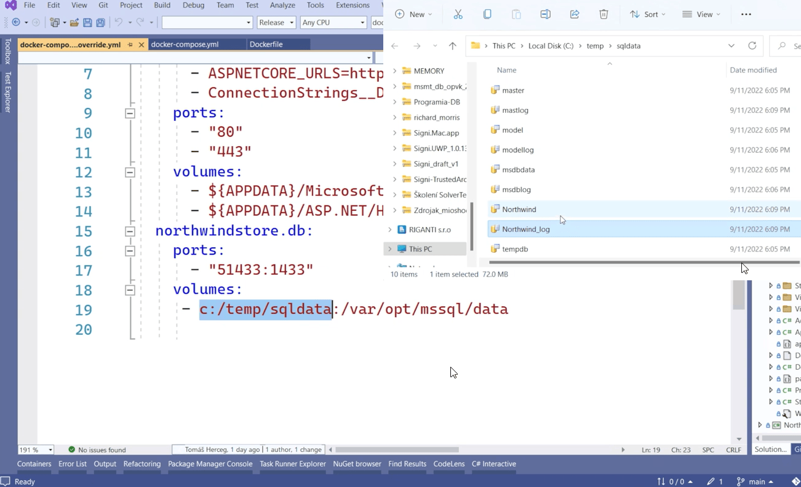

# Docker – Průvodce a reference

> Přehled základních pojmů, příkazů, konfigurace a doporučení pro práci s Dockerem na Windows.

---


## Co je Docker?

- Platforma pro vývoj, doručování a běh aplikací pomocí **kontejnerizace**.
- Izoluje aplikace v kontejnerech se všemi jejich závislostmi.
- Kontejnery jsou rychlejší a efektivnější než klasická virtualizace.

> [!NOTE]
> Pro instalaci Dockeru na Windows je nutné mít nainstalovaný [WSL](wsl.md).

---

## Klíčové pojmy

| Pojem | Popis |
|-------|-------|
| **Dockerfile** | Textový soubor s instrukcemi pro sestavení Docker image |
| **Docker image** | Komprimovaná šablona aplikace, ze které se spouští kontejner |
| **Docker run** | Příkaz pro spuštění kontejneru z image |
| **Docker Hub** | Oficiální veřejné úložiště Docker images |
| **Docker Engine** | Jádro Dockeru – klient-server architektura spravující kontejnery |
| **Docker Compose** | Definice a správa více kontejnerů přes soubor `docker-compose.yml` |

---

## Klíčové soubory

| Soubor | Účel |
|--------|------|
| `dockerd.exe` | Spouští Docker Daemon – hlavní službu pro správu kontejnerů |
| `docker.exe` | Klientský nástroj pro ovládání Dockeru (`docker run`, `docker ps`) |
| `docker-compose.exe` | Nástroj pro správu více kontejnerů v jedné aplikaci |
| `docker-compose.yml` | Konfigurační soubor – služby, porty, volumes, proměnné prostředí |

---

## Základní příkazy

| Kategorie | Příkaz | Popis |
|-----------|--------|-------|
| Zobrazení | `docker ps` | Zobrazí běžící kontejnery |
| | `docker images` | Zobrazí všechny lokální images |
| Automatické spouštění | `docker update --restart=yes <id>` | Zapne autostart kontejneru |
| | `docker update --restart=no <id>` | Vypne autostart kontejneru |
| Stažení | `docker pull <image>` | Stáhne image z Docker Hub |
| Záloha | `docker save -o <cesta>.tar <image>` | Exportuje image do souboru |
| | `docker load -i <cesta>.tar` | Importuje image ze souboru |
| Sestavení | `docker build -t <název> .` | Sestaví image z Dockerfile |
| Spuštění | `docker run <image>` | Spustí kontejner |
| | `docker run -p 70:80 <image>` | Spustí s mapováním portu |
| | `docker run --rm <image>` | Spustí a po ukončení automaticky smaže |
| | `docker run -it <image>` | Spustí v interaktivním módu |
| Docker Compose | `docker compose up -d` | Spustí všechny služby na pozadí |
| | `docker compose down` | Zastaví a odstraní kontejnery |
| Zastavení | `docker stop <id>` | Zastaví kontejner |
| | `docker rm <id>` | Odstraní zastaveý kontejner |
| | `docker rmi <image>` | Odstraní image |

---

## Dockerfile – příklady

<details>
<summary>.NET Core aplikace (pouze runtime)</summary>

```dockerfile
FROM mcr.microsoft.com/dotnet/core/runtime:3.1
WORKDIR /app
COPY ./publish .
ENTRYPOINT ["dotnet", "myapp.dll"]
```
</details>

<details>
<summary>C# aplikace s buildem uvnitř kontejneru</summary>

```dockerfile
FROM mcr.microsoft.com/dotnet/core/sdk:3.1
WORKDIR /app
COPY . .
RUN dotnet restore
RUN dotnet publish -c Release -o out
ENTRYPOINT ["dotnet", "out/myapp.dll"]
```
</details>

<details>
<summary>Aplikace s lokálními NuGet balíčky</summary>

```dockerfile
FROM mcr.microsoft.com/dotnet/core/sdk:3.1
WORKDIR /app
COPY . .
RUN dotnet restore --source ./nuget
RUN dotnet publish -c Release -o out
ENTRYPOINT ["dotnet", "out/myapp.dll"]
```
</details>

---

## Volumes a data

### Propojení složky z Windows s kontejnerem

| Nastavení | Cesta |
|-----------|-------|
| Host / Volume | `/run/desktop/mnt/host/c/Program Files/Unity/Hub/Editor/6000.0.33f1/Editor` |
| Cesta v kontejneru | `/app/unity` |

### Zachování dat z kontejneru na lokálním disku



---

## Získání dat z kontejneru

<details>
<summary>Export databázového schématu (PostgreSQL/Supabase)</summary>

```cmd
docker exec -t supabase-db pg_dump -U postgres -s postgres > D:\schema.sql
```

Příkaz se připojí k běžícímu kontejneru `supabase-db` a exportuje schéma databáze do souboru `D:\schema.sql`.

> [!WARNING]
> Pro `sqlc generate` je potřeba z exportovaného souboru odstranit nebo zakomentovat řádek začínající `\unrestrict`.
</details>

---

## Řešení problémů

### Port není dostupný

Restartujte službu Windows NAT:

```cmd
net stop winnat
net start winnat
```

> [!NOTE]
> Tento postup uvolní zablokované síťové porty pro Docker kontejnery.
