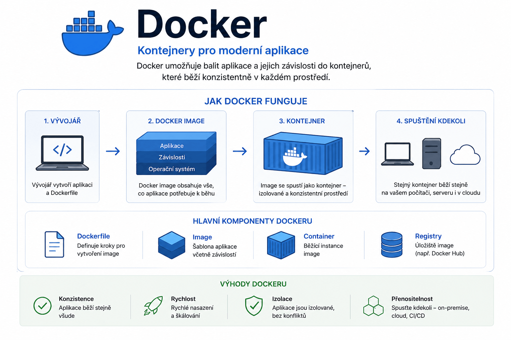
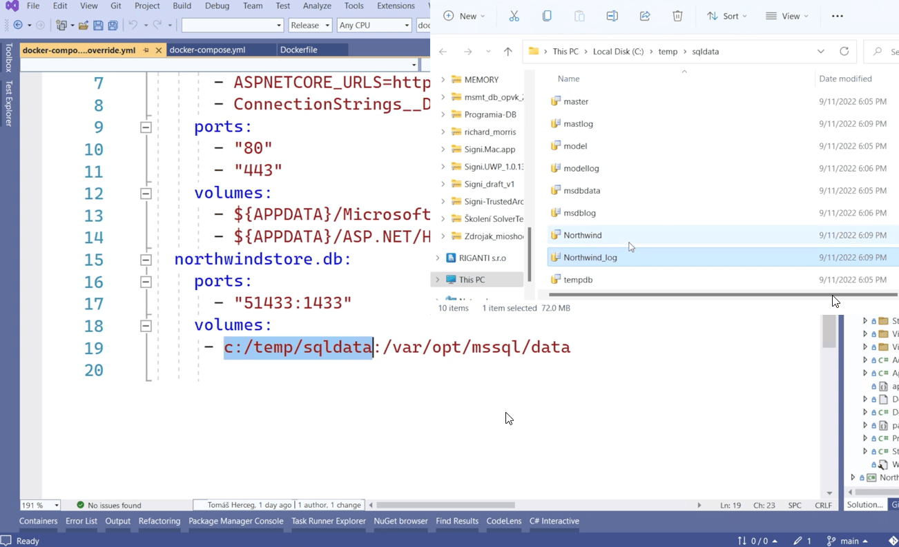

# Docker – Průvodce a reference

> Přehled základních pojmů, příkazů, konfigurace a doporučení pro práci s Dockerem na Windows.



## Co je Docker?

- Platforma pro vývoj, doručování a běh aplikací pomocí **kontejnerizace**.
- Izoluje aplikace v kontejnerech se všemi jejich závislostmi.
- Kontejnery jsou rychlejší a efektivnější než klasická virtualizace.

> [!NOTE]
> Pro použití Docker Desktopu s backendem WSL 2 ve Windows nejprve připrav [WSL](../wsl.md).

## Docker Desktop a WSL 2 ve Windows

Tento postup ověřuje používání linuxových kontejnerů Docker Desktopu z vlastní distribuce WSL, například Ubuntu.

### Proč jsou v Průzkumníku Ubuntu i docker-desktop

V části **Linux** v Průzkumníku Windows mohou být obě distribuce současně:

| Distribuce | Účel |
|---|---|
| `Ubuntu-22.04` | Tvoje vlastní Linux prostředí pro projekty, Bash, Git a správu balíčků; může být nainstalované běžně nebo importované z RootFS. |
| `docker-desktop` | Interní distribuce vytvořená a spravovaná Docker Desktopem, ve které běží Docker Engine. |

Zapnutá **WSL Integration** umožní zadávat příkazy `docker` z Ubuntu a používat engine spravovaný Docker Desktopem.

Ubuntu přitom není pro samotný běh Docker Desktopu povinné; Docker lze používat také přímo z terminálu Windows.

Přítomnost obou distribucí není chyba ani důvod jednu smazat; do `docker-desktop` běžně ručně nezasahuj. [Jak funguje integrace WSL](https://docs.docker.com/desktop/features/wsl/)

### 1. Zkontroluj distribuce a verzi WSL

Ve **Windows PowerShellu nebo CMD** spusť:

```text
wsl --list --verbose
```

Příklad výstupu při spuštěném Docker Desktopu:

```text
  NAME              STATE           VERSION
* Ubuntu-22.04      Stopped         2
  docker-desktop    Running         2
```

Pro tento postup musí používané distribuce běžet ve WSL 2, tedy mít ve sloupci `VERSION` hodnotu `2`.

`Stopped` znamená zastavenou distribuci, kterou můžeš spustit; hvězdička označuje výchozí distribuci. [Výpis distribucí WSL](https://learn.microsoft.com/en-us/windows/wsl/basic-commands#list-installed-linux-distributions)

Název `Ubuntu-22.04` je příklad z tohoto prostředí, proto jej v dalších příkazech nahraď přesným názvem ze svého výpisu.

### 2. Zapni integraci pro Ubuntu

1. Spusť Docker Desktop a počkej na spuštění enginu.
2. V **Settings → General** zapni **Use WSL 2 based engine**, pokud se tato volba zobrazuje.
3. V **Settings → Resources → WSL Integration** zapni svou distribuci Ubuntu a potvrď **Apply**.

Pokud nabídka WSL Integration chybí, ověř režim kontejnerů a případně v nabídce Docker Desktopu zvol **Switch to Linux containers**.

Pro tuto variantu neinstaluj do Ubuntu další samostatný Docker Engine nebo Docker CLI, protože může s integrací Docker Desktopu kolidovat. [Nastavení integrace](https://docs.docker.com/desktop/features/wsl/#enable-docker-in-a-wsl-2-distribution)

### 3. Ověř spojení s enginem a spuštění kontejneru

Ve **Windows PowerShellu nebo CMD** otevři Ubuntu:

```text
wsl --distribution Ubuntu-22.04
```

Následující příkaz už spusť **uvnitř Ubuntu**:

```text
docker version
```

Výpis má obsahovat části **Client** i **Server** bez chyby připojení; samotné `docker --version` ukazuje pouze verzi klienta. [Význam výstupu docker version](https://docs.docker.com/reference/cli/docker/version/)

Pak ve stejném terminálu Ubuntu spusť testovací kontejner:

```text
docker run --rm hello-world
```

Očekávaná zpráva je:

```text
Hello from Docker!
```

Pokud image ještě není uložená lokálně, Docker ji stáhne z Docker Hubu a potřebuje připojení k internetu.

Volba `--rm` po dokončení odstraní testovací kontejner, stažená image zůstane. [Spuštění a odstranění kontejneru](https://docs.docker.com/reference/cli/docker/container/run/#clean-up---rm)

| Výsledek | Co ověřit |
|---|---|
| `docker: command not found` | Zapnutí integrace pro správnou distribuci a nové otevření terminálu Ubuntu. |
| Chyba připojení v části `Server` | Běh Docker Desktopu a zvolené připojení klienta. |
| Chyba při stahování image | Přístup k Docker Hubu, proxy nebo limit stahování. |

Pokud používáš i vzdálený Docker, ověř připojení přes `docker context ls` a případné proměnné `DOCKER_HOST` nebo `DOCKER_CONTEXT`; úspěšný test se vztahuje k připojenému enginu. [Docker kontexty](https://docs.docker.com/engine/manage-resources/contexts/)

Z Ubuntu se do terminálu Windows vrátíš příkazem `exit`.

### Kam patří docker_data.vhdx

`docker_data.vhdx` je samostatný datový disk Docker Desktopu; obsahuje Docker images, kontejnery, pojmenované volumes a build cache.

Ubuntu má vlastní souborový systém a vlastní virtuální disk, takže záloha `docker_data.vhdx` nepatří do Ubuntu a nenahrazuje její disk.

Soubory připojené do kontejnerů pomocí bind mountů zůstávají ve zdrojových složkách Windows nebo Ubuntu a vyžadují vlastní zálohu. [Ukládání pomocí bind mountů](https://docs.docker.com/engine/storage/bind-mounts/)

Vlastní Ubuntu přenes pomocí [exportu a importu distribuce WSL](../wsl.md#přesun-wsl-distribuce-na-jiné-místo); pro datový disk Dockeru použij následující postup.

Úspěšné `hello-world` potvrzuje spuštění kontejneru, nikoli obnovu původních images, kontejnerů nebo dat aplikací.

### Přenos dat Docker Desktopu na jiný počítač

Tento postup je určený pro **Docker Desktop s backendem WSL 2 ve Windows, který ukládá data do souboru `docker_data.vhdx`**.

Záloha vzniká zkopírováním vypnutého datového disku a obnova jeho vložením do datového umístění cílové instalace podle [oficiálního postupu Dockeru](https://docs.docker.com/desktop/settings-and-maintenance/backup-and-restore/#if-docker-desktop-fails-to-start-or-you-want-to-back-up-the-whole-docker-desktop-vm).

Počítá se se stejnou architekturou obou počítačů, například x64; pro první obnovení doporučuji stejnou verzi Docker Desktopu jako na zdroji, aby se přenos nespojoval také s upgradem.

Obnova **nahradí současná Docker data na cíli**; nesloučí dvě existující prostředí.

Příkazy pro práci s datovým diskem zadávej ve **Windows PowerShellu** pod účtem, který Docker Desktop používá; uvedené cesty jsou příklady, které nahraď podle svých disků a složek.

<details>
<summary>Zdrojový počítač: záloha Docker dat</summary>

#### 1. Poznamenej si stav a skutečné umístění disku

V **About Docker Desktop** si poznamenej verzi aplikace a při spuštěném enginu zaznamenej, co chceš po obnově najít:

```text
docker context ls
docker image ls
docker container ls --all
docker volume ls
```

Ověř, že klient používá místní Linux engine Docker Desktopu, protože výpis vzdáleného enginu by nepopisoval zálohovaný disk.

Datový soubor v běžném kořenovém adresáři Dockeru vyhledáš takto:

```text
Get-ChildItem -LiteralPath "$env:LOCALAPPDATA\Docker\wsl" -Filter 'docker_data.vhdx' -File -Recurse |
    Select-Object FullName, Length
```

Pokud jsi datové umístění změnil, hledej v nastavené složce; jestli tvoje verze zobrazuje **Settings → Resources → Advanced → Disk image location**, ověř cestu také tam. [Umístění dat backendu WSL](https://docs.docker.com/desktop/features/wsl/)

Pokud soubor nenajdeš nebo nevíš, která nalezená kopie je aktivní, nejprve ověř datové umístění své instalace; nezaměňuj jej za disk Ubuntu ani za jiný soubor `ext4.vhdx`.

#### 2. Připrav soubory mimo datový disk a ukonči Docker

Samostatně uchovej Compose soubory, potřebné `.env` a konfigurace i zdrojové složky bind mountů; soubory uložené uvnitř vlastní distribuce Ubuntu přenese její export.

Řádně zastav své aplikace a databáze, aby dokončily zápis; u projektu spravovaného přes Compose lze v jeho složce použít:

```text
docker compose stop
```

Potom z nabídky ikony Dockeru u hodin zvol **Quit Docker Desktop** a počkej na úplné ukončení aplikace.

Ulož také práci ve všech distribucích WSL a zavři jejich terminály, protože následující příkaz zastaví všechny distribuce i virtuální stroj WSL 2:

```text
wsl --shutdown
```

Do dokončení kopírování a kontroly znovu nespouštěj Docker Desktop.

#### 3. Zkopíruj disk a ověř zálohu

V proměnné `$dockerDisk` nahraď ukázkovou cestu skutečnou cestou z prvního kroku a pro zálohu zvol novou složku na disku s dostatkem místa.

Přenosový disk musí podporovat velikost souboru; FAT32 neumožňuje soubor větší než 4 GB.

```text
$dockerDisk = 'D:\DockerData\docker_data.vhdx'
New-Item -ItemType Directory -Path 'E:\Prenos\Docker' -ErrorAction Stop
Copy-Item -LiteralPath $dockerDisk -Destination 'E:\Prenos\Docker\docker_data.vhdx' -ErrorAction Stop
Get-FileHash -LiteralPath $dockerDisk -Algorithm SHA256
Get-FileHash -LiteralPath 'E:\Prenos\Docker\docker_data.vhdx' -Algorithm SHA256
```

Obě hodnoty `Hash` musí být shodné; zaznamenej si je pro kontrolu po přenosu a při neshodě zálohu nepoužívej.

Po úspěšném dokončení můžeš zdrojový Docker Desktop znovu spustit, ale pozdější změny už v této záloze nebudou.

Disk může obsahovat databáze a přístupové údaje aplikací, proto zálohu chraň stejně jako původní data.

</details>

<details>
<summary>Cílový počítač: obnova a ověření Docker dat</summary>

#### 1. Připrav cílovou instalaci a ověř přenos

Připoj přenosový disk se zálohou nebo zkopíruj záložní soubor na cílový počítač a podle jeho umístění uprav cestu v příkazech.

Připrav WSL 2 a nainstaluj Docker Desktop pro linuxové kontejnery; prvním spuštěním nech vytvořit jeho datové umístění.

Zjisti skutečnou cestu cílového `docker_data.vhdx` stejným způsobem jako na zdroji.

Pokud na cíli už máš vlastní prostředí, řádně zastav jeho aplikace a databáze; potom Docker Desktop úplně ukonči přes **Quit Docker Desktop**.

Po uložení práce ve všech distribucích WSL spusť:

```text
wsl --shutdown
Get-FileHash -LiteralPath 'E:\Prenos\Docker\docker_data.vhdx' -Algorithm SHA256
```

Hodnota `Hash` přenesené zálohy musí odpovídat hodnotě zaznamenané na zdroji; při neshodě nepokračuj.

#### 2. Uchovej cílový disk a nahraď ho zálohou

V proměnné `$cilovyDisk` nastav skutečnou cestu cílové instalace a pro původní cílová data zvol novou záložní složku.

Po celou dobu kopírování a kontroly musí Docker Desktop zůstat ukončený; na disku musí být místo i pro zálohu dosavadních cílových dat.

Nejprve zazálohuj současný cílový disk:

```text
$cilovyDisk = 'D:\DockerData\docker_data.vhdx'
New-Item -ItemType Directory -Path 'D:\Zalohy\Docker-pred-obnovou' -ErrorAction Stop
Copy-Item -LiteralPath $cilovyDisk -Destination 'D:\Zalohy\Docker-pred-obnovou\docker_data.vhdx' -ErrorAction Stop
Get-FileHash -LiteralPath $cilovyDisk -Algorithm SHA256
Get-FileHash -LiteralPath 'D:\Zalohy\Docker-pred-obnovou\docker_data.vhdx' -Algorithm SHA256
```

Teprve když oba kontrolní součty souhlasí, přepiš cílový datový soubor přenesenou zálohou:

```text
Copy-Item -LiteralPath 'E:\Prenos\Docker\docker_data.vhdx' -Destination $cilovyDisk -ErrorAction Stop
Get-FileHash -LiteralPath $cilovyDisk -Algorithm SHA256
```

Výsledný `Hash` musí souhlasit se zálohou ze zdrojového počítače; tuto kontrolu proveď ještě před spuštěním Docker Desktopu, který začne disk měnit.

#### 3. Obnov okolní soubory a zkontroluj data aplikací

Před spuštěním enginu obnov také Compose soubory, konfigurace a zdrojové složky bind mountů do očekávaných cest, protože některé kontejnery se mohou automaticky spustit.

Pokud bind mounty používaly soubory z Ubuntu, nejprve dokonči jeho import a ověř, že cesty odpovídají obnovenému prostředí.

Spusť Docker Desktop a pro přístup z obnoveného Ubuntu zapni jeho [WSL Integration](#2-zapni-integraci-pro-ubuntu).

Nastavení aplikace Docker Desktop a zapnutí integrace ověř samostatně; kopie datového disku není zálohou nastavení Windows.

```text
docker version
docker image ls
docker container ls --all
docker volume ls
```

Ověř části **Client** a **Server**, porovnej seznamy se zdrojem a spusť své aplikace s obnovenou konfigurací.

Pokud se změnily cesty bind mountů nebo název distribuce Ubuntu, oprav konfiguraci a znovu vytvoř dotčené kontejnery; u Compose spusť ze správné distribuce a složky projektu:

```text
docker compose up --detach --force-recreate
```

Zachovej původní název projektu Compose a názvy volumes, aby aplikace použily obnovená data. [Opětovné vytvoření kontejnerů pomocí Compose](https://docs.docker.com/reference/cli/docker/compose/up/)

Zkontroluj konkrétní uložená data, například záznamy v databázi nebo nahrané soubory; samotná přítomnost volume ani úspěšné `hello-world` tuto kontrolu nenahrazují.

Původní zálohy ponech do dokončení kontroly; při návratu k předchozímu cílovému stavu Docker Desktop opět úplně ukonči a stejným postupem vrať jeho disk ze složky `Docker-pred-obnovou`.

</details>

## Klíčové pojmy

| Pojem | Popis |
|-------|-------|
| **Dockerfile** | Textový soubor s instrukcemi pro sestavení Docker image |
| **Docker image** | Komprimovaná šablona aplikace, ze které se spouští kontejner |
| **Docker run** | Příkaz pro spuštění kontejneru z image |
| **Docker Hub** | Oficiální veřejné úložiště Docker images |
| **Docker Engine** | Jádro Dockeru – klient-server architektura spravující kontejnery |
| **Docker Compose** | Definice a správa více kontejnerů přes soubor `docker-compose.yml` |

## Klíčové soubory

| Soubor | Účel |
|--------|------|
| `dockerd.exe` | Spouští Docker Daemon – hlavní službu pro správu kontejnerů |
| `docker.exe` | Klientský nástroj pro ovládání Dockeru (`docker run`, `docker ps`) |
| `docker-compose.exe` | Nástroj pro správu více kontejnerů v jedné aplikaci |
| `docker-compose.yml` | Konfigurační soubor – služby, porty, volumes, proměnné prostředí |

## Základní příkazy

| Kategorie | Příkaz | Popis |
|-----------|--------|-------|
| Zobrazení | `docker ps` | Zobrazí běžící kontejnery |
| | `docker images` | Zobrazí všechny lokální images |
| Automatické spouštění | `docker update --restart=yes <id>` | Zapne autostart kontejneru |
| | `docker update --restart=no <id>` | Vypne autostart kontejneru |
| Stažení | `docker pull <image>` | Stáhne image z Docker Hub |
| Záloha | `docker save -o <cesta>.tar <image>` | Exportuje image do souboru |
| | `docker load -i <cesta>.tar` | Importuje image ze souboru |
| Sestavení | `docker build -t <název>.` | Sestaví image z Dockerfile |
| Spuštění | `docker run <image>` | Spustí kontejner |
| | `docker run -p 70:80 <image>` | Spustí s mapováním portu |
| | `docker run --rm <image>` | Spustí a po ukončení automaticky smaže |
| | `docker run -it <image>` | Spustí v interaktivním módu |
| Docker Compose | `docker compose up -d` | Spustí všechny služby na pozadí |
| | `docker compose down` | Zastaví a odstraní kontejnery |
| Zastavení | `docker stop <id>` | Zastaví kontejner |
| | `docker rm <id>` | Odstraní zastaveý kontejner |
| | `docker rmi <image>` | Odstraní image |

## Dockerfile – příklady

<details>
<summary>.NET Core aplikace (pouze runtime)</summary>

```dockerfile
FROM mcr.microsoft.com/dotnet/core/runtime:3.1
WORKDIR /app
COPY ./publish .
ENTRYPOINT ["dotnet", "myapp.dll"]
```
</details>

<details>
<summary>C# aplikace s buildem uvnitř kontejneru</summary>

```dockerfile
FROM mcr.microsoft.com/dotnet/core/sdk:3.1
WORKDIR /app
COPY . .
RUN dotnet restore
RUN dotnet publish -c Release -o out
ENTRYPOINT ["dotnet", "out/myapp.dll"]
```
</details>

<details>
<summary>Aplikace s lokálními NuGet balíčky</summary>

```dockerfile
FROM mcr.microsoft.com/dotnet/core/sdk:3.1
WORKDIR /app
COPY . .
RUN dotnet restore --source ./nuget
RUN dotnet publish -c Release -o out
ENTRYPOINT ["dotnet", "out/myapp.dll"]
```
</details>

## Volumes a data

### Propojení složky z Windows s kontejnerem

| Nastavení | Cesta |
|-----------|-------|
| Host / Volume | `/run/desktop/mnt/host/c/Program Files/Unity/Hub/Editor/6000.0.33f1/Editor` |
| Cesta v kontejneru | `/app/unity` |

### Zachování dat z kontejneru na lokálním disku



## Získání dat z kontejneru

<details>
<summary>Export databázového schématu (PostgreSQL/Supabase)</summary>

```cmd
docker exec -t supabase-db pg_dump -U postgres -s postgres > D:\schema.sql
```

Příkaz se připojí k běžícímu kontejneru `supabase-db` a exportuje schéma databáze do souboru `D:\schema.sql`.

> [!WARNING]
> Pro `sqlc generate` je potřeba z exportovaného souboru odstranit nebo zakomentovat řádek začínající `\unrestrict`.
</details>

## Řešení problémů

### Port není dostupný

Restartujte službu Windows NAT:

```cmd
net stop winnat
net start winnat
```

> [!NOTE]
> Tento postup uvolní zablokované síťové porty pro Docker kontejnery.
