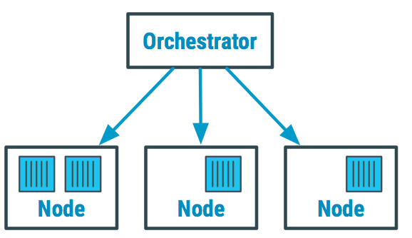

> [!IMPORTANT]
> Je zapotřebí znalost dockeru

Orchestrátory

Software nad kontejnerovou sítí, automaticky se stará o zavádění, údržbu a škálování kontejnerizovaných aplikací.

V praxi umožňují efektivně využívat kapacitu serverů, reagují na podněty a dynamicky služby spouští, vypínají staré verze a zapínají nové apod.

> [!NOTE]
> - Dovedete si představit, jak obtížné je spravovat kontejnery, které mohou běžet i na stovkách serverů?
    >
    > 	Manuálně je to nad lidské síly, a proto se ke správě využívají **orchestrátory**.
>
> - Je jedním z několika softwarových orchestrátorů.

Ukázka orchestrátoru

> [!NOTE]
> Orchestrátory usnadnily práci především vývojářům microservices.
>
> - **Microservices** je architektura, kde aplikace je rozdělena na menší, nezávislé služby, které spolu komunikují prostřednictvím API.

