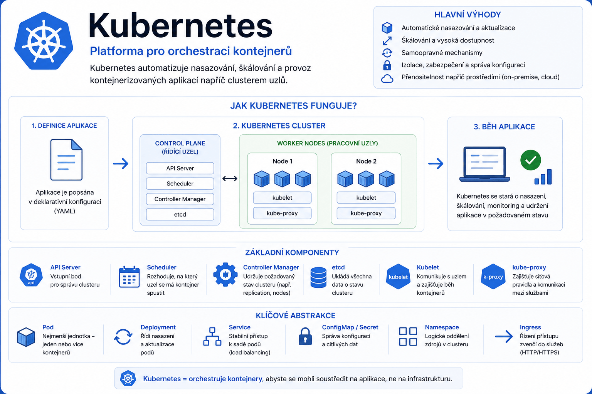
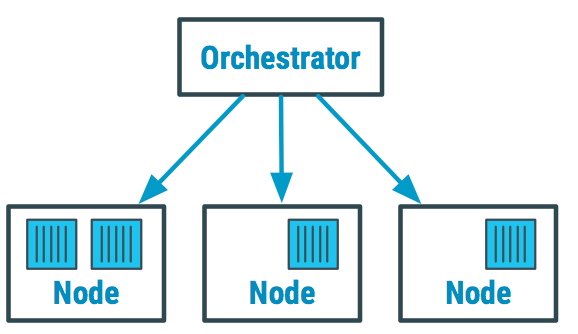

# Kubernetes – Průvodce a přehled

> Přehled základních pojmů, principů a doporučení pro práci s Kubernetes.

---

## Co je Kubernetes?

Kubernetes je orchestrátor kontejnerů pro automatizované nasazování, správu, škálování a aktualizaci aplikací.

Hlavní přínosy:
- Efektivně využívá kapacitu serverů.
- Dynamicky spouští nové verze a zastavuje staré.
- Automaticky reaguje na selhání (restart kontejnerů).
- Klíčový nástroj pro správu microservices architektur.

> [!IMPORTANT]
> Pro práci s Kubernetes je předpokládána znalost Dockeru.

---

## Základní pojmy

| Pojem | Popis |
|-------|-------|
| **Kontejner** | Izolovaná jednotka aplikace se svými závislostmi |
| **Pod** | Nejmenší nasaditelná jednotka – obsahuje jeden nebo více kontejnerů |
| **Service** | Abstrakce pro přístup ke skupině Podů; zajišťuje síťovou komunikaci |
| **Deployment** | Definuje, kolik Podů má běžet a jak se aktualizují |
| **Cluster** | Skupina serverů (nodes), na kterých Kubernetes běží a spravuje kontejnery |
| **Node** | Jednotlivý server v Kubernetes clusteru |
| **Namespace** | Logická izolace zdrojů v rámci jednoho clusteru |

---

## Co dělá orchestrátor?

Orchestrátor je software, který automaticky řídí celý životní cyklus kontejnerizovaných aplikací:

- Rozhoduje, na kterém serveru kontejner poběží.
- Restartuje kontejnery při selhání.
- Škáluje počet instancí podle zátěže.
- Aktualizuje verze bez výpadku (rolling update).

> [!NOTE]
> Manuální správa stovek kontejnerů na více serverech je prakticky nemožná bez orchestrátoru.

---

## Kubernetes a microservices

Kubernetes se nejčastěji používá s architekturou **microservices** – aplikace je rozdělena na nezávislé služby komunikující přes API.

