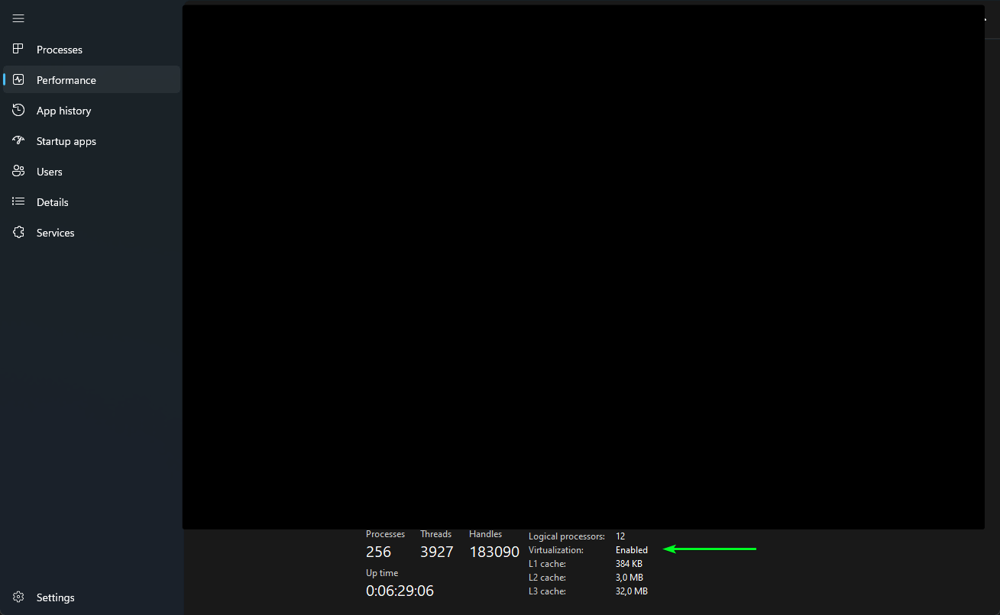
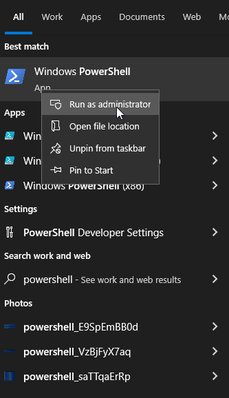
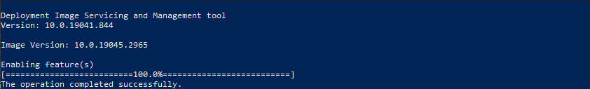
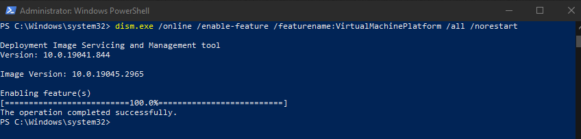
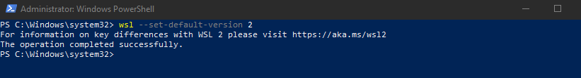

# WSL (Windows Subsystem for Linux) – Praktický průvodce & tipy

> Moderní přehled instalace, nastavení a doporučení pro práci s WSL na Windows.

---


## Co je WSL?

- **WSL** umožňuje instalaci a provoz linuxových distribucí přímo na Windows.
- Umožňuje spouštět linuxové aplikace bez potřeby virtuálního stroje.

> [!NOTE]
> Ideální pro vývojáře, kteří potřebují Linux nástroje na Windows.

---

## Instalace WSL na Windows

<details>
<summary>Krok 1: Povolení virtualizace v BIOS/UEFI</summary>

> [!IMPORTANT]
> V BIOSu/UEFI povolte:
> - **Podpora CPU virtualizace**
    >   - Intel: `Intel VT-x`
> - AMD: `AMD-V` nebo `SVM`
> - **Virtualizační technologie**
    >   - Intel: `VT-d`
> - AMD: `AMD-Vi`
> - **Vnořená virtualizace** (jen pokud potřebujete virtualizaci uvnitř WSL)

**Kontrola povolení virtualizace:**
1. Stiskněte `Ctrl + Shift + Esc`
2. Přejděte na záložku **Výkon (Performance)**
3. Dole najdete **Virtualization: Enabled**


</details>

<details>
<summary>Krok 2: Povolení WSL v systému</summary>

1. Spusťte **PowerShell jako správce**
   

2. Aktivujte WSL:
   ```bash
   dism.exe /online /enable-feature /featurename:Microsoft-Windows-Subsystem-Linux /all /norestart
   ```
   
</details>

<details>
<summary>Krok 3: Povolení Virtual Machine Platform & WSL 2</summary>

Aktivujte platformu pro WSL 2:
```bash
dism.exe /online /enable-feature /featurename:VirtualMachinePlatform /all /norestart
```


> [!IMPORTANT]
> Po povolení funkcí **restartujte počítač**.
</details>

<details>
<summary>Krok 4: Stažení aktualizace Linux jádra</summary>

- Stáhněte a nainstalujte poslední [aktualizaci jádra](https://github.com/Microsoft/WSL/releases).
- Řeší kompatibilitu s Dockerem a dalšími nástroji.

> [!NOTE]
> Doporučuji vždy instalovat nejnovější verzi jádra.
</details>

<details>
<summary>Krok 5: Nastavení WSL 2 jako výchozí</summary>

Nastavte WSL 2 jako výchozí:
```bash
wsl --set-default-version 2
```

</details>

<details>
<summary>Krok 6: Instalace linuxové distribuce</summary>

Stáhněte si RootFS (např. [Ubuntu](https://cloud-images.ubuntu.com/wsl/jammy/current/)) a nainstalujte:
```bash
wsl --import Ubuntu-22.04 C:\WSL\Ubuntu2204 C:\UbuntuRootFS\ubuntu-jammy-wsl-amd64-ubuntu22.04lts.rootfs.tar.gz --version 2
```

> [!NOTE]
> - `Ubuntu-22.04` = Název distribuce
> - `C:\WSL\Ubuntu2204` = Cesta k instalaci
> - `C:\UbuntuRootFS\...` = Cesta k RootFS souboru
> - `--version 2` = Použít WSL 2

Ověření instalace:
```bash
wsl --list
```

## Vypnutí všech WSL instancí

```bash
wsl --shutdown
```

> [!WARNING]
> Odstranění špatně nainstalované distribuce:
> ```bash
> wsl --unregister <distro name>
> ```
> Např.: `wsl --unregister Ubuntu-22.04`
</details>
---

## Přesun WSL distribuce na jiné místo

> Klasická past: nelze jen přesunout soubor `ext4.vhdx` na jiné místo – musíš projít cestou **export → import**.

<details>
<summary>Co vlastně chceš udělat?</summary>

Pokud chceš přesunout distribuci z:

```
D:\wsl\podman-machine-default\ext4.vhdx
```

na:

```
D:\wsl\ext4.vhdx
```

Nejde o přesun souboru – jde o **přesun celé WSL distribuce** na jiné umístění.

> [!WARNING]
> Ruční přesunutí `ext4.vhdx` nebo úprava registrů **rozbije WSL nebo Podman**. Použij výhradně postup níže.

</details>

<details>
<summary>Správný postup (export → import)</summary>

### 1. Zjisti název distribuce

```bash
wsl -l -v
```

Výstup zobrazí název (např. `podman-machine-default`).

---

### 2. Zastav distribuci

```bash
wsl --shutdown
```

---

### 3. Exportuj distribuci

```bash
wsl --export podman-machine-default D:\wsl\backup.tar
```

Vytvoří se záloha jako `.tar` soubor.

---

### 4. Odregistruj starou distribuci

```bash
wsl --unregister podman-machine-default
```

> [!WARNING]
> Tímto krokem zmizí starý `ext4.vhdx` – proto je předchozí export nezbytný.

---

### 5. Importuj na nové místo

```bash
wsl --import podman-machine-default D:\wsl\ D:\wsl\backup.tar --version 2
```

Po dokončení bude distribuce umístěna v:

```
D:\wsl\ext4.vhdx
```

---

### 6. Ověř výsledek

```bash
wsl -l -v
```

</details>

<details>
<summary>Specificky pro Podman machine</summary>

Podman machine je wrapper nad WSL. Po přesunu může být potřeba:

```bash
podman machine start
```

nebo v nejhorším případě:

```bash
podman machine init
```

</details>
