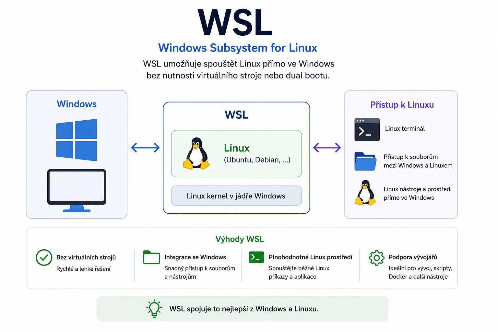
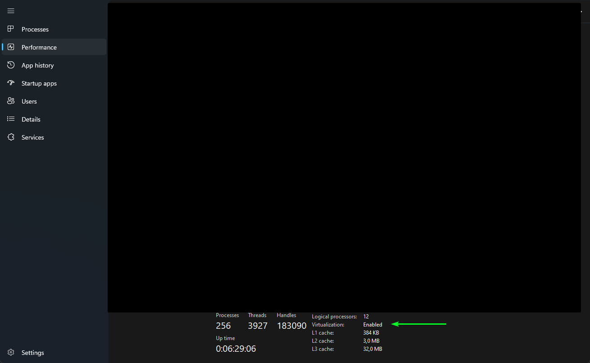
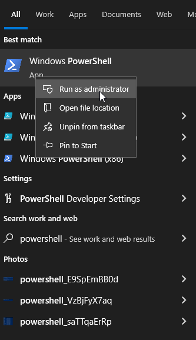
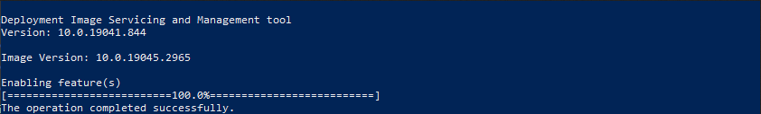
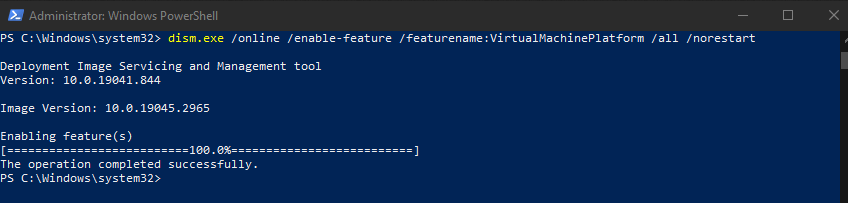
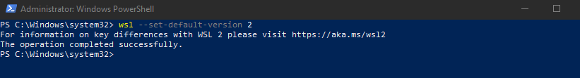

# WSL (Windows Subsystem for Linux) – Praktický průvodce a tipy

> Moderní přehled instalace, nastavení a doporučení pro práci s WSL na Windows.



## Co je WSL?

- **WSL** umožňuje instalaci a provoz linuxových distribucí přímo na Windows.
- Umožňuje spouštět linuxové aplikace bez potřeby virtuálního stroje.

> [!NOTE]
> Ideální pro vývojáře, kteří potřebují Linux nástroje na Windows.

## Instalace WSL na Windows

<details>
<summary>Krok 1: Povolení virtualizace v BIOS/UEFI</summary>

> [!IMPORTANT]
> V BIOSu/UEFI povolte:
> - **Podpora CPU virtualizace**
> - Intel: `Intel VT-x`
> - AMD: `AMD-V` nebo `SVM`
> - **Virtualizační technologie**
> - Intel: `VT-d`
> - AMD: `AMD-Vi`
> - **Vnořená virtualizace** (jen pokud potřebujete virtualizaci uvnitř WSL)

**Kontrola povolení virtualizace:**
1. Stiskněte `Ctrl + Shift + Esc`
2. Přejděte na záložku **Výkon (Performance)**
3. Dole najdete **Virtualization: Enabled**


</details>

<details>
<summary>Krok 2: Povolení WSL v systému</summary>

1. Spusťte **PowerShell jako správce**


2. Aktivujte WSL:
   ```bash
   dism.exe /online /enable-feature /featurename:Microsoft-Windows-Subsystem-Linux /all /norestart
   ```

</details>

<details>
<summary>Krok 3: Povolení Virtual Machine Platform a WSL 2</summary>

Aktivujte platformu pro WSL 2:
```bash
dism.exe /online /enable-feature /featurename:VirtualMachinePlatform /all /norestart
```


> [!IMPORTANT]
> Po povolení funkcí **restartujte počítač**.
</details>

<details>
<summary>Krok 4: Stažení aktualizace Linux jádra</summary>

- Stáhněte a nainstalujte poslední [aktualizaci jádra](https://github.com/Microsoft/WSL/releases).
- Řeší kompatibilitu s Dockerem a dalšími nástroji.

> [!NOTE]
> Doporučuji vždy instalovat nejnovější verzi jádra.
</details>

<details>
<summary>Krok 5: Nastavení WSL 2 jako výchozí</summary>

Nastavte WSL 2 jako výchozí:
```bash
wsl --set-default-version 2
```

</details>

<details>
<summary>Krok 6: Instalace linuxové distribuce</summary>

Stáhněte si RootFS (např. [Ubuntu](https://cloud-images.ubuntu.com/wsl/jammy/current/)) a nainstalujte:
```bash
wsl --import Ubuntu-22.04 C:\WSL\Ubuntu2204 C:\UbuntuRootFS\ubuntu-jammy-wsl-amd64-ubuntu22.04lts.rootfs.tar.gz --version 2
```

> [!NOTE]
> - `Ubuntu-22.04` = Název distribuce
> - `C:\WSL\Ubuntu2204` = Cesta k instalaci
> - `C:\UbuntuRootFS\...` = Cesta k RootFS souboru
> - `--version 2` = Použít WSL 2

Ověření instalace:
```bash
wsl --list
```

## Vypnutí všech WSL instancí

```bash
wsl --shutdown
```

> [!WARNING]
> Odstranění špatně nainstalované distribuce:
> ```bash
> wsl --unregister <distro name>
> ```
> Např.: `wsl --unregister Ubuntu-22.04`
</details>

## Přesun WSL distribuce na jiné místo

Export a import umožní přenést vlastní Ubuntu na jiný počítač s Windows nebo obnovit jeho kopii na jiném disku stejného počítače.

Přenáší se souborový systém distribuce včetně nainstalovaných balíčků, linuxových uživatelů, nastavení a souborů v jejich domovských adresářích.

Složky Windows připojené například pod `/mnt/c`, externí disky a nastavení Windows v souboru `%UserProfile%\.wslconfig` přenes samostatně.

Data Docker Desktopu mají [vlastní postup přenosu](docker/index.md#přenos-dat-docker-desktopu-na-jiný-počítač).

Následující příkazy zadávej ve **Windows PowerShellu** pod účtem Windows, který danou distribuci používá.

Příklady počítají s WSL 2 a se stejnou architekturou obou počítačů, například x64; názvy distribucí a cesty nahraď svými skutečnými hodnotami.

Na export, přenášený archiv i obnovenou distribuci potřebuješ dostatek místa; pro soubory větší než 4 GB nepoužívej přenosový disk s FAT32.

<details>
<summary>Zdrojový počítač: export Ubuntu</summary>

### 1. Zjisti název distribuce a uživatele

```text
wsl --list --verbose
wsl --distribution Ubuntu-22.04 --exec whoami
```

V dalších příkazech je zdrojovou distribucí `Ubuntu-22.04`; poznamenej si také vypsané linuxové uživatelské jméno pro přihlášení po importu.

### 2. Ulož práci a zastav distribuci

Nejprve řádně ukonči aplikace a databáze uvnitř Ubuntu, aby se jejich data dopsala na disk, a zavři jeho terminály i připojená vývojová prostředí.

```text
wsl --terminate Ubuntu-22.04
```

Tento příkaz zastaví pouze uvedenou distribuci; po dobu exportu ji znovu nespouštěj.

### 3. Vytvoř export a zaznamenej kontrolní součet

Zvol novou záložní složku mimo exportovanou distribuci, například na přenosovém disku `E:`.

```text
New-Item -ItemType Directory -Path 'E:\Prenos\WSL' -ErrorAction Stop
wsl --export Ubuntu-22.04 'E:\Prenos\WSL\Ubuntu-22.04.tar'
if ($LASTEXITCODE -ne 0) { throw 'Export Ubuntu se nezdařil.' }
Get-FileHash -LiteralPath 'E:\Prenos\WSL\Ubuntu-22.04.tar' -Algorithm SHA256
```

Počkej na úspěšné dokončení exportu a ulož si hodnotu `Hash`, abys ji mohl porovnat na cílovém počítači.

Výsledkem je archiv TAR; původní Ubuntu zůstává nainstalované a po exportu ho můžeš znovu používat.

Záloha zachycuje stav v okamžiku exportu, takže pozdější změny se do ní již nedoplní.

Archiv může obsahovat hesla, SSH klíče i další soukromé soubory; přenášej a uchovávej jej jako citlivá data.

[Dokumentace exportu WSL](https://learn.microsoft.com/en-us/windows/wsl/basic-commands#export-a-distribution)

</details>

<details>
<summary>Cílový počítač: import a ověření Ubuntu</summary>

### 1. Připrav WSL a ověř přenesený archiv

Na cílovém počítači musí fungovat WSL 2; před importem není potřeba instalovat novou distribuci Ubuntu z Microsoft Storu.

Přenes archiv na cílový počítač nebo připoj přenosový disk a zkontroluj jej:

```text
wsl --status
wsl --list --verbose
Get-FileHash -LiteralPath 'E:\Prenos\WSL\Ubuntu-22.04.tar' -Algorithm SHA256
```

Hodnota `Hash` musí přesně odpovídat hodnotě zaznamenané po exportu; při neshodě archiv znovu přenes a nepokračuj v importu.

### 2. Importuj pod volným názvem do nové složky

Název `Ubuntu-22.04-Prenesena` nesmí být v předchozím výpisu a cílová složka musí být nová nebo prázdná.

Odlišný název umožní ponechat původní Ubuntu i při přesunu na stejném počítači.

```text
New-Item -ItemType Directory -Path 'D:\WSL\Ubuntu2204-Prenesena' -ErrorAction Stop
wsl --import Ubuntu-22.04-Prenesena 'D:\WSL\Ubuntu2204-Prenesena' 'E:\Prenos\WSL\Ubuntu-22.04.tar' --version 2
if ($LASTEXITCODE -ne 0) { throw 'Import Ubuntu se nezdařil.' }
wsl --list --verbose
```

V seznamu očekávej novou distribuci s `VERSION 2`; její pracovní disk vznikne v cílové složce, archiv TAR zůstane samostatnou zálohou.

[Dokumentace importu WSL](https://learn.microsoft.com/en-us/windows/wsl/basic-commands#import-a-distribution)

### 3. Přihlas se a ověř svoje data

V následujícím příkazu nahraď `vyvojar` existujícím linuxovým uživatelským jménem zaznamenaným na zdroji:

```text
wsl --distribution Ubuntu-22.04-Prenesena --user vyvojar
```

Uvnitř Ubuntu ověř uživatele a obsah jeho domovského adresáře:

```text
whoami
cd ~
ls -la
```

Otevři své projekty a ověř potřebné aplikace i jejich uložená data; shodný kontrolní součet potvrzuje neporušený přenos archivu, nikoli funkčnost celého prostředí.

Pokud se distribuce bez přepínače `--user` spouští jako `root`, nastav v jejím `/etc/wsl.conf` výchozího uživatele; uvnitř Ubuntu můžeš soubor otevřít například editorem Nano:

```text
sudo nano /etc/wsl.conf
```

Zachovej ostatní sekce a existující sekci `[user]` uprav místo jejího opětovného přidání; také zde nahraď `vyvojar` svým linuxovým uživatelským jménem:

```ini
[user]
default=vyvojar
```

[Nastavení uživatele obnoveného Ubuntu](https://ubuntu.com/wsl/docs/latest/howto/manage-and-configure/#using-the-restored-backup)

V editoru Nano ulož změnu pomocí `Ctrl+O`, potvrď Enterem a editor zavři pomocí `Ctrl+X`.

Zavři práci v Ubuntu a příkazem `exit` se vrať do PowerShellu, kde distribuci restartuj a ověř výchozí přihlášení:

```text
wsl --terminate Ubuntu-22.04-Prenesena
wsl --distribution Ubuntu-22.04-Prenesena --exec whoami
```

V případě potřeby nastav obnovené Ubuntu také jako výchozí distribuci pro samotný příkaz `wsl`:

```text
wsl --set-default Ubuntu-22.04-Prenesena
```

### 4. Původní distribuci odstraň jen při skutečném přesunu

Při kopírování nebo zálohování není potřeba původní Ubuntu odstraňovat.

Pokud je chceš odstranit, proveď následující krok **na zdrojovém počítači až po ověření obnovených dat a při zachované záloze TAR**:

```text
wsl --unregister Ubuntu-22.04
```

> [!WARNING]
> Odregistrace nevratně smaže souborový systém, nastavení i programy uvedené distribuce, proto před spuštěním ověř její přesný název.

[Dopad odregistrace WSL](https://learn.microsoft.com/en-us/windows/wsl/basic-commands#unregister-or-uninstall-a-linux-distribution)

</details>

## Docker Desktop a vlastní Ubuntu

Rozdíl mezi distribucemi `Ubuntu-22.04` a `docker-desktop`, zapnutí integrace, ověření Dockeru z Ubuntu i význam disku `docker_data.vhdx` vysvětluje [Docker Desktop a WSL 2 ve Windows](docker/index.md#docker-desktop-a-wsl-2-ve-windows).
