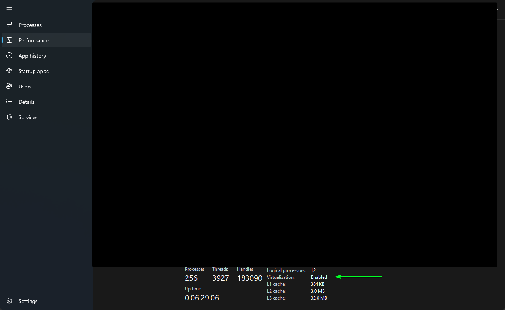
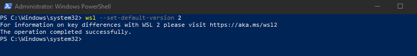

# 🗂️ WSL (Windows Subsystem for Linux) – Praktický průvodce & tipy

> 🚀 Moderní přehled instalace, nastavení a doporučení pro práci s WSL na Windows.

---

## 📖 Co je WSL?

- **WSL** umožňuje instalaci a provoz linuxových distribucí přímo na Windows.
- Umožňuje spouštět linuxové aplikace bez potřeby virtuálního stroje.

> [!NOTE]  
> Ideální pro vývojáře, kteří potřebují Linux nástroje na Windows.

---

## 🛠️ Instalace WSL na Windows

<details>
<summary><span style="color:#1E90FF;">🔹 Krok 1: Povolení virtualizace v BIOS/UEFI</span></summary>

> [!IMPORTANT]  
> V BIOSu/UEFI povolte:
> - **Podpora CPU virtualizace**
    >   - Intel: `Intel VT-x`
>   - AMD: `AMD-V` nebo `SVM`
> - **Virtualizační technologie**
    >   - Intel: `VT-d`
>   - AMD: `AMD-Vi`
> - **Vnořená virtualizace** (jen pokud potřebujete virtualizaci uvnitř WSL)

**Kontrola povolení virtualizace:**
1. Stiskněte `Ctrl + Shift + Esc`
2. Přejděte na záložku **Výkon (Performance)**
3. Dole najdete **Virtualization: Enabled**


</details>

<details>
<summary><span style="color:#1E90FF;">🔹 Krok 2: Povolení WSL v systému</span></summary>

1. Spusťte **PowerShell jako správce**  
   

2. Aktivujte WSL:
   ```bash
   dism.exe /online /enable-feature /featurename:Microsoft-Windows-Subsystem-Linux /all /norestart
   ```
   
</details>

<details>
<summary><span style="color:#1E90FF;">🔹 Krok 3: Povolení Virtual Machine Platform & WSL 2</span></summary>

Aktivujte platformu pro WSL 2:
```bash
dism.exe /online /enable-feature /featurename:VirtualMachinePlatform /all /norestart
```


> [!IMPORTANT]  
> Po povolení funkcí **restartujte počítač**.
</details>

<details>
<summary><span style="color:#1E90FF;">🔹 Krok 4: Stažení aktualizace Linux jádra</span></summary>

- Stáhněte a nainstalujte poslední [aktualizaci jádra](https://github.com/Microsoft/WSL/releases).
- Řeší kompatibilitu s Dockerem a dalšími nástroji.

> [!NOTE]  
> Doporučuji vždy instalovat nejnovější verzi jádra.
</details>

<details>
<summary><span style="color:#1E90FF;">🔹 Krok 5: Nastavení WSL 2 jako výchozí</span></summary>

Nastavte WSL 2 jako výchozí:
```bash
wsl --set-default-version 2
```

</details>

<details>
<summary><span style="color:#1E90FF;">🔹 Krok 6: Instalace linuxové distribuce</span></summary>

Stáhněte si RootFS (např. [Ubuntu](https://cloud-images.ubuntu.com/wsl/jammy/current/)) a nainstalujte:
```bash
wsl --import Ubuntu-22.04 C:\WSL\Ubuntu2204 C:\UbuntuRootFS\ubuntu-jammy-wsl-amd64-ubuntu22.04lts.rootfs.tar.gz --version 2
```

> [!NOTE]
> - `Ubuntu-22.04` = Název distribuce
> - `C:\WSL\Ubuntu2204` = Cesta k instalaci
> - `C:\UbuntuRootFS\...` = Cesta k RootFS souboru
> - `--version 2` = Použít WSL 2

Ověření instalace:
```bash
wsl --list
```

> [!WARNING]  
> Odstranění špatně nainstalované distribuce:
> ```bash
> wsl --unregister <distro name>
> ```
> Např.: `wsl --unregister Ubuntu-22.04`
</details>